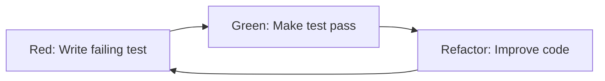

# Testing Fundamentals
## JUnit 5, AssertJ, and Modern Testing Practices

CPSC 310: Software Design  
Trinity College, Fall 2025

---

# Why Testing Matters

- **Quality Assurance**: Catch bugs before they reach users
- **Design Driver**: Tests guide better code design
- **Documentation**: Tests serve as living documentation
- **Confidence**: Refactor and change code with confidence
- **Regression Prevention**: Ensure fixes don't break existing functionality

<v-click>

## Testing Philosophy
> "Testing is not about finding bugs, it's about preventing them"

</v-click>

---

# Testing Pyramid

```
        /\
       /  \
      /    \
     /  UI  \
    /       \
   /________\
  /          \
 / Integration \
/              \
/______________\
/              \
/     Unit     \
/              \
/______________\
```

- **Unit Tests**: Fast, isolated, focused
- **Integration Tests**: Verify component interactions
- **UI Tests**: End-to-end user scenarios

---

# JUnit 5 Architecture

## Three Components

1. **JUnit Platform**: Foundation for launching testing frameworks
2. **JUnit Jupiter**: New programming and extension model
3. **JUnit Vintage**: Backward compatibility with JUnit 3 and 4

<v-click>

## Key Improvements over JUnit 4
- Java 8+ features (lambdas, streams)
- Modular architecture
- Better parameterized tests
- Nested test organization
- Custom extensions

</v-click>

---

# Your First JUnit 5 Test

```java
import org.junit.jupiter.api.Test;
import static org.junit.jupiter.api.Assertions.assertEquals;

public class FirstTest {
    @Test
    void myFirstTest() {
        assertEquals(2, 1 + 1, "2 should be the sum of 1 and 1");
    }
}
```

<v-click>

## Key Changes from JUnit 4
- `@Test` annotation from `org.junit.jupiter.api`
- Methods can be package-private (no need for `public`)
- Better assertion methods with optional messages

</v-click>

---

# JUnit 5 Assertions

## Basic Assertions

```java
import static org.junit.jupiter.api.Assertions.*;

@Test
void basicAssertions() {
    // Equality
    assertEquals(expected, actual);
    assertNotEquals(unexpected, actual);
    
    // Boolean conditions
    assertTrue(condition);
    assertFalse(condition);
    
    // Null checks
    assertNull(object);
    assertNotNull(object);
    
    // Object identity
    assertSame(expected, actual);
    assertNotSame(unexpected, actual);
}
```

---

# Advanced Assertions

## Exception Testing

```java
@Test
void exceptionTesting() {
    // Assert that an exception is thrown
    assertThrows(IllegalArgumentException.class, () -> {
        throw new IllegalArgumentException("Invalid argument");
    });
    
    // Capture and examine the exception
    Exception exception = assertThrows(RuntimeException.class, () -> {
        riskyOperation();
    });
    assertEquals("Expected message", exception.getMessage());
}
```

---

# Grouped Assertions

```java
@Test
void groupedAssertions() {
    Person person = new Person("John", "Doe", 30);
    
    // All assertions execute, even if some fail
    assertAll("person properties",
        () -> assertEquals("John", person.getFirstName()),
        () -> assertEquals("Doe", person.getLastName()),
        () -> assertEquals(30, person.getAge())
    );
}
```

<v-click>

## Benefits
- All assertions run regardless of failures
- Better error reporting
- Logical grouping of related assertions

</v-click>

---

# AssertJ: Fluent Assertions

## Why AssertJ?
- **Fluent API**: More readable and expressive
- **Better error messages**: Clear failure descriptions
- **IDE support**: Excellent autocomplete
- **Extensible**: Easy to create custom assertions

```java
import static org.assertj.core.api.Assertions.assertThat;

@Test
void fluentAssertions() {
    String title = "The Lord of the Rings";
    assertThat(title)
        .isNotNull()
        .startsWith("The")
        .contains("Lord")
        .endsWith(" Rings");
}
```

---

# AssertJ Examples

## Collection Assertions

```java
@Test
void collectionAssertions() {
    List<String> names = Arrays.asList("Alice", "Bob", "Charlie");
    
    assertThat(names)
        .hasSize(3)
        .contains("Alice", "Bob")
        .doesNotContain("David")
        .startsWith("Alice")
        .endsWith("Charlie");
}
```

<v-click>

## Object Extraction

```java
@Test
void objectExtraction() {
    Person person = new Person("Jean-Luc", "Picard", LocalDate.of(2305, 7, 13));
    
    assertThat(person)
        .extracting(Person::first, Person::last)
        .containsExactly("Jean-Luc", "Picard");
}
```

</v-click>

---

# Test Lifecycle

```java
class TestLifecycleDemo {
    @BeforeAll
    static void initAll() {
        // Run once before all tests
    }
    
    @BeforeEach
    void init() {
        // Run before each test
    }
    
    @Test
    void testOne() {
        // Test method
    }
    
    @AfterEach
    void tearDown() {
        // Run after each test
    }
    
    @AfterAll
    static void tearDownAll() {
        // Run once after all tests
    }
}
```

---

# Parameterized Tests

## Value Sources

```java
@ParameterizedTest(name = "{0} is prime and less than 20")
@ValueSource(ints = {2, 3, 5, 7, 11, 13, 17, 19})
void valueIsPrime(int candidate) {
    assertTrue(isPrime(candidate));
}

@ParameterizedTest
@ValueSource(strings = {"this", "is", "a", "list", "of", "strings"})
void noneAreEmpty(String str) {
    assertThat(str).isNotEmpty();
}
```

<v-click>

## Benefits
- Test multiple inputs with single test method
- Parameterized test names for clarity
- Reduce code duplication

</v-click>

---

# Method Sources

```java
@ParameterizedTest
@MethodSource("primesLessThan100")
void checkPrimesLessThan100(int candidate) {
    assertTrue(isPrime(candidate));
}

private static IntStream primesLessThan100() {
    return IntStream.rangeClosed(2, 100)
            .filter(TestUtils::isPrime);
}
```

<v-click>

## Multiple Parameters

```java
@ParameterizedTest
@MethodSource("maxWithArgs")
void testMax(int x, int y, int expected) {
    assertEquals(expected, Math.max(x, y));
}

private static Stream<Arguments> maxWithArgs() {
    return Stream.of(
        Arguments.of(1, 2, 2),
        Arguments.of(7, 3, 7),
        Arguments.of(5, 5, 5)
    );
}
```

</v-click>

---

# CSV Sources

```java
@ParameterizedTest
@CsvSource({
    "1, 2, 2",
    "7, 3, 7", 
    "5, 5, 5"
})
void testMaxWithCsv(int x, int y, int expected) {
    assertEquals(expected, Math.max(x, y));
}
```

<v-click>

## External CSV Files

```java
@ParameterizedTest
@CsvFileSource(resources = "/book_data.csv", numLinesToSkip = 1)
void testBookData(String isbn, String title, String author, LocalDate date) {
    assertAll(
        () -> assertNotNull(title),
        () -> assertNotNull(author),
        () -> assertTrue(date.isAfter(LocalDate.of(2010, 1, 1)))
    );
}
```

</v-click>

---

# Enum Sources

```java
@ParameterizedTest
@EnumSource(Month.class)
void monthsEnum(Month month) {
    assertThat(month).isNotNull();
}
```

<v-click>

## Filtered Enum Sources

```java
@ParameterizedTest
@EnumSource(mode = EnumSource.Mode.MATCH_ALL, names = "^.*DAYS$")
void testChronoUnits(ChronoUnit unit) {
    assertTrue(unit.name().endsWith("DAYS"));
}
```

</v-click>

---

# Nested Tests

```java
@DisplayName("A stack")
class StackTest {
    Stack<Object> stack;
    
    @Nested
    @DisplayName("when new")
    class WhenNew {
        @BeforeEach
        void createNewStack() {
            stack = new Stack<>();
        }
        
        @Test
        @DisplayName("is empty")
        void isEmpty() {
            assertTrue(stack.isEmpty());
        }
        
        @Nested
        @DisplayName("after pushing an element")
        class AfterPushing {
            String element = "test";
            
            @BeforeEach
            void pushElement() {
                stack.push(element);
            }
            
            @Test
            @DisplayName("is no longer empty")
            void isNotEmpty() {
                assertFalse(stack.isEmpty());
            }
        }
    }
}
```

---

# Property-Based Testing with jqwik

## Traditional Testing vs Property-Based Testing

**Traditional**: Test specific examples
```java
@Test
void testReverse() {
    assertEquals("cba", reverse("abc"));
    assertEquals("", reverse(""));
}
```

**Property-Based**: Test properties that should always hold
```java
@Property
boolean reverseReverseShouldBeOriginal(@ForAll String original) {
    return reverse(reverse(original)).equals(original);
}
```

---

# jqwik Examples

```java
@Property
boolean every_third_element_starts_with_Fizz(@ForAll("divisibleBy3") int i) {
    return fizzBuzz().get(i - 1).startsWith("Fizz");
}

@Property  
boolean every_fifth_element_ends_with_Buzz(@ForAll("divisibleBy5") int i) {
    return fizzBuzz().get(i - 1).endsWith("Buzz");
}

@Provide
Arbitrary<Integer> divisibleBy3() {
    return Arbitraries.integers()
            .between(1, 100)
            .filter(i -> i % 3 == 0);
}
```

<v-click>

## Benefits
- Tests hundreds of generated inputs
- Finds edge cases you might miss
- Shrinks failing cases to minimal examples

</v-click>

---

# Test-Driven Development (TDD)

## Red-Green-Refactor Cycle



<v-click>

## TDD Benefits
- **Design Driver**: Tests guide API design
- **Confidence**: High test coverage from the start
- **Focus**: Work in small, manageable steps
- **Documentation**: Tests document expected behavior

</v-click>

---

# TDD Example: Calculator

## Step 1: Red (Failing Test)

```java
@Test
void shouldAddTwoNumbers() {
    Calculator calculator = new Calculator();
    assertThat(calculator.add(2, 3)).isEqualTo(5);
}
```

<v-click>

## Step 2: Green (Make it pass)

```java
public class Calculator {
    public int add(int a, int b) {
        return a + b;
    }
}
```

</v-click>

<v-click>

## Step 3: Refactor (if needed)
No refactoring needed for this simple case, but consider:
- Edge cases (overflow, negative numbers)
- Input validation
- Code organization

</v-click>

---

# Testing Best Practices

## Test Naming
- Use descriptive names that explain behavior
- Consider using `given_when_then` format
- Use `@DisplayName` for complex scenarios

```java
@Test
@DisplayName("Should calculate discount when customer is premium")
void shouldCalculateDiscountWhenCustomerIsPremium() {
    // Test implementation
}
```

<v-click>

## Test Organization
- One assertion per test (when possible)
- Arrange-Act-Assert pattern
- Use `@Nested` for logical grouping
- Keep tests independent

</v-click>

---

# AAA Pattern

```java
@Test
void shouldCalculateOrderTotal() {
    // Arrange
    Order order = new Order();
    order.addItem(new Item("Book", 25.00));
    order.addItem(new Item("Pen", 5.00));
    
    // Act
    double total = order.calculateTotal();
    
    // Assert
    assertThat(total).isEqualTo(30.00);
}
```

<v-click>

## Benefits
- Clear test structure
- Easy to understand and maintain
- Separates test concerns
- Follows given-when-then pattern

</v-click>

---

# Testing in Practice

## What to Test
- **Public API**: Test behavior, not implementation
- **Edge Cases**: Boundary conditions, null values, empty collections
- **Error Conditions**: Invalid inputs, exceptional scenarios
- **Business Logic**: Core functionality and rules

<v-click>

## What NOT to Test
- Private methods (test through public API)
- Third-party libraries (trust their tests)
- Trivial code (getters/setters)
- Implementation details

</v-click>

---

# Test Coverage

## Coverage Metrics
- **Line Coverage**: Percentage of lines executed
- **Branch Coverage**: Percentage of decision points tested
- **Method Coverage**: Percentage of methods called

<v-click>

## Coverage Guidelines
- Aim for 80-90% line coverage
- Focus on critical business logic
- 100% coverage ≠ bug-free code
- Quality > Quantity

</v-click>

<v-click>

## Gradle Coverage
```bash
./gradlew test jacocoTestReport
```

</v-click>

---

# Integration with Build Tools

## Gradle Configuration

```kotlin
dependencies {
    testImplementation(platform("org.junit:junit-bom:5.11.0"))
    testImplementation("org.junit.jupiter:junit-jupiter")
    testImplementation("org.assertj:assertj-core:3.26.3")
    testImplementation("net.jqwik:jqwik:1.9.3")
}

tasks.test {
    useJUnitPlatform()
}
```

<v-click>

## Running Tests
```bash
./gradlew test           # Run all tests
./gradlew test --info    # Verbose output
./gradlew test --rerun-tasks  # Force rerun
```

</v-click>

---

# Testing Summary

## Key Takeaways
1. **Tests are first-class citizens** in modern development
2. **JUnit 5** provides powerful testing capabilities
3. **AssertJ** makes assertions more readable
4. **Property-based testing** finds edge cases
5. **TDD** drives better design
6. **Good tests** are fast, isolated, and maintainable

<v-click>

## Next Steps
- Practice writing tests for existing code
- Try TDD for new features
- Explore advanced testing patterns
- Integrate testing into CI/CD pipeline

</v-click>

---

# Resources

## Official Documentation
- [JUnit 5 User Guide](https://junit.org/junit5/docs/current/user-guide/)
- [AssertJ Documentation](https://assertj.github.io/doc/)
- [jqwik User Guide](https://jqwik.net/docs/current/user-guide.html)

## Books
- "Effective Unit Testing" by Lasse Koskela
- "Growing Object-Oriented Software, Guided by Tests" by Freeman & Pryce
- "Unit Testing Principles, Practices, and Patterns" by Vladimir Khorikov

## Online Resources
- [Baeldung JUnit 5 Tutorials](https://www.baeldung.com/junit-5)
- [Spring Boot Testing Documentation](https://spring.io/guides/gs/testing-web/)

---

# Questions?

## Let's Practice!

Time to write some tests using:
- JUnit 5 assertions
- AssertJ fluent assertions  
- Parameterized tests
- TDD methodology

**Remember**: Good tests make good code!