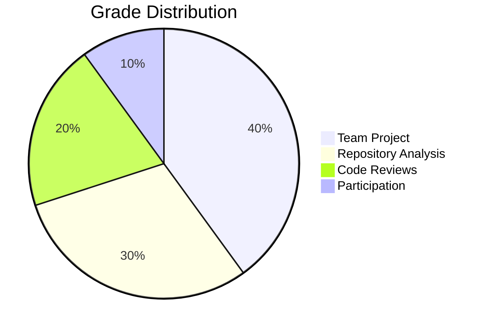
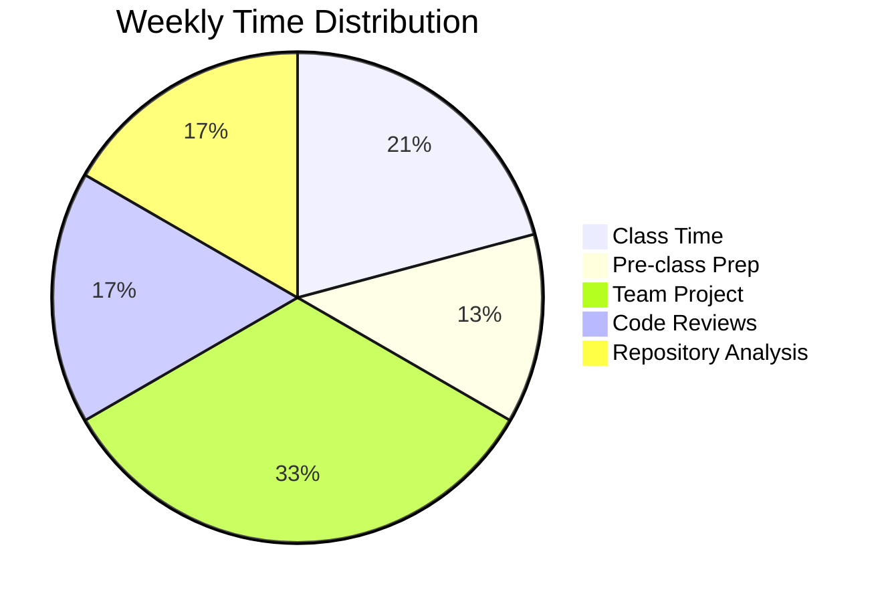

# CPSC 310: Software Design

## Week 1: Java Foundations & Team Formation

### Fall 2025
Prof. Ken Kousen

---
transition: fade-out
---

# Welcome to Software Design!

<div class="grid grid-cols-2 gap-10">

<div>

## Who Am I?

- Ken Kousen
- Industry experience + Academia
- Focus on practical skills
- AI-assisted development advocate

</div>

<div>

## Who Are You?

- Future software architects
- Not just coders
- Problem solvers
- Team collaborators

</div>

</div>

<style>
h2 {
  @apply text-2xl font-bold text-blue-600 mb-4;
}
</style>

---
layout: statement
---

# The software industry doesn't need more coders

## It needs software designers who can build systems that last

---

# Course Philosophy

<div class="grid grid-cols-2 gap-8">

<div>

## Traditional Approach ❌

- Pretend AI doesn't exist
- Write everything from scratch
- Individual assignments only
- Toy problems
- Theory over practice

</div>

<div>

## Our Approach ✅

- **Embrace AI as a tool**
- **Build on existing code**
- **Team collaboration from Day 1**
- **Real production systems**
- **Practice with theory**

</div>

</div>

---

# What Makes This Course Different

<v-clicks>

- 🤝 **Teams from Day 1** - Just like industry
- 🤖 **AI as your pair programmer** - But you're the architect
- 🚀 **Build production systems** - Portfolio-worthy projects
- ☁️ **Deploy to the cloud** - Especially with CPSC 415
- 👀 **Code reviews** - Learn from different approaches
- 🎯 **SOLID principles & patterns** - Timeless design skills

</v-clicks>

---

# Your Semester Project

## Progressive Team Project (40% of grade)

<div class="grid grid-cols-2 gap-6 mt-6">

<div>

### Milestone 1 (Week 2)
- Team formation ✅
- Repository setup
- Basic API
- SonarCloud integration

### Milestone 2 (Week 7)
- Complete CRUD API
- SOLID principles
- 80% test coverage
- Code reviews via PRs

</div>

<div>

### Milestone 3 (Week 11)
- Security implementation
- Design patterns (3+)
- API documentation
- Performance benchmarks

### Milestone 4 (Week 13)
- Cloud deployment
- CI/CD pipeline
- Final presentation
- Complete documentation

</div>

</div>

---

# Grading Structure

<div class="flex justify-center">



</div>

## Key Points

- **Team assignments** - 8 teams, not 25 individuals
- **Repository analysis** - Individual critical thinking
- **Code reviews** - Quality of feedback matters
- **AI required** - But must document and verify

---

# Today's Agenda

<div class="text-xl space-y-4 mt-8">

<v-clicks>

1. ✅ **Course Introduction** - Philosophy & structure
2. 🎯 **Live Coding Demo** - Build an API with AI
3. 👥 **Team Formation** - Groups of 3
4. 💻 **Environment Setup** - Tools you need
5. 📝 **First Assignment** - Task Tracker Evolution

</v-clicks>

</div>

<div class="mt-8 p-4 bg-blue-100 rounded">

**By end of class:** Teams formed, repositories created, ready to code!

</div>

---

# Live Coding: Spring Boot API in 10 Minutes!

## Watch me build a Task Tracker API with AI assistance

<v-clicks>

- Spring Initializr setup
- Simple Task entity
- REST controller with CRUD operations
- AI helps with boilerplate
- But... AI makes mistakes!
- We'll catch and fix them together
- Push to GitHub

</v-clicks>

<div class="mt-8 p-4 bg-yellow-50 border-2 border-yellow-400 rounded">

**Key Lesson:** AI is powerful but needs human oversight

</div>

---
layout: center
---

# Demo Time! 

## Let's build something real...

<div class="text-6xl">💻</div>

---

# What Just Happened?

<div class="grid grid-cols-2 gap-8">

<div>

## The Good ✅
- Working API in minutes
- AI handled boilerplate
- Tests help verify behavior
- Deployed to GitHub

</div>

<div>

## The Gotchas ⚠️
- AI forgot error handling
- No validation initially
- ID generation issues
- Missing duplicate checks

</div>

</div>

<div class="mt-4 text-xl font-bold text-center text-blue-600">

💡 The Lesson: You must understand what AI generates

</div>

---

# Team Formation Time!

## Teams of 3 People

<div class="grid grid-cols-2 gap-8 mt-6">

<div>

### Ideal Team Composition
- Mixed experience levels
- Different backgrounds (Python/JS/Java)
- At least 1 from CPSC 415 if possible
- Complementary skills

</div>

<div>

### Your Team Tasks Today
1. Form your team
2. Exchange contact info
3. Choose a team name/number
4. Create GitHub accounts
5. Decide on communication channel

</div>

</div>

<div class="mt-8 p-4 bg-blue-100 rounded">

**Remember:** You'll work with this team all semester!

</div>

---

# Assignment 1: Task Tracker Evolution

## Due: Thursday, September 11 at 11:59 PM

<div class="grid grid-cols-2 gap-6">

<div>

### Your Mission
Transform the demo app into your own domain:
- **BookmarkManager**
- **QuoteKeeper**
- **HabitTracker**
- **RecipeBox**
- **MovieWatchlist**

First team to claim a domain gets it!

</div>

<div>

### Requirements
- ✅ Make all 15 tests pass
- ✅ Rename to your domain
- ✅ Add 3+ meaningful fields
- ✅ Document AI usage
- ✅ Push to GitHub
- ✅ Submit URL to Moodle

</div>

</div>

---

# Getting Started with Assignment 1

## Step by Step

```bash
# 1. One team member: Go to starter repo
https://github.com/kousen/assignment-1-starter

# 2. Click "Use this template" (not Fork!)

# 3. Name it: team-X-domain (e.g., team-3-bookmarks)
# 4. This creates YOUR NEW repository

# 5. Add teammates as collaborators (Settings → Manage access)

# 6. Everyone clones THE NEW TEAM REPO
git clone https://github.com/STUDENT-USERNAME/team-3-bookmarks.git

# 7. Run tests (they'll fail - that's expected!)
./gradlew test

# 8. Start coding!
./gradlew bootRun
```

---

# AI Collaboration Requirements

## Document Your AI Usage

```java
/**
 * AI Collaboration Report:
 * - AI Tool Used: [ChatGPT/Claude/Copilot/Gemini]
 * - Most Helpful Prompt: [paste your best prompt]
 * - AI Mistake We Fixed: [describe what went wrong]
 * - Time Saved: [estimate hours]
 * - Team Members: [all names]
 */
@RestController
public class ItemController {
    // Your implementation
}
```

<div class="mt-6 p-4 bg-green-100 rounded">

**Pro Tip:** Good prompts lead to better code. Be specific!

</div>

---

# Development Environment

## Required Tools (All Free!)

<v-clicks>

1. **Java 21 LTS** - [adoptium.net](https://adoptium.net)
2. **IntelliJ IDEA Ultimate** - Free with student license
3. **Git** - Version control
4. **GitHub Account** - Code hosting
5. **SonarCloud Account** - Code quality
6. **AI Assistant** - Copilot, Claude, ChatGPT, or Gemini

</v-clicks>

<div class="mt-8">

## Before Next Class
- Install all tools
- Join team GitHub repository
- Run the starter project locally

</div>

---
layout: section
---

# Thursday: Java Basics & Testing

What we'll cover in Session 2

---

# Thursday's Topics

## Session 2: Java Basics & Testing Introduction

<div class="grid grid-cols-2 gap-8 mt-6">

<div>

### Java Fundamentals
- Transition from Python
- Classes and objects
- Methods and constructors
- Instance variables
- Encapsulation basics

</div>

<div>

### Testing Introduction
- Running JUnit tests
- Understanding test output
- Tests as specifications
- Test-first learning
- Making tests pass

</div>

</div>

<div class="mt-8 p-4 bg-purple-100 rounded">

**Team Assignment 1 officially starts Thursday!**

</div>

---

# Java Basics: The Essentials

## Everything is in a Class

<div class="grid grid-cols-2 gap-6">

<div>

### Python - Can be loose
```python
# Just write code
def greet(name):
    return f"Hello, {name}"

print(greet("World"))
```

</div>

<div>

### Java - Must be in a class
```java
public class Greeting {
    public static void main(String[] args) {
        System.out.println(greet("World"));
    }
    
    public static String greet(String name) {
        return "Hello, " + name;
    }
}
```

</div>

</div>

---

# Java Types: Everything Has a Type

<div class="grid grid-cols-2 gap-6">

<div>

## Primitive Types
```java
int age = 25;
double price = 19.99;
boolean isActive = true;
char grade = 'A';
long bigNumber = 1000000L;
```

</div>

<div>

## Object Types
```java
String name = "Alice";
Integer boxedInt = 42;
List<String> names = new ArrayList<>();
Map<String, Integer> scores = new HashMap<>();
Task myTask = new Task("Learn Java");
```

</div>

</div>

<div class="mt-6 p-4 bg-blue-50 border-2 border-blue-400 rounded">

**Key Difference:** Java makes you declare types. Python figures them out.

</div>

---

# Methods and Access Modifiers

```java
public class Student {
    private String name;        // Only this class can access
    private int age;
    
    // Constructor
    public Student(String name, int age) {
        this.name = name;       // 'this' refers to current instance
        this.age = age;
    }
    
    // Public method - anyone can call
    public String getName() {
        return name;
    }
    
    // Private method - only this class can call
    private boolean isAdult() {
        return age >= 18;
    }
}
```

**Access Modifiers:** `public` (everywhere) • `private` (this class only) • `protected` (package + subclasses) • default (package only)

---

# Creating and Using Objects

<div class="grid grid-cols-2 gap-6">

<div>

## Creating & Using
```java
// Create with 'new'
Student alice = new Student("Alice", 20);

// Call methods
String name = alice.getName();
alice.setAge(21);

// Null checking
Student nobody = null;
if (nobody != null) {
    nobody.getName();  // Safe
}
```

</div>

<div>

## References & Equality
```java
// Objects are references
Student bob = alice;  // Same object!
bob.setName("Bob");   // Changes alice too!

// Compare with equals()
if (alice.equals(bob)) {
    System.out.println("Same");
}

// Don't use == for objects
if (alice == bob) {  // Checks reference
    // Only true if same object
}
```

</div>

</div>

<div class="mt-4 p-4 bg-yellow-50 border-2 border-yellow-400 rounded text-center">

**Key Point:** Use `new` to create, `equals()` to compare

</div>

---

# Collections: Lists and Maps

<div class="grid grid-cols-2 gap-6">

<div>

## Lists (like Python lists)
```java
// Create a list
List<String> names = new ArrayList<>();

// Add elements
names.add("Alice");
names.add("Bob");

// Access elements
String first = names.get(0);

// Iterate
for (String name : names) {
    System.out.println(name);
}

// Size
int count = names.size();
```

</div>

<div>

## Maps (like Python dicts)
```java
// Create a map
Map<String, Integer> scores = new HashMap<>();

// Add key-value pairs
scores.put("Alice", 95);
scores.put("Bob", 87);

// Get value
Integer aliceScore = scores.get("Alice");

// Check if key exists
if (scores.containsKey("Charlie")) {
    // ...
}

// Iterate
for (String key : scores.keySet()) {
    System.out.println(key + ": " + scores.get(key));
}
```

</div>

</div>

---

# Error Handling: Exceptions

<div class="grid grid-cols-2 gap-6">

<div>

## Python Try/Except
```python
try:
    result = 10 / 0
except ZeroDivisionError as e:
    print(f"Error: {e}")
finally:
    print("Cleanup")
```

</div>

<div>

## Java Try/Catch
```java
try {
    int result = 10 / 0;
} catch (ArithmeticException e) {
    System.out.println("Error: " + e.getMessage());
} finally {
    System.out.println("Cleanup");
}
```

</div>

</div>

<div class="mt-6">

## Checked vs Unchecked Exceptions

```java
// Checked - MUST handle or declare
public void readFile(String filename) throws IOException {
    Files.readAllLines(Paths.get(filename));  // Might throw IOException
}

// Unchecked - CAN handle if you want
public void divide(int a, int b) {
    int result = a / b;  // Might throw ArithmeticException
}
```

</div>

---

# From Python to Java

<div class="grid grid-cols-2 gap-6">

<div>

### Python
```python
class Task:
    def __init__(self, title):
        self.title = title
        self.completed = False
    
    def complete(self):
        self.completed = True
```

</div>

<div>

### Java
```java
public class Task {
    private String title;
    private boolean completed;
    
    public Task(String title) {
        this.title = title;
        this.completed = false;
    }
    
    public void complete() {
        this.completed = true;
    }
}
```

</div>

</div>

---

# Why Java for This Course?

<v-clicks>

- **Type Safety** - Catches errors at compile time
- **IDE Support** - IntelliJ knows everything
- **Refactoring** - Safe changes in large codebases
- **Industry Standard** - Netflix, Amazon, LinkedIn, Uber
- **Spring Boot** - Production-ready framework
- **Scalability** - Handles millions of users

</v-clicks>

<div class="mt-8 p-4 bg-blue-100 rounded">

Python is great for scripts. Java is for systems that last.

</div>

---

# Course Resources

## Everything You Need

<div class="grid grid-cols-2 gap-6">

<div>

### On Moodle
- 📋 Course Syllabus
- 📅 Course Schedule
- 📚 Setup Guides
- 📝 Assignment Submissions
- 💬 Discussion Forums

</div>

<div>

### On GitHub
- 💻 Starter Code
- 📖 Examples
- 🎯 Assignment Templates
- 📊 Your Team Repository

</div>

</div>

## Office Hours
**Wednesdays 1:30-3:00 PM** - MECC 175

---

# Expected Workload

## 10-12 Hours Per Week

<div class="flex justify-center mt-8">



</div>

<v-clicks>

- Team work makes it manageable
- AI tools save time (when used correctly)
- Build something real = time flies!
- Start early, avoid last-minute stress

</v-clicks>

---

# Success Tips

## How to Excel in This Course

<v-clicks>

1. **Attend Every Class** - Concepts build on each other
2. **Work with Your Team** - Don't go solo
3. **Use AI Wisely** - Verify everything
4. **Test Everything** - If it's not tested, it's broken
5. **Ask Questions** - In class, office hours, Moodle
6. **Start Early** - Don't wait until the deadline
7. **Review Code** - Learn from others' approaches

</v-clicks>

---

# Common Pitfalls to Avoid

<v-clicks>

- ❌ Blindly copying AI output
- ❌ Not running tests
- ❌ Committing without testing
- ❌ Working in isolation
- ❌ Ignoring SonarCloud warnings
- ❌ Not documenting AI usage
- ❌ Missing team meetings

</v-clicks>

<div class="mt-8 p-4 bg-red-100 rounded">

**Remember:** AI can generate wrong code that looks right!

</div>

---

# Action Items for Today

## Before You Leave

- [x] Form your team of 3
- [ ] Exchange contact information
- [ ] Claim team number (1-8) with me
- [ ] Ensure everyone has GitHub account
- [ ] One person: Create team repository from template
- [ ] Add all teammates as collaborators

## Before Thursday

- [ ] Install Java 21 and IntelliJ IDEA
- [ ] Clone team repository
- [ ] Run `./gradlew test` successfully
- [ ] Choose your domain (first come, first served)

---
layout: center
---

# Questions?

## Let's make this a great semester!

### 📧 kkousen@trincoll.edu
### 🏢 Office Hours: Wed 1:30-3:00 PM

---
layout: end
---

# Ready to Build!

## This Week's Goals
✅ Teams formed  
✅ Environment set up  
✅ Java basics covered  
✅ First assignment started  

### Next Week: Object-Oriented Programming in Java

<div class="text-6xl mt-8">🚀</div>