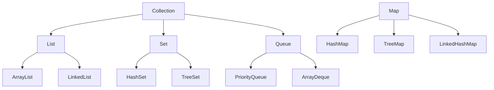

# CPSC 310: Software Design

## Week 2: Object-Oriented Programming in Java

### Fall 2025
Prof. Ken Kousen

---
transition: fade-out
---

# Week 2 Overview

<div class="grid grid-cols-2 gap-10">

<div>

## Session 3: Tuesday
### Inheritance & Polymorphism

- Inheritance with `extends`
- Method overriding
- Abstract classes
- Polymorphism in action
- Spring service inheritance

</div>

<div>

## Session 4: Thursday
### Interfaces & Collections

- Interface contracts
- Multiple inheritance via interfaces
- Java Collections Framework
- Generics basics
- Collections in Spring services

</div>

</div>

---

# From Last Week to This Week

<div class="grid grid-cols-2 gap-8">

<div>

## What You Built (Week 1)
- Basic Spring Boot API
- Simple CRUD operations
- Entity classes
- Basic tests passing

</div>

<div>

## What You'll Build (Week 2)
- Service layer hierarchy
- Repository interfaces
- Collection-based storage
- Polymorphic behavior
- 80%+ test coverage

</div>

</div>

<div class="mt-8 p-4 bg-blue-100 rounded">

**Key Evolution:** From simple classes to sophisticated object hierarchies

</div>

---
layout: section
---

# Session 3
## Inheritance & Polymorphism

<div class="text-6xl">🏗️</div>

---

# The Power of Inheritance

## Building on What Exists

<v-clicks>

- 🔄 **Reuse** - Don't repeat yourself (DRY)
- 📦 **Extend** - Add new capabilities
- 🎯 **Specialize** - Create specific implementations
- 🔧 **Override** - Change behavior when needed
- 🏛️ **Organize** - Create logical hierarchies

</v-clicks>

<div class="mt-8 p-4 bg-green-100 rounded">

**In Spring Boot:** Every `@Service`, `@Repository`, and `@Controller` uses inheritance!

</div>

---

# Basic Inheritance in Java

<div class="grid grid-cols-2 gap-6">

<div>

## Parent Class (Superclass)
```java
public class Employee {
    protected String name;
    protected double salary;
    
    public Employee(String name, double salary) {
        this.name = name;
        this.salary = salary;
    }
    
    public double calculatePay() {
        return salary / 12;
    }
}
```

</div>

<div>

## Child Class (Subclass)
```java
public class Manager extends Employee {
    private double bonus;
    
    public Manager(String name, double salary, 
                   double bonus) {
        super(name, salary);  // Call parent constructor
        this.bonus = bonus;
    }
    
    @Override
    public double calculatePay() {
        return super.calculatePay() + (bonus / 12);
    }
}
```

</div>

</div>

---

# Key Inheritance Concepts

<div class="grid grid-cols-2 gap-8">

<div>

## Access Modifiers in Inheritance

```java
public class Parent {
    public String a;     // Everyone
    protected String b;  // Package + subclasses
    String c;           // Package only
    private String d;   // This class only
}

public class Child extends Parent {
    void test() {
        this.a = "OK";  // ✅ public
        this.b = "OK";  // ✅ protected
        this.c = "OK";  // ✅ same package
        // this.d = "NO";  // ❌ private
    }
}
```

</div>

<div>

## Constructor Chaining

```java
public class Vehicle {
    private String brand;
    
    public Vehicle(String brand) {
        this.brand = brand;
        System.out.println("Vehicle created");
    }
}

public class Car extends Vehicle {
    private int doors;
    
    public Car(String brand, int doors) {
        super(brand);  // MUST be first line
        this.doors = doors;
        System.out.println("Car created");
    }
}
```

</div>

</div>

---

# Method Overriding

```java
public class Animal {
    public void makeSound() {
        System.out.println("Some generic sound");
    }
    
    public void move() {
        System.out.println("Moving");
    }
}

public class Dog extends Animal {
    @Override  // Always use this annotation!
    public void makeSound() {
        System.out.println("Woof!");
    }
    // move() is inherited as-is
}

public class Cat extends Animal {
    @Override
    public void makeSound() {
        System.out.println("Meow!");
    }
    
    @Override
    public void move() {
        System.out.println("Sneaking silently");
    }
}
```

**Key Point:** Use `@Override` to catch typos and ensure correct overriding

---

# Overriding vs Overloading

<div class="grid grid-cols-2 gap-6">

<div>

## Overriding (Runtime)
```java
class Shape {
    public double area() {
        return 0;
    }
}

class Circle extends Shape {
    private double radius;
    
    @Override  // Same signature
    public double area() {
        return Math.PI * radius * radius;
    }
}
```

**Same name, same parameters**
**Different implementation**

</div>

<div>

## Overloading (Compile-time)
```java
class Calculator {
    public int add(int a, int b) {
        return a + b;
    }
    
    // Different parameters
    public double add(double a, double b) {
        return a + b;
    }
    
    // Different number of parameters
    public int add(int a, int b, int c) {
        return a + b + c;
    }
}
```

**Same name, different parameters**
**Multiple methods coexist**

</div>

</div>

---

# Abstract Classes

## Templates for Subclasses

```java
public abstract class PaymentProcessor {
    protected double amount;
    
    // Abstract method - MUST be implemented by subclasses
    public abstract boolean processPayment(double amount);
    
    // Abstract method for validation
    public abstract boolean validatePaymentDetails();
    
    // Concrete method - inherited as-is
    public void logTransaction() {
        System.out.println("Transaction logged: $" + amount);
    }
    
    // Template method pattern
    public final boolean makePayment(double amount) {
        this.amount = amount;
        if (validatePaymentDetails() && processPayment(amount)) {
            logTransaction();
            return true;
        }
        return false;
    }
}
```

---

# Implementing Abstract Classes

```java
public class CreditCardProcessor extends PaymentProcessor {
    private String cardNumber;
    
    @Override
    public boolean processPayment(double amount) {
        // Actual credit card processing logic
        System.out.println("Processing $" + amount + " via credit card");
        return true;
    }
    
    @Override
    public boolean validatePaymentDetails() {
        return cardNumber != null && cardNumber.length() == 16;
    }
}

public class PayPalProcessor extends PaymentProcessor {
    private String email;
    
    @Override
    public boolean processPayment(double amount) {
        System.out.println("Processing $" + amount + " via PayPal");
        return true;
    }
    
    @Override
    public boolean validatePaymentDetails() {
        return email != null && email.contains("@");
    }
}
```

---

# Polymorphism in Action

## One Interface, Many Implementations

```java
public class PaymentService {
    public void processAllPayments(List<PaymentProcessor> processors) {
        for (PaymentProcessor processor : processors) {
            // Each processor uses its own implementation
            processor.makePayment(100.00);  // Polymorphic call
        }
    }
    
    public static void main(String[] args) {
        List<PaymentProcessor> processors = new ArrayList<>();
        processors.add(new CreditCardProcessor());
        processors.add(new PayPalProcessor());
        processors.add(new BitcoinProcessor());
        
        PaymentService service = new PaymentService();
        service.processAllPayments(processors);
        
        // Output:
        // Processing $100.0 via credit card
        // Transaction logged: $100.0
        // Processing $100.0 via PayPal
        // Transaction logged: $100.0
        // Processing $100.0 via Bitcoin
        // Transaction logged: $100.0
    }
}
```

---

# Spring Boot Service Hierarchy

## Real-World Example

```java
// Base service with common functionality
@Service
public abstract class BaseItemService<T extends BaseItem> {
    protected final List<T> items = new ArrayList<>();
    
    public T findById(Long id) {
        return items.stream()
            .filter(item -> item.getId().equals(id))
            .findFirst()
            .orElse(null);
    }
    
    public List<T> findAll() {
        return new ArrayList<>(items);
    }
    
    public abstract T create(T item);
    public abstract void validate(T item);
}

@Service
public class TaskService extends BaseItemService<Task> {
    @Override
    public Task create(Task task) {
        validate(task);
        task.setId(generateId());
        task.setCreatedAt(LocalDateTime.now());
        items.add(task);
        return task;
    }
    
    @Override
    public void validate(Task task) {
        if (task.getTitle() == null || task.getTitle().isEmpty()) {
            throw new IllegalArgumentException("Task title is required");
        }
    }
}
```

---

# instanceof and Type Casting

## Working with Polymorphic Types

```java
public class AnimalShelter {
    private List<Animal> animals = new ArrayList<>();
    
    public void feedAnimals() {
        for (Animal animal : animals) {
            // Check type before casting
            if (animal instanceof Dog) {
                Dog dog = (Dog) animal;  // Safe cast
                dog.wagTail();
            } else if (animal instanceof Cat) {
                Cat cat = (Cat) animal;
                cat.purr();
            }
            
            // All animals can eat (polymorphic)
            animal.eat();
        }
    }
    
    // Modern Java pattern matching (Java 17+)
    public void modernFeedAnimals() {
        for (Animal animal : animals) {
            switch (animal) {
                case Dog dog -> dog.wagTail();
                case Cat cat -> cat.purr();
                case Bird bird -> bird.fly();
                default -> System.out.println("Unknown animal");
            }
            animal.eat();
        }
    }
}
```

---

# Common Inheritance Pitfalls

<v-clicks>

## ❌ What NOT to Do

1. **Deep inheritance hierarchies** - Keep it shallow (max 3-4 levels)
2. **Inheriting for code reuse only** - Use composition when there's no "is-a" relationship
3. **Breaking LSP** - Subclasses should be substitutable for parent classes
4. **Forgetting @Override** - Always use the annotation
5. **Accessing private parent fields** - Use protected or getters

</v-clicks>

<div class="mt-8 p-4 bg-red-100 rounded">

**AI Alert:** ChatGPT often creates unnecessarily deep hierarchies. Always question if inheritance is needed!

</div>

---

# Testing Inheritance

```java
@Test
class InheritanceTest {
    @Test
    void testPolymorphism() {
        PaymentProcessor processor = new CreditCardProcessor();
        
        // Test polymorphic behavior
        assertTrue(processor instanceof PaymentProcessor);
        assertTrue(processor instanceof CreditCardProcessor);
        
        // Test method override
        boolean result = processor.processPayment(100.00);
        assertTrue(result);
    }
    
    @Test
    void testAbstractClassContract() {
        List<PaymentProcessor> processors = List.of(
            new CreditCardProcessor(),
            new PayPalProcessor(),
            new BitcoinProcessor()
        );
        
        // All implementations should fulfill contract
        processors.forEach(p -> {
            assertNotNull(p);
            assertDoesNotThrow(() -> p.makePayment(50.00));
        });
    }
}
```

---

# Live Coding: Service Hierarchy

## Let's Build a Spring Boot Service Hierarchy

<v-clicks>

1. Create abstract `BaseService` with common CRUD operations
2. Implement `TaskService` extending `BaseService`
3. Implement `ProjectService` with additional features
4. Add validation in each service
5. Test polymorphic behavior
6. Use AI to generate boilerplate, then fix issues

</v-clicks>

<div class="mt-8 p-4 bg-yellow-50 border-2 border-yellow-400 rounded">

**Demo Goal:** Show how inheritance reduces code duplication in Spring services

</div>

---
layout: center
---

# Break Time! ☕

## Next: Interfaces & Collections

<div class="text-6xl">⏸️</div>

---
layout: section
---

# Session 4
## Interfaces & Collections

<div class="text-6xl">🔌</div>

---

# Why Interfaces?

## Contracts Without Implementation

<v-clicks>

- 📝 **Define contracts** - What methods must exist
- 🔀 **Multiple inheritance** - Implement many interfaces
- 🎯 **Loose coupling** - Depend on abstractions
- 🔄 **Flexibility** - Swap implementations easily
- 🧪 **Testability** - Mock interfaces for testing

</v-clicks>

<div class="mt-8 p-4 bg-purple-100 rounded">

**Spring Boot Reality:** Almost everything is interface-based!

</div>

---

# Interface Basics

```java
// Interface definition
public interface PaymentGateway {
    // All methods are public abstract by default
    boolean charge(double amount, String currency);
    
    // Can have constants (public static final)
    int MAX_RETRY_ATTEMPTS = 3;
    
    // Default methods (Java 8+)
    default boolean charge(double amount) {
        return charge(amount, "USD");
    }
    
    // Static methods (Java 8+)
    static boolean isValidCurrency(String currency) {
        return List.of("USD", "EUR", "GBP").contains(currency);
    }
    
    // Private methods (Java 9+)
    private void log(String message) {
        System.out.println("[Payment] " + message);
    }
}
```

---

# Implementing Interfaces

```java
// A class can implement multiple interfaces
public class StripeGateway implements PaymentGateway, Auditable, Retryable {
    
    @Override
    public boolean charge(double amount, String currency) {
        // Implementation specific to Stripe
        System.out.println("Charging $" + amount + " via Stripe");
        return true;
    }
    
    @Override
    public void audit(String action) {
        // From Auditable interface
        System.out.println("Audit: " + action);
    }
    
    @Override
    public void retry(Runnable action) {
        // From Retryable interface
        for (int i = 0; i < MAX_RETRY_ATTEMPTS; i++) {
            try {
                action.run();
                break;
            } catch (Exception e) {
                System.out.println("Retry attempt " + (i + 1));
            }
        }
    }
}
```

---

# Interface vs Abstract Class

<div class="grid grid-cols-2 gap-6 text-sm">

<div>

## Interface
```java
public interface Vehicle {
    // No state (except constants)
    int MAX_SPEED = 200;
    
    // Abstract methods
    void start();
    void stop();
    
    // Default implementation
    default void honk() {
        System.out.println("Beep!");
    }
}

// Multiple inheritance
class Car implements Vehicle, Insurable {
    // Must implement all abstract methods
}
```

**Use when:**
- Defining contracts
- Need multiple inheritance
- No shared state needed

</div>

<div>

## Abstract Class
```java
public abstract class Vehicle {
    // Can have state
    protected String brand;
    protected int speed;
    
    // Constructor
    public Vehicle(String brand) {
        this.brand = brand;
    }
    
    // Mix of abstract and concrete
    public abstract void start();
    
    public void stop() {
        speed = 0;
    }
}

// Single inheritance
class Car extends Vehicle {
    // Must implement abstract methods
}
```

**Use when:**
- Sharing code implementation
- Need shared state
- Have common behavior

</div>

</div>

---

# Spring Repository Pattern

## Interface-Based Data Access

```java
// Define the contract
public interface TaskRepository {
    Task save(Task task);
    Optional<Task> findById(Long id);
    List<Task> findAll();
    void deleteById(Long id);
    List<Task> findByStatus(String status);
}

// In-memory implementation for development
@Repository
@Profile("dev")
public class InMemoryTaskRepository implements TaskRepository {
    private final Map<Long, Task> tasks = new HashMap<>();
    private Long nextId = 1L;
    
    @Override
    public Task save(Task task) {
        if (task.getId() == null) {
            task.setId(nextId++);
        }
        tasks.put(task.getId(), task);
        return task;
    }
    
    @Override
    public Optional<Task> findById(Long id) {
        return Optional.ofNullable(tasks.get(id));
    }
    
    // ... other methods
}
```

---

# Dependency Injection with Interfaces

```java
@RestController
@RequestMapping("/tasks")
public class TaskController {
    // Depend on interface, not implementation
    private final TaskRepository repository;
    
    // Spring injects the implementation
    public TaskController(TaskRepository repository) {
        this.repository = repository;
    }
    
    @GetMapping("/{id}")
    public ResponseEntity<Task> getTask(@PathVariable Long id) {
        return repository.findById(id)
            .map(ResponseEntity::ok)
            .orElse(ResponseEntity.notFound().build());
    }
}

// Easy to test with mock
@Test
class TaskControllerTest {
    @Mock
    private TaskRepository repository;
    
    @Test
    void testGetTask() {
        // Given
        Task task = new Task("Test Task");
        when(repository.findById(1L)).thenReturn(Optional.of(task));
        
        // When & Then
        // ... test the controller
    }
}
```

---

# Functional Interfaces

## Foundation for Lambdas

```java
// Functional interface - exactly one abstract method
@FunctionalInterface
public interface TaskFilter {
    boolean test(Task task);
}

// Using with lambda
public class TaskService {
    private List<Task> tasks = new ArrayList<>();
    
    public List<Task> filterTasks(TaskFilter filter) {
        List<Task> result = new ArrayList<>();
        for (Task task : tasks) {
            if (filter.test(task)) {  // Apply the filter
                result.add(task);
            }
        }
        return result;
    }
    
    public void example() {
        // Lambda expression implements the interface
        List<Task> completed = filterTasks(task -> task.isCompleted());
        List<Task> highPriority = filterTasks(task -> task.getPriority() > 5);
        List<Task> overdue = filterTasks(task -> 
            task.getDueDate().isBefore(LocalDate.now()));
    }
}
```

---

# Java Collections Framework

## The Interface Hierarchy



<div class="mt-4 p-4 bg-blue-50 rounded">

**Key Principle:** Program to interfaces, not implementations!

</div>

---

# List Interface

## Ordered, Indexed, Duplicates Allowed

```java
public class ListExamples {
    public void demonstrateLists() {
        // Program to interface
        List<String> names = new ArrayList<>();  // Fast random access
        // List<String> names = new LinkedList<>();  // Fast insertion/deletion
        
        // Basic operations
        names.add("Alice");
        names.add("Bob");
        names.add("Alice");  // Duplicates OK
        
        // Indexed access
        String first = names.get(0);
        names.set(1, "Robert");
        
        // Iteration
        for (String name : names) {
            System.out.println(name);
        }
        
        // Stream operations
        List<String> filtered = names.stream()
            .filter(name -> name.startsWith("A"))
            .map(String::toUpperCase)
            .collect(Collectors.toList());
    }
}
```

---

# Set Interface

## Unique Elements, No Duplicates

```java
public class SetExamples {
    public void demonstrateSets() {
        // HashSet - Fast, unordered
        Set<String> tags = new HashSet<>();
        tags.add("java");
        tags.add("spring");
        tags.add("java");  // Ignored - duplicate
        
        // TreeSet - Sorted
        Set<Integer> scores = new TreeSet<>();
        scores.addAll(List.of(85, 92, 78, 92, 88));
        // Results in: [78, 85, 88, 92] - sorted, no duplicates
        
        // Set operations
        Set<String> skills1 = Set.of("Java", "Spring", "SQL");
        Set<String> skills2 = Set.of("Java", "Python", "SQL");
        
        // Intersection
        Set<String> common = new HashSet<>(skills1);
        common.retainAll(skills2);  // [Java, SQL]
        
        // Union
        Set<String> all = new HashSet<>(skills1);
        all.addAll(skills2);  // [Java, Spring, SQL, Python]
    }
}
```

---

# Map Interface

## Key-Value Pairs

```java
public class MapExamples {
    public void demonstrateMaps() {
        // HashMap - Fast, unordered
        Map<String, Integer> wordCount = new HashMap<>();
        
        // Basic operations
        wordCount.put("hello", 1);
        wordCount.put("world", 2);
        
        // Update with compute
        wordCount.compute("hello", (k, v) -> v == null ? 1 : v + 1);
        
        // Get with default
        int count = wordCount.getOrDefault("missing", 0);
        
        // Iteration
        for (Map.Entry<String, Integer> entry : wordCount.entrySet()) {
            System.out.println(entry.getKey() + ": " + entry.getValue());
        }
        
        // Modern iteration
        wordCount.forEach((word, freq) -> 
            System.out.println(word + " appears " + freq + " times"));
        
        // Useful methods
        boolean hasHello = wordCount.containsKey("hello");
        Set<String> words = wordCount.keySet();
        Collection<Integer> frequencies = wordCount.values();
    }
}
```

---

# Collections in Spring Services

## Real-World Example

```java
@Service
public class TaskManagementService {
    // Using Map for fast lookup
    private final Map<Long, Task> taskById = new HashMap<>();
    
    // Using List for ordered results
    private final List<Task> taskHistory = new ArrayList<>();
    
    // Using Set for unique tags
    private final Set<String> availableTags = new HashSet<>();
    
    public Task createTask(Task task) {
        task.setId(generateId());
        taskById.put(task.getId(), task);
        taskHistory.add(task);
        
        // Extract and store unique tags
        if (task.getTags() != null) {
            availableTags.addAll(task.getTags());
        }
        
        return task;
    }
    
    public List<Task> findTasksByTag(String tag) {
        return taskById.values().stream()
            .filter(task -> task.getTags().contains(tag))
            .collect(Collectors.toList());
    }
    
    public Map<String, List<Task>> groupTasksByStatus() {
        return taskById.values().stream()
            .collect(Collectors.groupingBy(Task::getStatus));
    }
}
```

---

# Generics with Collections

## Type Safety at Compile Time

```java
public class GenericRepository<T extends BaseEntity> {
    private final Map<Long, T> entities = new HashMap<>();
    
    public T save(T entity) {
        entities.put(entity.getId(), entity);
        return entity;
    }
    
    public Optional<T> findById(Long id) {
        return Optional.ofNullable(entities.get(id));
    }
    
    public List<T> findAll() {
        return new ArrayList<>(entities.values());
    }
    
    // Generic method
    public <R> List<R> extractField(Function<T, R> extractor) {
        return entities.values().stream()
            .map(extractor)
            .collect(Collectors.toList());
    }
}

// Usage
GenericRepository<Task> taskRepo = new GenericRepository<>();
GenericRepository<Project> projectRepo = new GenericRepository<>();

List<String> taskTitles = taskRepo.extractField(Task::getTitle);
List<String> projectNames = projectRepo.extractField(Project::getName);
```

---

# Common Collection Patterns

```java
public class CollectionPatterns {
    
    // 1. Defensive copying
    public List<Task> getTasks() {
        return new ArrayList<>(tasks);  // Return copy, not original
    }
    
    // 2. Immutable collections
    public Set<String> getRequiredFields() {
        return Set.of("title", "description", "dueDate");  // Immutable
    }
    
    // 3. Null-safe operations
    public List<String> getTags(Task task) {
        return task.getTags() != null 
            ? new ArrayList<>(task.getTags()) 
            : Collections.emptyList();
    }
    
    // 4. Collection transformation
    public Map<String, Long> countTasksByStatus(List<Task> tasks) {
        return tasks.stream()
            .collect(Collectors.groupingBy(
                Task::getStatus,
                Collectors.counting()
            ));
    }
    
    // 5. Filtering and mapping
    public List<String> getOverdueTaskTitles(List<Task> tasks) {
        return tasks.stream()
            .filter(task -> task.getDueDate().isBefore(LocalDate.now()))
            .map(Task::getTitle)
            .collect(Collectors.toList());
    }
}
```

---

# AI Collaboration Tips

## Getting Better Collection Code from AI

<v-clicks>

### ✅ Good Prompts

- "Create a service that uses a Map to cache tasks by ID"
- "Implement a method that groups tasks by status using Collectors"
- "Show me how to use Set operations to find common tags"

### ❌ AI Common Mistakes

- Using raw types: `List list = new ArrayList();`
- Not handling nulls: Direct access without checks
- Modifying while iterating: ConcurrentModificationException
- Using implementation types in method signatures
- Creating deep copies when shallow would suffice

</v-clicks>

<div class="mt-6 p-4 bg-yellow-100 rounded">

**Pro Tip:** Always ask AI to use generics and handle edge cases!

</div>

---

# Testing Collections

```java
@Test
class CollectionServiceTest {
    private TaskService service;
    
    @BeforeEach
    void setup() {
        service = new TaskService();
    }
    
    @Test
    void testUniqueTagsExtraction() {
        // Given
        Task task1 = new Task("Task 1", Set.of("java", "spring"));
        Task task2 = new Task("Task 2", Set.of("java", "docker"));
        service.addTask(task1);
        service.addTask(task2);
        
        // When
        Set<String> allTags = service.getAllUniqueTags();
        
        // Then
        assertThat(allTags)
            .hasSize(3)
            .containsExactlyInAnyOrder("java", "spring", "docker");
    }
    
    @Test
    void testGroupingByPriority() {
        // Given - tasks with different priorities
        // When
        Map<Priority, List<Task>> grouped = service.groupByPriority();
        
        // Then
        assertThat(grouped).containsKeys(Priority.HIGH, Priority.LOW);
        assertThat(grouped.get(Priority.HIGH)).hasSize(2);
    }
}
```

---

# Assignment 2 Preview

## Team Assignment: Service Layer with Collections

<div class="grid grid-cols-2 gap-6">

<div>

### Requirements
- Implement service layer with inheritance
- Use appropriate collections
- Create repository interfaces
- Add business logic methods
- Achieve 80% test coverage

</div>

<div>

### Deliverables
- Service hierarchy (abstract + concrete)
- Repository interfaces + implementations
- Collection-based data management
- Comprehensive tests
- AI usage documentation

</div>

</div>

<div class="mt-6 p-4 bg-green-100 rounded">

**Due:** Thursday, September 18 at 11:59 PM

</div>

---

# Repository Analysis Assignment

## Individual Work: Analyze Spring Framework

### Your Task (Due Sept 18)
1. Choose a Spring Boot project from GitHub (>1000 stars)
2. Analyze their use of:
   - Inheritance patterns
   - Interface design
   - Collection usage
3. Write a 2-page analysis covering:
   - Good OOP practices you found
   - Potential improvements
   - How they handle polymorphism

<div class="mt-4 p-4 bg-purple-100 rounded">

**Tip:** Look at projects like Spring PetClinic, Spring Boot Admin, or JHipster

</div>

---

# Key Takeaways

<v-clicks>

## This Week You Learned

1. **Inheritance** - Extend and specialize classes
2. **Polymorphism** - One interface, many behaviors
3. **Abstract Classes** - Templates for concrete classes
4. **Interfaces** - Contracts for implementation
5. **Collections** - List, Set, Map usage
6. **Spring Patterns** - Service/Repository layers

</v-clicks>

<div class="mt-8 p-4 bg-blue-100 rounded">

**Remember:** Good OOP design makes code maintainable and testable!

</div>

---

# Practice Problems

## Try These Before Next Class

```java
// 1. Create an animal hierarchy
// Base: Animal (abstract)
// Subclasses: Dog, Cat, Bird
// Each with unique behaviors

// 2. Design a payment system
// Interface: PaymentMethod
// Implementations: CreditCard, PayPal, Bitcoin
// Service class that processes any payment method

// 3. Build a generic cache
// Use Map for storage
// Implement TTL (time-to-live)
// Support any object type

// 4. Collection operations
// Find duplicates in a List
// Merge two Sets
// Invert a Map (swap keys and values)
```

---

# Common Interview Questions

## Be Prepared to Answer

<v-clicks>

1. **What's the difference between abstract class and interface?**
2. **When would you use inheritance vs composition?**
3. **Explain polymorphism with an example**
4. **What's the Liskov Substitution Principle?**
5. **How does HashMap work internally?**
6. **What's the difference between ArrayList and LinkedList?**
7. **When would you use Set vs List?**
8. **How do you handle concurrent modifications to collections?**

</v-clicks>

---

# Resources & Help

## Where to Get Support

<div class="grid grid-cols-2 gap-6">

<div>

### Documentation
- [Java Documentation](https://docs.oracle.com/en/java/)
- [Spring Guides](https://spring.io/guides)
- [Baeldung Tutorials](https://www.baeldung.com)
- Course GitHub repository

</div>

<div>

### Getting Help
- Office Hours: Wed 1:30-3:00 PM
- Moodle discussion forum
- Team members
- Stack Overflow (search first!)

</div>

</div>

<div class="mt-8 p-4 bg-yellow-100 rounded">

**Pro Tip:** Read error messages carefully - Java's are very descriptive!

</div>

---

# Action Items

## Before Tuesday's Class

<v-clicks>

- [ ] Complete Assignment 1 (Due Sept 11)
- [ ] Set up team communication channel
- [ ] Review inheritance examples in course repo
- [ ] Try the practice problems
- [ ] Start thinking about your service design

</v-clicks>

## Before Thursday's Class

<v-clicks>

- [ ] Implement service layer (Assignment 2)
- [ ] Find a Spring project to analyze
- [ ] Run all tests in your project
- [ ] Document AI usage and learnings

</v-clicks>

---
layout: center
---

# Questions?

## Ready for Advanced OOP?

### 📧 kkousen@trincoll.edu
### 🏢 Office Hours: Wed 1:30-3:00 PM

---
layout: end
---

# See You Tuesday!

## Week 2 Goals
✅ Master inheritance & polymorphism  
✅ Understand interfaces & contracts  
✅ Use collections effectively  
✅ Build service layers  

### Next Week: Spring Boot & REST APIs

<div class="text-6xl mt-8">💪</div>