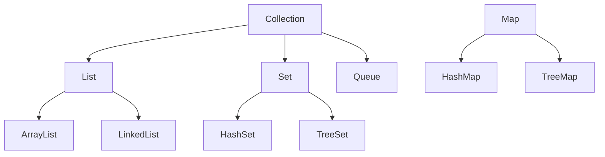

# CPSC 310: Software Design

## Week 2: Object-Oriented Programming in Java

### Fall 2025
Prof. Ken Kousen

---
transition: fade-out
---

# Week 2 Overview

<div class="grid grid-cols-2 gap-10">

<div>

## Session 3: Tuesday
### Inheritance & Polymorphism

- Inheritance with `extends`
- Method overriding
- Abstract classes
- Polymorphism in action
- Spring service inheritance

</div>

<div>

## Session 4: Thursday
### Interfaces & Collections

- Interface contracts
- Multiple inheritance via interfaces
- Java Collections Framework
- Generics basics
- Collections in Spring services

</div>

</div>

---

# From Last Week to This Week

<div class="grid grid-cols-2 gap-8">

<div>

## What You Built (Week 1)
- Basic Spring Boot API
- Simple CRUD operations
- Entity classes
- Basic tests passing

</div>

<div>

## What You'll Build (Week 2)
- Service layer hierarchy
- Repository interfaces
- Collection-based storage
- Polymorphic behavior
- 80%+ test coverage

</div>

</div>

<div class="mt-8 p-4 bg-blue-100 rounded">

**Key Evolution:** From simple classes to sophisticated object hierarchies

</div>

---
layout: section
---

# Session 3
## Inheritance & Polymorphism

<div class="text-6xl">🏗️</div>

---

# The Power of Inheritance

## Building on What Exists

<v-clicks>

- 🔄 **Reuse** - Don't repeat yourself (DRY)
- 📦 **Extend** - Add new capabilities
- 🎯 **Specialize** - Create specific implementations
- 🔧 **Override** - Change behavior when needed
- 🏛️ **Organize** - Create logical hierarchies

</v-clicks>

<div class="mt-8 p-4 bg-green-100 rounded">

**In Spring Boot:** Every `@Service`, `@Repository`, and `@Controller` uses inheritance!

</div>

---

# Parent Class (Superclass)

```java
public class Employee {
    protected String name;
    protected double salary;
    
    public Employee(String name, double salary) {
        this.name = name;
        this.salary = salary;
    }
    
    public double calculatePay() {
        return salary / 12;
    }
}
```

**Key Points:**
- `protected` allows subclass access
- Constructor initializes state
- Methods can be inherited or overridden

---

# Child Class (Subclass)

```java
public class Manager extends Employee {
    private double bonus;
    
    public Manager(String name, double salary, double bonus) {
        super(name, salary);  // Call parent constructor
        this.bonus = bonus;
    }
    
    @Override
    public double calculatePay() {
        return super.calculatePay() + (bonus / 12);
    }
}
```

**Key Points:**
- `extends` creates inheritance relationship
- `super()` must be first in constructor
- `@Override` for safety

---

# Access Modifiers in Inheritance

```java
public class Parent {
    public String a;     // Everyone
    protected String b;  // Package + subclasses
    String c;           // Package only
    private String d;   // This class only
}

public class Child extends Parent {
    void test() {
        this.a = "OK";  // ✅ public
        this.b = "OK";  // ✅ protected
        this.c = "OK";  // ✅ same package
        // this.d = "NO";  // ❌ private
    }
}
```

---

# Constructor Chaining

```java
public class Vehicle {
    private String brand;
    
    public Vehicle(String brand) {
        this.brand = brand;
        System.out.println("Vehicle created");
    }
}

public class Car extends Vehicle {
    private int doors;
    
    public Car(String brand, int doors) {
        super(brand);  // MUST be first line
        this.doors = doors;
        System.out.println("Car created");
    }
}
```

Output: "Vehicle created" then "Car created"

---

# Method Overriding - Base Class

```java
public class Animal {
    public void makeSound() {
        System.out.println("Some generic sound");
    }
    
    public void move() {
        System.out.println("Moving");
    }
}
```

---

# Method Overriding - Subclasses

```java
public class Dog extends Animal {
    @Override  // Always use this annotation!
    public void makeSound() {
        System.out.println("Woof!");
    }
    // move() is inherited as-is
}

public class Cat extends Animal {
    @Override
    public void makeSound() {
        System.out.println("Meow!");
    }
    
    @Override
    public void move() {
        System.out.println("Sneaking silently");
    }
}
```

---

# Overriding (Runtime Polymorphism)

```java
class Shape {
    public double area() {
        return 0;
    }
}

class Circle extends Shape {
    private double radius;
    
    @Override  // Same signature
    public double area() {
        return Math.PI * radius * radius;
    }
}
```

**Key:** Same name, same parameters, different implementation

---

# Overloading (Compile-time)

```java
class Calculator {
    public int add(int a, int b) {
        return a + b;
    }
    
    // Different parameter types
    public double add(double a, double b) {
        return a + b;
    }
    
    // Different number of parameters
    public int add(int a, int b, int c) {
        return a + b + c;
    }
}
```

**Key:** Same name, different parameters

---

# Abstract Class Definition

```java
public abstract class PaymentProcessor {
    protected double amount;
    
    // Abstract methods - subclasses MUST implement
    public abstract boolean processPayment(double amount);
    public abstract boolean validatePaymentDetails();
    
    // Concrete method - inherited as-is
    public void logTransaction() {
        System.out.println("Transaction logged: $" + amount);
    }
}
```

---

# Template Method Pattern

```java
public abstract class PaymentProcessor {
    // Template method - defines algorithm structure
    public final boolean makePayment(double amount) {
        this.amount = amount;
        
        if (validatePaymentDetails() && 
            processPayment(amount)) {
            logTransaction();
            return true;
        }
        return false;
    }
}
```

Subclasses provide specific implementations

---

# Implementing Abstract Classes - Part 1

```java
public class CreditCardProcessor extends PaymentProcessor {
    private String cardNumber;
    
    @Override
    public boolean processPayment(double amount) {
        System.out.println("Processing $" + amount + 
                          " via credit card");
        return true;
    }
    
    @Override
    public boolean validatePaymentDetails() {
        return cardNumber != null && 
               cardNumber.length() == 16;
    }
}
```

---

# Implementing Abstract Classes - Part 2

```java
public class PayPalProcessor extends PaymentProcessor {
    private String email;
    
    @Override
    public boolean processPayment(double amount) {
        System.out.println("Processing $" + amount + 
                          " via PayPal");
        return true;
    }
    
    @Override
    public boolean validatePaymentDetails() {
        return email != null && email.contains("@");
    }
}
```

---

# Polymorphism in Action

```java
public class PaymentService {
    public void processAllPayments(
            List<PaymentProcessor> processors) {
        
        for (PaymentProcessor processor : processors) {
            // Each uses its own implementation
            processor.makePayment(100.00);
        }
    }
}
```

Each processor type executes its specific implementation!

---

# Using Polymorphism

```java
public static void main(String[] args) {
    List<PaymentProcessor> processors = new ArrayList<>();
    processors.add(new CreditCardProcessor());
    processors.add(new PayPalProcessor());
    
    PaymentService service = new PaymentService();
    service.processAllPayments(processors);
}

// Output:
// Processing $100.0 via credit card
// Transaction logged: $100.0
// Processing $100.0 via PayPal
// Transaction logged: $100.0
```

---

# Spring Boot Base Service

```java
@Service
public abstract class BaseItemService<T extends BaseItem> {
    protected final List<T> items = new ArrayList<>();
    
    public T findById(Long id) {
        return items.stream()
            .filter(item -> item.getId().equals(id))
            .findFirst()
            .orElse(null);
    }
    
    public abstract T create(T item);
    public abstract void validate(T item);
}
```

---

# Spring Boot Concrete Service

```java
@Service
public class TaskService extends BaseItemService<Task> {
    @Override
    public Task create(Task task) {
        validate(task);
        task.setId(generateId());
        task.setCreatedAt(LocalDateTime.now());
        items.add(task);
        return task;
    }
    
    @Override
    public void validate(Task task) {
        if (task.getTitle() == null) {
            throw new IllegalArgumentException(
                "Task title is required");
        }
    }
}
```

---

# instanceof and Type Casting

```java
public void feedAnimals(List<Animal> animals) {
    for (Animal animal : animals) {
        // Check type before casting
        if (animal instanceof Dog) {
            Dog dog = (Dog) animal;  // Safe cast
            dog.wagTail();
        } else if (animal instanceof Cat) {
            Cat cat = (Cat) animal;
            cat.purr();
        }
        
        // All animals can eat (polymorphic)
        animal.eat();
    }
}
```

---

# Modern Pattern Matching (Java 17+)

```java
public void modernFeedAnimals(List<Animal> animals) {
    for (Animal animal : animals) {
        switch (animal) {
            case Dog dog -> dog.wagTail();
            case Cat cat -> cat.purr();
            case Bird bird -> bird.fly();
            default -> System.out.println("Unknown");
        }
        animal.eat();
    }
}
```

Much cleaner syntax!

---

# Common Inheritance Pitfalls

<v-clicks>

## ❌ What NOT to Do

1. **Deep inheritance hierarchies** - Keep it shallow (max 3-4 levels)
2. **Inheriting for code reuse only** - Use composition when there's no "is-a" relationship
3. **Breaking LSP** - Subclasses should be substitutable for parent classes
4. **Forgetting @Override** - Always use the annotation
5. **Accessing private parent fields** - Use protected or getters

</v-clicks>

<div class="mt-8 p-4 bg-red-100 rounded">

**AI Alert:** ChatGPT often creates unnecessarily deep hierarchies!

</div>

---

# Testing Polymorphism

```java
@Test
void testPolymorphism() {
    PaymentProcessor processor = new CreditCardProcessor();
    
    // Test polymorphic behavior
    assertTrue(processor instanceof PaymentProcessor);
    assertTrue(processor instanceof CreditCardProcessor);
    
    // Test method override
    boolean result = processor.processPayment(100.00);
    assertTrue(result);
}
```

---

# Testing Abstract Classes

```java
@Test
void testAbstractClassContract() {
    List<PaymentProcessor> processors = List.of(
        new CreditCardProcessor(),
        new PayPalProcessor()
    );
    
    // All implementations should fulfill contract
    processors.forEach(p -> {
        assertNotNull(p);
        assertDoesNotThrow(() -> p.makePayment(50.00));
    });
}
```

---

# Live Coding: Service Hierarchy

## Let's Build a Spring Boot Service Hierarchy

<v-clicks>

1. Create abstract `BaseService` with common CRUD operations
2. Implement `TaskService` extending `BaseService`
3. Implement `ProjectService` with additional features
4. Add validation in each service
5. Test polymorphic behavior
6. Use AI to generate boilerplate, then fix issues

</v-clicks>

<div class="mt-8 p-4 bg-yellow-50 border-2 border-yellow-400 rounded">

**Demo Goal:** Show how inheritance reduces code duplication

</div>

---
layout: center
---

# Break Time! ☕

## Next: Interfaces & Collections

<div class="text-6xl">⏸️</div>

---
layout: section
---

# Session 4
## Interfaces & Collections

<div class="text-6xl">🔌</div>

---

# Why Interfaces?

## Contracts Without Implementation

<v-clicks>

- 📝 **Define contracts** - What methods must exist
- 🔀 **Multiple inheritance** - Implement many interfaces
- 🎯 **Loose coupling** - Depend on abstractions
- 🔄 **Flexibility** - Swap implementations easily
- 🧪 **Testability** - Mock interfaces for testing

</v-clicks>

<div class="mt-8 p-4 bg-purple-100 rounded">

**Spring Boot Reality:** Almost everything is interface-based!

</div>

---

# Interface Definition

```java
public interface PaymentGateway {
    // Abstract method (public by default)
    boolean charge(double amount, String currency);
    
    // Constant (public static final)
    int MAX_RETRY_ATTEMPTS = 3;
    
    // Default method (Java 8+)
    default boolean charge(double amount) {
        return charge(amount, "USD");
    }
}
```

---

# Interface Features (Java 8+)

```java
public interface PaymentGateway {
    // Static method (Java 8+)
    static boolean isValidCurrency(String currency) {
        return List.of("USD", "EUR", "GBP")
                   .contains(currency);
    }
    
    // Private method (Java 9+)
    private void log(String message) {
        System.out.println("[Payment] " + message);
    }
}
```

---

# Implementing Multiple Interfaces

```java
public class StripeGateway 
    implements PaymentGateway, Auditable, Retryable {
    
    @Override
    public boolean charge(double amount, String currency) {
        System.out.println("Charging via Stripe");
        return true;
    }
    
    @Override
    public void audit(String action) {
        System.out.println("Audit: " + action);
    }
    
    @Override
    public void retry(Runnable action) {
        // Retry logic
    }
}
```

---

# Interface vs Abstract Class

<div class="grid grid-cols-2 gap-4 text-sm">

<div>

## Interface
- No state (except constants)
- Multiple inheritance
- All methods public
- Default methods allowed

**Use for:** Contracts, capabilities

</div>

<div>

## Abstract Class
- Can have state
- Single inheritance
- Any access modifier
- Mix of abstract/concrete

**Use for:** Shared implementation

</div>

</div>

---

# Spring Repository Interface

```java
public interface TaskRepository {
    Task save(Task task);
    Optional<Task> findById(Long id);
    List<Task> findAll();
    void deleteById(Long id);
    List<Task> findByStatus(String status);
}
```

Defines the contract for data access

---

# Repository Implementation

```java
@Repository
@Profile("dev")
public class InMemoryTaskRepository 
    implements TaskRepository {
    
    private final Map<Long, Task> tasks = new HashMap<>();
    private Long nextId = 1L;
    
    @Override
    public Task save(Task task) {
        if (task.getId() == null) {
            task.setId(nextId++);
        }
        tasks.put(task.getId(), task);
        return task;
    }
}
```

---

# Dependency Injection with Interfaces

```java
@RestController
@RequestMapping("/tasks")
public class TaskController {
    // Depend on interface, not implementation
    private final TaskRepository repository;
    
    // Spring injects the implementation
    public TaskController(TaskRepository repository) {
        this.repository = repository;
    }
    
    @GetMapping("/{id}")
    public ResponseEntity<Task> getTask(@PathVariable Long id) {
        return repository.findById(id)
            .map(ResponseEntity::ok)
            .orElse(ResponseEntity.notFound().build());
    }
}
```

---

# Testing with Mock Interfaces

```java
@Test
class TaskControllerTest {
    @Mock
    private TaskRepository repository;
    
    @Test
    void testGetTask() {
        // Given
        Task task = new Task("Test Task");
        when(repository.findById(1L))
            .thenReturn(Optional.of(task));
        
        // When & Then - test the controller
        // Mock makes testing easy!
    }
}
```

---

# Functional Interfaces

```java
@FunctionalInterface
public interface TaskFilter {
    boolean test(Task task);  // Single abstract method
}

public class TaskService {
    public List<Task> filterTasks(TaskFilter filter) {
        List<Task> result = new ArrayList<>();
        for (Task task : tasks) {
            if (filter.test(task)) {
                result.add(task);
            }
        }
        return result;
    }
}
```

---

# Using Lambdas with Functional Interfaces

```java
public void example() {
    TaskService service = new TaskService();
    
    // Lambda implements the functional interface
    List<Task> completed = 
        service.filterTasks(task -> task.isCompleted());
    
    List<Task> highPriority = 
        service.filterTasks(task -> task.getPriority() > 5);
    
    List<Task> overdue = 
        service.filterTasks(task -> 
            task.getDueDate().isBefore(LocalDate.now()));
}
```

---

# Java Collections Framework

## The Interface Hierarchy



**Key:** Program to interfaces, not implementations!

---

# List Interface - Basics

```java
// Program to interface
List<String> names = new ArrayList<>();

// Basic operations
names.add("Alice");
names.add("Bob");
names.add("Alice");  // Duplicates OK

// Indexed access
String first = names.get(0);
names.set(1, "Robert");

// Size
int count = names.size();
```

---

# List Interface - Iteration and Streams

```java
// Traditional iteration
for (String name : names) {
    System.out.println(name);
}

// Stream operations
List<String> filtered = names.stream()
    .filter(name -> name.startsWith("A"))
    .map(String::toUpperCase)
    .collect(Collectors.toList());
```

---

# Set Interface - Basics

```java
// HashSet - Fast, unordered
Set<String> tags = new HashSet<>();
tags.add("java");
tags.add("spring");
tags.add("java");  // Ignored - duplicate

// TreeSet - Sorted
Set<Integer> scores = new TreeSet<>();
scores.addAll(List.of(85, 92, 78, 92, 88));
// Result: [78, 85, 88, 92] - sorted, no duplicates
```

---

# Set Operations

```java
Set<String> skills1 = Set.of("Java", "Spring", "SQL");
Set<String> skills2 = Set.of("Java", "Python", "SQL");

// Intersection (common elements)
Set<String> common = new HashSet<>(skills1);
common.retainAll(skills2);  // [Java, SQL]

// Union (all elements)
Set<String> all = new HashSet<>(skills1);
all.addAll(skills2);  // [Java, Spring, SQL, Python]

// Difference
Set<String> unique = new HashSet<>(skills1);
unique.removeAll(skills2);  // [Spring]
```

---

# Map Interface - Basics

```java
Map<String, Integer> wordCount = new HashMap<>();

// Basic operations
wordCount.put("hello", 1);
wordCount.put("world", 2);

// Get with default
int count = wordCount.getOrDefault("missing", 0);

// Check existence
boolean hasHello = wordCount.containsKey("hello");

// Get all keys and values
Set<String> words = wordCount.keySet();
Collection<Integer> counts = wordCount.values();
```

---

# Map Interface - Advanced Operations

```java
// Update with compute
wordCount.compute("hello", 
    (k, v) -> v == null ? 1 : v + 1);

// Iterate entries
for (Map.Entry<String, Integer> entry : 
     wordCount.entrySet()) {
    System.out.println(entry.getKey() + ": " + 
                      entry.getValue());
}

// Modern iteration
wordCount.forEach((word, freq) -> 
    System.out.println(word + " appears " + freq));
```

---

# Collections in Spring Service

```java
@Service
public class TaskManagementService {
    // Map for fast lookup
    private final Map<Long, Task> taskById = new HashMap<>();
    
    // List for ordered results
    private final List<Task> taskHistory = new ArrayList<>();
    
    // Set for unique tags
    private final Set<String> availableTags = new HashSet<>();
}
```

---

# Service Methods with Collections

```java
public Task createTask(Task task) {
    task.setId(generateId());
    taskById.put(task.getId(), task);
    taskHistory.add(task);
    
    // Extract unique tags
    if (task.getTags() != null) {
        availableTags.addAll(task.getTags());
    }
    
    return task;
}

public List<Task> findTasksByTag(String tag) {
    return taskById.values().stream()
        .filter(task -> task.getTags().contains(tag))
        .collect(Collectors.toList());
}
```

---

# Generics with Collections

```java
public class GenericRepository<T extends BaseEntity> {
    private final Map<Long, T> entities = new HashMap<>();
    
    public T save(T entity) {
        entities.put(entity.getId(), entity);
        return entity;
    }
    
    public Optional<T> findById(Long id) {
        return Optional.ofNullable(entities.get(id));
    }
    
    public List<T> findAll() {
        return new ArrayList<>(entities.values());
    }
}
```

---

# Using Generic Repository

```java
// Type-safe repositories
GenericRepository<Task> taskRepo = 
    new GenericRepository<>();
    
GenericRepository<Project> projectRepo = 
    new GenericRepository<>();

// Compile-time type checking
Task task = taskRepo.findById(1L).orElse(null);
Project project = projectRepo.findById(1L).orElse(null);
```

---

# Defensive Copying Pattern

```java
public class CollectionPatterns {
    private List<Task> tasks = new ArrayList<>();
    
    // Return copy, not original
    public List<Task> getTasks() {
        return new ArrayList<>(tasks);
    }
    
    // Immutable collections
    public Set<String> getRequiredFields() {
        return Set.of("title", "description", "dueDate");
    }
}
```

---

# Null-Safe Collection Operations

```java
// Handle null collections safely
public List<String> getTags(Task task) {
    return task.getTags() != null 
        ? new ArrayList<>(task.getTags()) 
        : Collections.emptyList();
}

// Never return null
public List<Task> findTasks(String query) {
    if (query == null || query.isEmpty()) {
        return Collections.emptyList();
    }
    // ... search logic
}
```

---

# Stream Operations with Collections

```java
// Group by status
Map<String, List<Task>> byStatus = tasks.stream()
    .collect(Collectors.groupingBy(Task::getStatus));

// Count by category
Map<String, Long> counts = tasks.stream()
    .collect(Collectors.groupingBy(
        Task::getCategory,
        Collectors.counting()
    ));

// Filter and map
List<String> overdueTitles = tasks.stream()
    .filter(t -> t.getDueDate().isBefore(LocalDate.now()))
    .map(Task::getTitle)
    .collect(Collectors.toList());
```

---

# AI Collaboration Tips

## Getting Better Collection Code from AI

### ✅ Good Prompts
- "Create a service that uses a Map to cache tasks by ID"
- "Show me how to use Set operations to find common tags"

### ❌ AI Common Mistakes
- Using raw types: `List list = new ArrayList();`
- Not handling nulls
- Modifying while iterating
- Using implementation types in signatures

---

# Testing Collections - Part 1

```java
@Test
void testUniqueTagsExtraction() {
    // Given
    Task task1 = new Task("Task 1", 
                          Set.of("java", "spring"));
    Task task2 = new Task("Task 2", 
                          Set.of("java", "docker"));
    service.addTask(task1);
    service.addTask(task2);
    
    // When
    Set<String> allTags = service.getAllUniqueTags();
    
    // Then
    assertThat(allTags)
        .hasSize(3)
        .containsExactlyInAnyOrder("java", "spring", "docker");
}
```

---

# Testing Collections - Part 2

```java
@Test
void testGroupingByPriority() {
    // Given - tasks with different priorities
    service.addTask(new Task("High", Priority.HIGH));
    service.addTask(new Task("Low", Priority.LOW));
    
    // When
    Map<Priority, List<Task>> grouped = 
        service.groupByPriority();
    
    // Then
    assertThat(grouped).containsKeys(Priority.HIGH, Priority.LOW);
    assertThat(grouped.get(Priority.HIGH)).hasSize(1);
}
```

---

# Assignment 2 Preview

## Team Assignment: Service Layer with Collections

### Requirements
- Implement service layer with inheritance
- Use appropriate collections
- Create repository interfaces
- Add business logic methods
- Achieve 80% test coverage

### Due: Thursday, September 18 at 11:59 PM

---

# Repository Analysis Assignment

## Individual Work: Analyze Spring Framework

### Your Task (Due Sept 18)
1. Choose a Spring Boot project from GitHub (>1000 stars)
2. Analyze their use of:
   - Inheritance patterns
   - Interface design
   - Collection usage
3. Write a 2-page analysis

**Tip:** Look at Spring PetClinic or JHipster

---

# Key Takeaways

## This Week You Learned

<v-clicks>

1. **Inheritance** - Extend and specialize classes
2. **Polymorphism** - One interface, many behaviors
3. **Abstract Classes** - Templates for concrete classes
4. **Interfaces** - Contracts for implementation
5. **Collections** - List, Set, Map usage
6. **Spring Patterns** - Service/Repository layers

</v-clicks>

<div class="mt-8 p-4 bg-blue-100 rounded">

**Remember:** Good OOP design makes code maintainable!

</div>

---

# Practice Problems

```java
// 1. Create an animal hierarchy
// Base: Animal (abstract)
// Subclasses: Dog, Cat, Bird

// 2. Design a payment system
// Interface: PaymentMethod
// Implementations: CreditCard, PayPal

// 3. Build a generic cache
// Use Map for storage

// 4. Collection operations
// Find duplicates in a List
// Merge two Sets
```

---

# Common Interview Questions

<v-clicks>

1. **Abstract class vs interface?**
2. **Inheritance vs composition?**
3. **Explain polymorphism**
4. **How does HashMap work?**
5. **ArrayList vs LinkedList?**
6. **When to use Set vs List?**

</v-clicks>

---

# Resources & Help

<div class="grid grid-cols-2 gap-6">

<div>

### Documentation
- Java Documentation
- Spring Guides
- Baeldung Tutorials
- Course GitHub

</div>

<div>

### Getting Help
- Office Hours: Wed 1:30-3:00 PM
- Moodle forum
- Team members
- Stack Overflow

</div>

</div>

---

# Action Items

## Before Tuesday's Class

- [ ] Complete Assignment 1 (Due Sept 11)
- [ ] Set up team communication
- [ ] Review inheritance examples
- [ ] Try practice problems

## Before Thursday's Class

- [ ] Implement service layer
- [ ] Find a Spring project to analyze
- [ ] Run all tests
- [ ] Document AI usage

---
layout: center
---

# Questions?

## Ready for Advanced OOP?

### 📧 kkousen@trincoll.edu
### 🏢 Office Hours: Wed 1:30-3:00 PM

---
layout: end
---

# See You Tuesday!

## Week 2 Goals
✅ Master inheritance & polymorphism  
✅ Understand interfaces & contracts  
✅ Use collections effectively  
✅ Build service layers  

### Next Week: Spring Boot & REST APIs

<div class="text-6xl mt-8">💪</div>