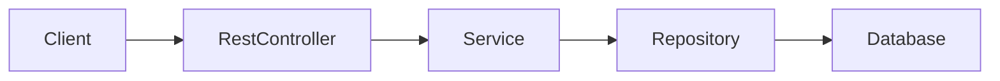

# CPSC 310: Software Design

## Week 3: Spring Boot & REST APIs

### Fall 2025
Prof. Ken Kousen

---
transition: fade-out
---

# Week 3 Overview

<div class="grid grid-cols-2 gap-10">

<div>

## Session 5: Tuesday
### Spring Boot REST APIs

- @RestController & mappings
- Request/Response handling
- DTOs and data transfer
- Dependency injection
- Basic API design principles

</div>

<div>

## Session 6: Thursday
### Guest Lecturer - Testing

- Unit testing fundamentals
- Integration testing
- Test-Driven Development (TDD)
- Mocking and test doubles
- Testing best practices

</div>

</div>

<div class="mt-8 p-4 bg-blue-100 rounded">

**Note:** Guest lecturer on Thursday covering comprehensive testing strategies

</div>

---

# From Week 2 to Week 3

<div class="grid grid-cols-2 gap-8">

<div>

## What You Built (Week 2)
- Service layer hierarchy
- Repository interfaces
- Collection-based storage
- SOLID principles applied
- 80% test coverage

</div>

<div>

## What You'll Build (Week 3)
- Full REST API
- Spring annotations
- Dependency injection
- API documentation
- Integration tests

</div>

</div>

<div class="mt-8 p-4 bg-green-100 rounded">

**Key Evolution:** From Java classes to production REST APIs

</div>

---
layout: section
---

# Session 5
## Spring Boot REST APIs

<div class="text-6xl">🚀</div>

---

# What is Spring Boot?

## The Framework That Powers Enterprise Java

<v-clicks>

- 🎯 **Opinionated** - Sensible defaults, less configuration
- 📦 **All-inclusive** - Embedded server, no deployment needed
- 🔧 **Production-ready** - Health checks, metrics, security
- ⚡ **Fast development** - Auto-configuration, hot reload
- 🧪 **Testable** - Built-in testing support
- 🌍 **Industry standard** - Netflix, Uber, LinkedIn use it

</v-clicks>

<div class="mt-8 p-4 bg-blue-100 rounded">

**Fun Fact:** Spring processes billions of requests daily worldwide

</div>

---

# Spring Boot Architecture



<div class="grid grid-cols-3 gap-4 mt-4 text-sm">

<div>

**Controller Layer**
- @RestController
- Handle HTTP
- DTOs

</div>

<div>

**Service Layer**
- @Service
- Business logic
- Domain models

</div>

<div>

**Repository Layer**
- @Repository
- Data access
- Entities

</div>

</div>

---

# Your First REST Controller

```java
@RestController
@RequestMapping("/api/tasks")
public class TaskController {

    @GetMapping
    public List<Task> getAllTasks() {
        return List.of(
            new Task(1L, "Learn Spring Boot"),
            new Task(2L, "Build REST API")
        );
    }
}
```

That's it! Spring Boot handles everything else.

---

# REST Annotations Overview

```java
@RestController  // Combines @Controller + @ResponseBody
@RequestMapping("/api/tasks")  // Base path for all methods
public class TaskController {

    @GetMapping         // GET /api/tasks
    @PostMapping        // POST /api/tasks
    @PutMapping("/{id}")  // PUT /api/tasks/{id}
    @DeleteMapping("/{id}")  // DELETE /api/tasks/{id}
    @PatchMapping("/{id}")  // PATCH /api/tasks/{id}
}
```

---

# HTTP Methods & CRUD

<div class="grid grid-cols-2 gap-6">

<div>

## HTTP Method
- **GET** - Retrieve data
- **POST** - Create new resource
- **PUT** - Update (replace)
- **PATCH** - Partial update
- **DELETE** - Remove resource

</div>

<div>

## CRUD Operation
- **Read**
- **Create**
- **Update (full)**
- **Update (partial)**
- **Delete**

</div>

</div>

<div class="mt-8 p-4 bg-yellow-50 border-2 border-yellow-400 rounded">

**REST Rule:** Use HTTP methods correctly - GET never modifies data!

</div>

---

# Complete CRUD Controller

```java
@RestController
@RequestMapping("/api/tasks")
public class TaskController {
    private final List<Task> tasks = new ArrayList<>();
    private Long nextId = 1L;

    @GetMapping
    public List<Task> getAllTasks() {
        return new ArrayList<>(tasks);
    }

    @GetMapping("/{id}")
    public Task getTask(@PathVariable Long id) {
        return tasks.stream()
            .filter(t -> t.getId().equals(id))
            .findFirst()
            .orElseThrow(() -> new TaskNotFoundException(id));
    }
}
```

---

# Creating Resources with POST

```java
@PostMapping
@ResponseStatus(HttpStatus.CREATED)  // 201 instead of 200
public Task createTask(@RequestBody Task task) {
    task.setId(nextId++);
    task.setCreatedAt(LocalDateTime.now());
    tasks.add(task);
    return task;
}

// Client sends:
// POST /api/tasks
// Content-Type: application/json
// {
//   "title": "Learn Spring Boot",
//   "description": "Master REST APIs"
// }
```

---

# Updating with PUT

```java
@PutMapping("/{id}")
public Task updateTask(@PathVariable Long id,
                       @RequestBody Task updated) {
    Task existing = findTaskById(id);
    existing.setTitle(updated.getTitle());
    existing.setDescription(updated.getDescription());
    existing.setCompleted(updated.isCompleted());
    existing.setUpdatedAt(LocalDateTime.now());
    return existing;
}

// PUT replaces the entire resource
// Client must send ALL fields
```

---

# Partial Updates with PATCH

```java
@PatchMapping("/{id}")
public Task partialUpdate(@PathVariable Long id,
                         @RequestBody Map<String, Object> updates) {
    Task task = findTaskById(id);

    updates.forEach((key, value) -> {
        switch (key) {
            case "title" -> task.setTitle((String) value);
            case "completed" -> task.setCompleted((Boolean) value);
            case "priority" -> task.setPriority((Integer) value);
        }
    });

    return task;
}

// PATCH only updates provided fields
```

---

# Deleting Resources

```java
@DeleteMapping("/{id}")
@ResponseStatus(HttpStatus.NO_CONTENT)  // 204 - No body
public void deleteTask(@PathVariable Long id) {
    tasks.removeIf(task -> task.getId().equals(id));
}

// Alternative: Return the deleted resource
@DeleteMapping("/{id}")
public Task deleteTaskWithResponse(@PathVariable Long id) {
    Task task = findTaskById(id);
    tasks.remove(task);
    return task;  // 200 with body
}
```

---

# Path Variables

```java
@GetMapping("/{id}")
public Task getTask(@PathVariable Long id) {
    // GET /api/tasks/123 → id = 123
}

@GetMapping("/{projectId}/tasks/{taskId}")
public Task getProjectTask(@PathVariable Long projectId,
                           @PathVariable Long taskId) {
    // GET /api/projects/1/tasks/5
}

// Custom variable names
@GetMapping("/{task-id}")
public Task getTaskCustom(@PathVariable("task-id") Long id) {
    // GET /api/tasks/123 → id = 123
}
```

---

# Query Parameters

```java
@GetMapping
public List<Task> getTasks(
    @RequestParam(required = false) String status,
    @RequestParam(defaultValue = "0") int page,
    @RequestParam(defaultValue = "10") int size) {

    // GET /api/tasks?status=completed&page=2&size=20

    return tasks.stream()
        .filter(t -> status == null ||
                     t.getStatus().equals(status))
        .skip(page * size)
        .limit(size)
        .collect(Collectors.toList());
}
```

---

# Request Headers

```java
@GetMapping("/{id}")
public Task getTask(
    @PathVariable Long id,
    @RequestHeader("X-API-Version") String apiVersion,
    @RequestHeader(value = "Accept-Language",
                   defaultValue = "en") String language) {

    // Use headers for versioning, auth, content negotiation
    if ("v2".equals(apiVersion)) {
        // Return v2 format
    }

    return findTaskById(id);
}
```

---

# Request Body with Validation

```java
public record CreateTaskRequest(
    @NotBlank(message = "Title is required")
    String title,

    @Size(max = 500, message = "Description too long")
    String description,

    @Future(message = "Due date must be in future")
    LocalDate dueDate,

    @Min(1) @Max(5)
    Integer priority
) {}

@PostMapping
public Task createTask(@Valid @RequestBody CreateTaskRequest request) {
    // Spring validates automatically
    // Returns 400 Bad Request if invalid
}
```

---

# DTOs (Data Transfer Objects)

```java
// Domain model - internal representation
@Entity
public class Task {
    private Long id;
    private String title;
    private String internalNotes;  // Don't expose
    private User assignedTo;        // Complex object
}

// DTO - what clients see
public record TaskDTO(
    Long id,
    String title,
    String assigneeName  // Simplified
) {
    public static TaskDTO from(Task task) {
        return new TaskDTO(
            task.getId(),
            task.getTitle(),
            task.getAssignedTo().getName()
        );
    }
}
```

---

# Why Use DTOs?

<v-clicks>

- 🔒 **Security** - Hide sensitive fields
- 📐 **Shape data** - Different views for different clients
- 🔄 **Versioning** - Change internals without breaking API
- 🎯 **Validation** - Different rules for create vs update
- 🚀 **Performance** - Send only needed data
- 📝 **Documentation** - Clear API contracts

</v-clicks>

<div class="mt-8 p-4 bg-red-100 rounded">

**Common Mistake:** Exposing entities directly leads to security issues!

</div>

---

# Response Entities

```java
@GetMapping("/{id}")
public ResponseEntity<TaskDTO> getTask(@PathVariable Long id) {
    Optional<Task> task = repository.findById(id);

    if (task.isEmpty()) {
        return ResponseEntity.notFound().build();  // 404
    }

    return ResponseEntity.ok(TaskDTO.from(task.get()));  // 200
}

@PostMapping
public ResponseEntity<TaskDTO> createTask(@RequestBody CreateTaskRequest request) {
    Task task = service.createTask(request);
    URI location = URI.create("/api/tasks/" + task.getId());
    return ResponseEntity.created(location)  // 201 with Location header
                        .body(TaskDTO.from(task));
}
```

---

# HTTP Status Codes

```java
// Success responses
200 OK              // GET, PUT, PATCH success
201 Created         // POST success (new resource)
204 No Content      // DELETE success (no body)

// Client errors
400 Bad Request     // Invalid input
401 Unauthorized    // Not authenticated
403 Forbidden       // Not authorized
404 Not Found       // Resource doesn't exist
409 Conflict        // Duplicate or constraint violation

// Server errors
500 Internal Server Error  // Unhandled exception
503 Service Unavailable   // Temporary outage
```

---

# Dependency Injection Basics

```java
@RestController
@RequestMapping("/api/tasks")
public class TaskController {
    // DON'T: Create dependencies yourself
    // private TaskService service = new TaskService();

    // DO: Let Spring inject them
    private final TaskService service;

    // Constructor injection (preferred)
    public TaskController(TaskService service) {
        this.service = service;
    }
}
```

Spring creates and manages the `TaskService` instance

---

# The Three Injection Types

```java
@RestController
public class TaskController {
    // 1. Constructor injection (BEST)
    private final TaskService service;
    public TaskController(TaskService service) {
        this.service = service;
    }

    // 2. Field injection (avoid)
    @Autowired
    private TaskService fieldService;

    // 3. Setter injection (rare)
    private TaskService setterService;
    @Autowired
    public void setService(TaskService service) {
        this.setterService = service;
    }
}
```

---

# Why Constructor Injection?

<v-clicks>

## ✅ Constructor Injection Benefits

- **Immutability** - `final` fields can't change
- **Required dependencies** - Can't create invalid objects
- **Testability** - Easy to mock in tests
- **Fail fast** - Missing beans detected at startup
- **No reflection** - Better performance
- **Clear dependencies** - Visible in constructor

</v-clicks>

<div class="mt-8 p-4 bg-green-100 rounded">

**Best Practice:** Always use constructor injection with `final` fields

</div>

---

# Spring Stereotype Annotations

```java
@Component    // Generic Spring bean
public class EmailValidator { }

@Service      // Business logic layer
public class TaskService { }

@Repository   // Data access layer
public class TaskRepository { }

@RestController  // Web layer (includes @ResponseBody)
public class TaskController { }

@Configuration   // Configuration class
public class AppConfig { }
```

All create Spring-managed beans (singletons by default)

---

# Service Layer Pattern

```java
@Service
public class TaskService {
    private final TaskRepository repository;
    private final NotificationService notifier;

    public TaskService(TaskRepository repository,
                      NotificationService notifier) {
        this.repository = repository;
        this.notifier = notifier;
    }

    @Transactional
    public Task createTask(CreateTaskRequest request) {
        // Business logic
        Task task = new Task(request.title(), request.description());
        task = repository.save(task);
        notifier.notifyNewTask(task);
        return task;
    }
}
```

---

# Repository Layer

```java
@Repository
public class TaskRepository {
    private final Map<Long, Task> tasks = new HashMap<>();
    private final AtomicLong idGenerator = new AtomicLong(1);

    public Task save(Task task) {
        if (task.getId() == null) {
            task.setId(idGenerator.getAndIncrement());
        }
        tasks.put(task.getId(), task);
        return task;
    }

    public Optional<Task> findById(Long id) {
        return Optional.ofNullable(tasks.get(id));
    }

    public List<Task> findAll() {
        return new ArrayList<>(tasks.values());
    }
}
```

---

# Wiring It All Together

```java
@RestController
@RequestMapping("/api/tasks")
public class TaskController {
    private final TaskService service;

    public TaskController(TaskService service) {
        this.service = service;
    }

    @PostMapping
    public ResponseEntity<TaskDTO> createTask(
            @Valid @RequestBody CreateTaskRequest request) {
        Task task = service.createTask(request);
        return ResponseEntity.status(HttpStatus.CREATED)
                            .body(TaskDTO.from(task));
    }
}
```

Spring automatically wires: Controller → Service → Repository

---

# Testing REST Controllers

```java
@WebMvcTest(TaskController.class)
class TaskControllerTest {
    @Autowired
    private MockMvc mockMvc;

    @MockitoBean  // New in Spring Boot 3.4+
    private TaskService service;

    @Test
    void shouldGetAllTasks() throws Exception {
        when(service.findAll()).thenReturn(
            List.of(new Task(1L, "Test Task"))
        );

        mockMvc.perform(get("/api/tasks"))
            .andExpect(status().isOk())
            .andExpect(jsonPath("$[0].title").value("Test Task"));
    }
}
```

---

# Testing POST Requests

```java
@Test
void shouldCreateTask() throws Exception {
    Task task = new Task(1L, "New Task");
    when(service.createTask(any())).thenReturn(task);

    String json = """
        {
            "title": "New Task",
            "description": "Task description"
        }
        """;

    mockMvc.perform(post("/api/tasks")
            .contentType(MediaType.APPLICATION_JSON)
            .content(json))
        .andExpect(status().isCreated())
        .andExpect(jsonPath("$.id").value(1))
        .andExpect(jsonPath("$.title").value("New Task"));
}
```

---

# Testing with @SpringBootTest

```java
@SpringBootTest
@AutoConfigureMockMvc
class TaskIntegrationTest {
    @Autowired
    private MockMvc mockMvc;

    @Test
    void shouldCreateAndRetrieveTask() throws Exception {
        // Create task
        mockMvc.perform(post("/api/tasks")
                .contentType(MediaType.APPLICATION_JSON)
                .content("""
                    {"title": "Integration Test"}
                    """))
            .andExpect(status().isCreated());

        // Verify it exists
        mockMvc.perform(get("/api/tasks"))
            .andExpect(status().isOk())
            .andExpect(jsonPath("$[0].title").value("Integration Test"));
    }
}
```

---

# Common Spring Boot Mistakes

<v-clicks>

## ❌ What NOT to Do

1. **Using field injection** - Makes testing harder
2. **Returning entities directly** - Security risk
3. **No validation** - Always validate input
4. **Ignoring HTTP semantics** - GET shouldn't modify
5. **No error handling** - Users see stack traces
6. **Circular dependencies** - Design smell

</v-clicks>

<div class="mt-8 p-4 bg-red-100 rounded">

**AI Alert:** ChatGPT often uses field injection - always fix this!

</div>

---

# Live Coding: Build a Task API

## Let's Build a Complete REST API

<v-clicks>

1. Create Spring Boot project with Spring Initializr
2. Define Task entity and DTOs
3. Implement TaskController with CRUD operations
4. Add TaskService for business logic
5. Create TaskRepository for data storage
6. Write comprehensive tests
7. Test with Postman/curl

</v-clicks>

<div class="mt-8 p-4 bg-yellow-50 border-2 border-yellow-400 rounded">

**Goal:** Working API in 15 minutes with AI assistance

</div>

---
layout: center
---

# End of Session 5

## Thursday: Guest Lecturer on Testing

<div class="text-6xl">🧪</div>

---
layout: section
---

# Additional Material
## API Design & Documentation
### (May be covered in Week 4 if time permits)

<div class="text-6xl">📚</div>

---

# RESTful Design Principles

## REST = REpresentational State Transfer

<v-clicks>

- 📍 **Resources** - Nouns, not verbs (/tasks, not /getTasks)
- 🔗 **HTTP methods** - Verbs for actions (GET, POST, PUT, DELETE)
- 🎯 **Stateless** - Each request is independent
- 📄 **Representations** - JSON, XML, HTML
- 🔀 **HATEOAS** - Hypermedia links (optional)
- 📊 **Uniform interface** - Consistent patterns

</v-clicks>

<div class="mt-8 p-4 bg-blue-100 rounded">

**Key:** Think in resources and representations, not actions

</div>

---

# Good vs Bad API Design

<div class="grid grid-cols-2 gap-4 text-sm">

<div>

## ✅ Good (RESTful)
```
GET    /api/tasks
GET    /api/tasks/123
POST   /api/tasks
PUT    /api/tasks/123
DELETE /api/tasks/123
GET    /api/tasks?status=completed
GET    /api/users/456/tasks
```

</div>

<div>

## ❌ Bad (RPC-style)
```
GET /api/getAllTasks
GET /api/getTaskById?id=123
POST /api/createNewTask
POST /api/updateTask?id=123
GET /api/deleteTask/123
GET /api/getCompletedTasks
GET /api/getTasksForUser?userId=456
```

</div>

</div>

---

# Resource Naming Conventions

## Rules for Clean APIs

<v-clicks>

- **Use nouns**: `/tasks`, not `/getTasks`
- **Plural for collections**: `/tasks`, not `/task`
- **Lowercase with hyphens**: `/task-items`, not `/taskItems`
- **Hierarchical**: `/projects/123/tasks`
- **Avoid deep nesting**: Max 2-3 levels
- **Query for filters**: `?status=active&sort=date`

</v-clicks>

```
✅ GET /api/projects/123/tasks?status=completed
❌ GET /api/getCompletedTasksForProject/123
```

---

# API Versioning Strategies

```java
// 1. URL Path Versioning
@RestController
@RequestMapping("/api/v1/tasks")
public class TaskControllerV1 { }

// 2. Header Versioning
@GetMapping(headers = "X-API-Version=1")
public List<Task> getTasksV1() { }

// 3. Media Type Versioning
@GetMapping(produces = "application/vnd.company.v1+json")
public List<Task> getTasksV1() { }

// 4. Query Parameter (avoid)
@GetMapping(params = "version=1")
public List<Task> getTasksV1() { }
```

**Recommendation:** URL versioning is clearest

---

# Pagination Pattern

```java
@GetMapping
public Page<TaskDTO> getTasks(
    @RequestParam(defaultValue = "0") int page,
    @RequestParam(defaultValue = "20") int size,
    @RequestParam(defaultValue = "createdAt,desc") String sort) {

    // Returns:
    // {
    //   "content": [...],
    //   "totalElements": 150,
    //   "totalPages": 8,
    //   "size": 20,
    //   "number": 0,
    //   "first": true,
    //   "last": false
    // }
}
```

---

# Filtering and Searching

```java
@GetMapping
public List<TaskDTO> searchTasks(
    @RequestParam(required = false) String title,
    @RequestParam(required = false) String status,
    @RequestParam(required = false) LocalDate dueBefore,
    @RequestParam(required = false) List<String> tags) {

    // Build dynamic query
    // GET /api/tasks?status=active&tags=urgent,bug&dueBefore=2025-12-31

    return service.searchTasks(
        TaskSearchCriteria.builder()
            .title(title)
            .status(status)
            .dueBefore(dueBefore)
            .tags(tags)
            .build()
    );
}
```

---

# Error Response Format

```java
@ExceptionHandler(TaskNotFoundException.class)
@ResponseStatus(HttpStatus.NOT_FOUND)
public ErrorResponse handleNotFound(TaskNotFoundException ex) {
    return new ErrorResponse(
        404,
        "TASK_NOT_FOUND",
        ex.getMessage(),
        LocalDateTime.now(),
        "/api/tasks/" + ex.getTaskId()
    );
}

// Produces:
// {
//   "status": 404,
//   "code": "TASK_NOT_FOUND",
//   "message": "Task with id 123 not found",
//   "timestamp": "2025-09-16T10:30:00",
//   "path": "/api/tasks/123"
// }
```

---

# Global Exception Handler

```java
@RestControllerAdvice
public class GlobalExceptionHandler {

    @ExceptionHandler(ValidationException.class)
    @ResponseStatus(HttpStatus.BAD_REQUEST)
    public ErrorResponse handleValidation(ValidationException ex) {
        return ErrorResponse.badRequest(ex.getErrors());
    }

    @ExceptionHandler(ResourceNotFoundException.class)
    @ResponseStatus(HttpStatus.NOT_FOUND)
    public ErrorResponse handleNotFound(ResourceNotFoundException ex) {
        return ErrorResponse.notFound(ex.getResource(), ex.getId());
    }

    @ExceptionHandler(Exception.class)
    @ResponseStatus(HttpStatus.INTERNAL_SERVER_ERROR)
    public ErrorResponse handleGeneral(Exception ex) {
        log.error("Unexpected error", ex);
        return ErrorResponse.internalError();
    }
}
```

---

# Input Validation

```java
public record CreateTaskRequest(
    @NotBlank(message = "Title is required")
    @Size(min = 3, max = 100)
    String title,

    @Size(max = 500)
    String description,

    @NotNull(message = "Due date is required")
    @Future(message = "Due date must be in future")
    LocalDate dueDate,

    @Email(message = "Invalid email format")
    String assigneeEmail,

    @Min(1) @Max(5)
    Integer priority
) {}
```

---

# Custom Validation

```java
// Custom annotation
@Target({ElementType.FIELD})
@Retention(RetentionPolicy.RUNTIME)
@Constraint(validatedBy = NotProfanityValidator.class)
public @interface NotProfanity {
    String message() default "Contains inappropriate content";
    Class<?>[] groups() default {};
    Class<? extends Payload>[] payload() default {};
}

// Validator implementation
public class NotProfanityValidator
    implements ConstraintValidator<NotProfanity, String> {

    @Override
    public boolean isValid(String value, ConstraintValidatorContext context) {
        return value == null || !containsProfanity(value);
    }
}
```

---

# OpenAPI/Swagger Documentation

```java
@RestController
@RequestMapping("/api/tasks")
@Tag(name = "Tasks", description = "Task management operations")
public class TaskController {

    @Operation(summary = "Get all tasks",
               description = "Returns a paginated list of tasks")
    @ApiResponses({
        @ApiResponse(responseCode = "200",
                    description = "Successfully retrieved tasks"),
        @ApiResponse(responseCode = "401",
                    description = "Not authenticated")
    })
    @GetMapping
    public Page<TaskDTO> getTasks(
        @Parameter(description = "Page number") @RequestParam int page) {
        // Implementation
    }
}
```

---

# Swagger Configuration

```java
@Configuration
public class SwaggerConfig {

    @Bean
    public OpenAPI customOpenAPI() {
        return new OpenAPI()
            .info(new Info()
                .title("Task Management API")
                .version("1.0")
                .description("API for managing tasks and projects")
                .contact(new Contact()
                    .name("API Support")
                    .email("api@example.com")))
            .servers(List.of(
                new Server().url("http://localhost:8080")
                           .description("Development"),
                new Server().url("https://api.example.com")
                           .description("Production")
            ));
    }
}
```

Access at: `http://localhost:8080/swagger-ui.html`

---

# API Documentation Best Practices

<v-clicks>

## 📝 Document Everything

- **Request/response examples** - Show real JSON
- **Error responses** - All possible errors
- **Authentication** - How to get/use tokens
- **Rate limits** - Quotas and throttling
- **Versioning** - Migration guides
- **Deprecation** - Sunset timelines

</v-clicks>

<div class="mt-8 p-4 bg-green-100 rounded">

**Pro Tip:** Good docs reduce support tickets by 90%

</div>

---

# Example API Documentation

```yaml
paths:
  /api/tasks:
    post:
      summary: Create a new task
      requestBody:
        required: true
        content:
          application/json:
            schema:
              $ref: '#/components/schemas/CreateTaskRequest'
            example:
              title: "Implement user authentication"
              description: "Add JWT-based auth"
              dueDate: "2025-10-01"
              priority: 3
      responses:
        '201':
          description: Task created successfully
          headers:
            Location:
              description: URL of created resource
```

---

# HATEOAS (Optional but Cool)

```java
@GetMapping("/{id}")
public EntityModel<TaskDTO> getTask(@PathVariable Long id) {
    TaskDTO task = service.findById(id);

    return EntityModel.of(task,
        linkTo(methodOn(TaskController.class).getTask(id))
            .withSelfRel(),
        linkTo(methodOn(TaskController.class).updateTask(id, null))
            .withRel("update"),
        linkTo(methodOn(TaskController.class).deleteTask(id))
            .withRel("delete"),
        linkTo(methodOn(ProjectController.class).getProject(task.projectId()))
            .withRel("project")
    );
}

// Response includes links for next actions
```

---

# Content Negotiation

```java
@RestController
public class TaskController {

    @GetMapping(value = "/tasks/{id}",
                produces = {MediaType.APPLICATION_JSON_VALUE,
                           MediaType.APPLICATION_XML_VALUE})
    public Task getTask(@PathVariable Long id,
                       @RequestHeader("Accept") String acceptHeader) {
        // Spring automatically converts based on Accept header
        // Accept: application/json → JSON response
        // Accept: application/xml → XML response
        return service.findById(id);
    }
}
```

---

# Rate Limiting

```java
@Component
public class RateLimitInterceptor implements HandlerInterceptor {
    private final RateLimiter rateLimiter = RateLimiter.create(100); // 100 req/sec

    @Override
    public boolean preHandle(HttpServletRequest request,
                           HttpServletResponse response,
                           Object handler) {
        if (!rateLimiter.tryAcquire()) {
            response.setStatus(429); // Too Many Requests
            response.setHeader("X-RateLimit-Retry-After", "1");
            return false;
        }
        return true;
    }
}
```

---

# Caching Headers

```java
@GetMapping("/{id}")
public ResponseEntity<TaskDTO> getTask(@PathVariable Long id) {
    TaskDTO task = service.findById(id);

    return ResponseEntity.ok()
        .cacheControl(CacheControl.maxAge(5, TimeUnit.MINUTES))
        .eTag(task.version())
        .lastModified(task.updatedAt())
        .body(task);
}

// Response headers:
// Cache-Control: max-age=300
// ETag: "v123"
// Last-Modified: Mon, 16 Sep 2025 10:00:00 GMT
```

---

# AI Code Evaluation Strategies

## How to Verify AI-Generated APIs

<v-clicks>

1. **Test the happy path** - Basic CRUD operations
2. **Test edge cases** - Empty lists, nulls, invalid IDs
3. **Check HTTP semantics** - Correct status codes
4. **Validate error handling** - Proper error responses
5. **Security review** - No data leaks, SQL injection
6. **Performance check** - N+1 queries, pagination

</v-clicks>

<div class="mt-8 p-4 bg-yellow-50 border-2 border-yellow-400 rounded">

**Remember:** AI often forgets error handling and validation!

</div>

---

# Common AI Mistakes in APIs

```java
// ❌ AI often generates this
@GetMapping
public List<Task> getTasks() {
    return taskRepository.findAll();  // No pagination!
}

// ✅ You should fix to this
@GetMapping
public Page<TaskDTO> getTasks(Pageable pageable) {
    return taskRepository.findAll(pageable)
        .map(TaskDTO::from);
}
```

More issues: Missing validation, wrong status codes, entity exposure

---

# Testing API Design

```java
@Test
void shouldFollowRestfulConventions() {
    // Resource names are nouns and plural
    mockMvc.perform(get("/api/tasks"))
        .andExpect(status().isOk());

    // HTTP methods match operations
    mockMvc.perform(post("/api/tasks").content("{}"))
        .andExpect(status().isCreated());

    // Proper status codes
    mockMvc.perform(get("/api/tasks/999"))
        .andExpect(status().isNotFound());

    // Consistent error format
    mockMvc.perform(post("/api/tasks").content("{}"))
        .andExpect(jsonPath("$.code").exists())
        .andExpect(jsonPath("$.message").exists());
}
```

---

# API Security Basics

<v-clicks>

## Essential Security Measures

- 🔐 **Authentication** - Who are you? (JWT, OAuth)
- 🎫 **Authorization** - What can you do? (Roles, permissions)
- 🔒 **HTTPS only** - Encrypt all traffic
- 🛡️ **Input validation** - Never trust client data
- 📊 **Rate limiting** - Prevent abuse
- 🎭 **CORS configuration** - Control origins

</v-clicks>

<div class="mt-8 p-4 bg-red-100 rounded">

**Week 11 Preview:** We'll implement full security then

</div>

---

# Assignment 3 Preview

## Team Assignment: Complete CRUD API

### Requirements
- Full CRUD operations for your domain
- Proper HTTP methods and status codes
- Input validation with meaningful errors
- Service and repository layers
- 80% test coverage
- Basic Swagger documentation

### Due: Thursday, September 25 at 11:59 PM

---

# Repository Analysis Assignment

## Individual Work: REST API Design Analysis

### Your Task (Due Sept 25)
1. Find a popular REST API (GitHub, Stripe, Twitter)
2. Analyze their:
   - Resource naming conventions
   - HTTP method usage
   - Error handling approach
   - Documentation quality
3. Identify 3 things they do well
4. Suggest 2 improvements

---

# Key Takeaways

## This Week's Topics

<v-clicks>

### Tuesday - Spring Boot REST APIs
1. **Spring Boot basics** - Controllers, services, repositories
2. **REST operations** - CRUD with proper HTTP methods
3. **Dependency injection** - Constructor injection pattern
4. **Request/Response** - DTOs, validation, status codes

### Thursday - Testing (Guest Lecturer)
5. **Unit testing** - JUnit 5 and AssertJ
6. **Integration testing** - Testing layers together
7. **TDD methodology** - Red-Green-Refactor cycle
8. **Mocking** - Test doubles and isolation

</v-clicks>

<div class="mt-8 p-4 bg-blue-100 rounded">

**Combined Learning:** Build APIs on Tuesday, test them properly on Thursday

</div>

---

# Practice Exercises

```java
// 1. Create a Project API
// - Projects have many tasks
// - Implement /api/projects/{id}/tasks

// 2. Add search functionality
// - Filter by multiple fields
// - Sort by any field

// 3. Implement pagination
// - Page size limits
// - Total count in response

// 4. Add validation
// - Custom validators
// - Meaningful error messages
```

---

# Common Interview Questions

<v-clicks>

1. **REST vs RPC vs GraphQL?**
2. **How does Spring dependency injection work?**
3. **When to use @Service vs @Component?**
4. **PUT vs PATCH difference?**
5. **How to version APIs?**
6. **Idempotency - which methods?**
7. **How to handle pagination?**

</v-clicks>

---

# Useful Spring Boot Annotations

<div class="grid grid-cols-2 gap-4 text-sm">

<div>

## Web Layer
- `@RestController`
- `@RequestMapping`
- `@GetMapping`, `@PostMapping`
- `@PathVariable`
- `@RequestParam`
- `@RequestBody`
- `@Valid`

</div>

<div>

## Core Spring
- `@Service`
- `@Repository`
- `@Component`
- `@Autowired`
- `@Configuration`
- `@Bean`
- `@Value`

</div>

</div>

---

# Resources & Tools

<div class="grid grid-cols-2 gap-6">

<div>

### Documentation
- Spring Boot Docs
- Spring Guides
- Baeldung Spring Tutorials
- REST API Guidelines

</div>

<div>

### Testing Tools
- Postman
- Insomnia
- curl
- HTTPie
- Swagger UI

</div>

</div>

---

# AI Prompting Tips for APIs

## Getting Better Code from AI

### ✅ Good Prompts
- "Create a Spring Boot REST controller with constructor injection"
- "Add validation and error handling to this endpoint"
- "Write MockMvc tests for all CRUD operations"

### ❌ Avoid
- "Create an API" (too vague)
- "Make this RESTful" (unclear requirements)
- Accepting first output without review

---

# Action Items

## Before Thursday's Guest Lecture

- [ ] Complete Assignment 2 (Due Sept 18)
- [ ] Build your first REST API
- [ ] Review testing materials from Week 2
- [ ] Prepare questions about testing

## After This Week

- [ ] Practice TDD with your API
- [ ] Write comprehensive test suites
- [ ] Test with Postman or curl
- [ ] Document your API endpoints

---
layout: center
---

# Questions?

## Ready to Build Production APIs?

### 📧 kkousen@trincoll.edu
### 🏢 Office Hours: Wed 1:30-3:00 PM

---
layout: end
---

# See You Thursday!

## Week 3 Goals
✅ Master Spring Boot REST APIs
✅ Understand dependency injection
✅ Design clean API interfaces
✅ Document with OpenAPI

### Next Week: Functional Programming & Advanced Spring

<div class="text-6xl mt-8">🎯</div>