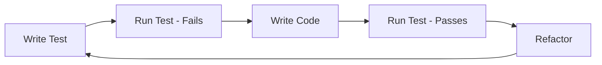

# Functional Programming & TDD
## Conway's Game of Life

CPSC 310: Software Design
Week 4

---

# Learning Objectives

By the end of this session, you will:

- Understand **Test-Driven Development** (TDD) methodology
- Learn core **functional programming** concepts in Java
- Apply TDD to implement Game of Life rules
- Explore **lambdas**, **streams**, and **Optional**
- See how functional programming improves code clarity

---

# Conway's Game of Life

A cellular automaton created by John Conway (1970)

## Rules
1. **Underpopulation**: Live cell with < 2 neighbors dies
2. **Survival**: Live cell with 2-3 neighbors survives
3. **Overpopulation**: Live cell with > 3 neighbors dies
4. **Reproduction**: Dead cell with exactly 3 neighbors becomes alive

---

# Visual Example

```
Generation 0:          Generation 1:

  . . .                  . * .
  * * *       -->        . * .
  . . .                  . * .

(Blinker pattern - oscillates with period 2)
```

- `*` = Live cell
- `.` = Dead cell

---

# Test-Driven Development (TDD)

## The Red-Green-Refactor Cycle

1. **Red**: Write a failing test
2. **Green**: Write minimal code to pass
3. **Refactor**: Improve code quality



---

# Why TDD for Game of Life?

- **Clear rules** → Easy to write tests first
- **Deterministic behavior** → Predictable outcomes
- **Incremental complexity** → Build step by step
- **Visual feedback** → Easy to verify

Perfect for learning TDD!

---

# Starting Simple: Cell State

## Test First (Red)

```java
@Test
@DisplayName("Dead cell with exactly 3 neighbors becomes alive")
void reproductionRule() {
    CellState current = CellState.DEAD;
    int liveNeighbors = 3;

    CellState next = GameRules.conway()
        .apply(current, liveNeighbors);

    assertEquals(CellState.ALIVE, next);
}
```

---

# Implementation (Green)

```java
public class GameRules {
    public CellState apply(CellState current,
                          int liveNeighbors) {
        if (current.isAlive()) {
            return (liveNeighbors == 2 || liveNeighbors == 3)
                ? CellState.ALIVE
                : CellState.DEAD;
        } else {
            return liveNeighbors == 3
                ? CellState.ALIVE
                : CellState.DEAD;
        }
    }
}
```

---

# Testing All Rules

```java
@ParameterizedTest
@DisplayName("Conway's rules correctly applied")
@CsvSource({
    "ALIVE, 0, DEAD",   // underpopulation
    "ALIVE, 1, DEAD",   // underpopulation
    "ALIVE, 2, ALIVE",  // survival
    "ALIVE, 3, ALIVE",  // survival
    "ALIVE, 4, DEAD",   // overpopulation
    "DEAD,  2, DEAD",   // stays dead
    "DEAD,  3, ALIVE",  // reproduction
    "DEAD,  4, DEAD"    // stays dead
})
void conwayRules(CellState current, int neighbors,
                 CellState expected) {
    assertEquals(expected,
        GameRules.conway().apply(current, neighbors));
}
```

---

# Introduction to Lambdas

## What is a Lambda?

A **lambda expression** is a concise way to write anonymous functions

## Syntax
```java
(parameters) -> expression
(parameters) -> { statements; }
```

## Examples
```java
// Traditional anonymous class
Runnable r1 = new Runnable() {
    public void run() {
        System.out.println("Hello");
    }
};

// Lambda expression
Runnable r2 = () -> System.out.println("Hello");
```

---

# Functional Interfaces

A functional interface has **exactly one abstract method**

```java
@FunctionalInterface
public interface CellEvolution {
    CellState evolve(CellState current, int liveNeighbors);
}

// Can be used with lambdas
CellEvolution conway = (current, neighbors) -> {
    if (current.isAlive()) {
        return (neighbors == 2 || neighbors == 3)
            ? CellState.ALIVE : CellState.DEAD;
    }
    return neighbors == 3 ? CellState.ALIVE : CellState.DEAD;
};
```

---

# Common Functional Interfaces

Java provides many built-in functional interfaces:

| Interface | Method | Example |
|-----------|--------|---------|
| `Predicate<T>` | `test(T) → boolean` | Filter cells |
| `Function<T,R>` | `apply(T) → R` | Transform data |
| `Consumer<T>` | `accept(T) → void` | Process results |
| `Supplier<T>` | `get() → T` | Generate values |

---

# Using Predicates in Tests

```java
@Test
void testLiveCellFiltering() {
    Grid grid = new Grid("""
        *..
        .*.
        *.*
        """);

    // Get all cells and filter for live ones
    Predicate<Cell> isAlive = cell -> grid.getCellState(cell).isAlive();

    long livingCells = grid.getAllCells().stream()
        .filter(isAlive)
        .count();

    assertEquals(4, livingCells);
}
```

---

# Introduction to Streams

## What is a Stream?

A **sequence of elements** supporting sequential and parallel operations

## Stream Pipeline

```java
source.stream()
    .intermediateOperation1()
    .intermediateOperation2()
    .terminalOperation();
```

---

# Stream Example: Counting Neighbors

## Imperative Approach
```java
public int countLiveNeighbors(Cell cell) {
    int count = 0;
    for (Cell neighbor : getNeighbors(cell)) {
        if (getCellState(neighbor).isAlive()) {
            count++;
        }
    }
    return count;
}
```

## Functional Approach
```java
public int countLiveNeighbors(Cell cell) {
    return (int) getNeighbors(cell).stream()
        .map(this::getCellState)
        .filter(CellState::isAlive)
        .count();
}
```

---

# Method References

## Shorthand for Lambda Expressions

When a lambda just calls an existing method, use `::`

```java
// Lambda expression
.map(neighbor -> getCellState(neighbor))
.filter(state -> state.isAlive())

// Method reference
.map(this::getCellState)
.filter(CellState::isAlive)
```

## Types of Method References
- `Class::staticMethod`
- `instance::instanceMethod`
- `Class::instanceMethod`
- `Class::new` (constructor)

---

# Testing with Streams

```java
@Test
@DisplayName("Grid correctly identifies all live cells")
void findAllLiveCells() {
    Grid grid = new Grid("""
        .*.
        ***
        .*.
        """);

    List<Cell> liveCells = grid.getAllCells().stream()
        .filter(cell -> grid.getCellState(cell).isAlive())
        .toList();

    assertEquals(5, liveCells.size());
    assertTrue(liveCells.contains(Cell.of(0, 1)));
    assertTrue(liveCells.contains(Cell.of(1, 0)));
}
```

---

# Stream Operations

## Intermediate Operations (return Stream)
- `filter(Predicate)` - Keep matching elements
- `map(Function)` - Transform elements
- `flatMap(Function)` - Transform and flatten
- `distinct()` - Remove duplicates
- `sorted()` - Sort elements

## Terminal Operations (return result)
- `collect(Collector)` - Gather into collection
- `count()` - Count elements
- `anyMatch(Predicate)` - Check if any match
- `forEach(Consumer)` - Process each element

---

# Practical Example: Evolution

```java
public Grid evolveWith(GameRules rules) {
    // Get all cells to check (living + their neighbors)
    Set<Cell> cellsToEvaluate = cells.keySet().stream()
        .flatMap(cell -> Stream.concat(
            Stream.of(cell),
            getNeighbors(cell).stream()
        ))
        .collect(Collectors.toSet());

    // Apply rules to each cell
    Grid nextGrid = new Grid(rows, cols, boundary);
    cellsToEvaluate.forEach(cell -> {
        CellState current = getCellState(cell);
        int neighbors = countLiveNeighbors(cell);
        CellState next = rules.apply(current, neighbors);
        nextGrid.setCellState(cell, next);
    });

    return nextGrid;
}
```

---

# Testing Evolution

```java
@Test
@DisplayName("Blinker pattern oscillates correctly")
void testBlinkerEvolution() {
    // Arrange
    Grid initial = new Grid("""
        ...
        ***
        ...
        """);

    // Act
    Grid gen1 = initial.evolveWith(GameRules.conway());
    Grid gen2 = gen1.evolveWith(GameRules.conway());

    // Assert - should rotate 90 degrees
    assertEquals(CellState.ALIVE, gen1.getCellState(Cell.of(0, 1)));
    assertEquals(CellState.ALIVE, gen1.getCellState(Cell.of(1, 1)));
    assertEquals(CellState.ALIVE, gen1.getCellState(Cell.of(2, 1)));

    // Should return to original after 2 generations
    assertEquals(initial, gen2);
}
```

---

# Introduction to Optional

## The Null Problem

```java
// Dangerous - might return null
public Cell findCell(int row, int col) {
    if (isValid(row, col)) {
        return new Cell(row, col);
    }
    return null;  // NullPointerException waiting to happen!
}
```

## The Optional Solution

```java
public Optional<Cell> findCell(int row, int col) {
    if (isValid(row, col)) {
        return Optional.of(new Cell(row, col));
    }
    return Optional.empty();
}
```

---

# Working with Optional

```java
public Optional<Cell> wrap(Cell cell, int rows, int cols) {
    // Boundary checking with Optional
    if (cell.row() < 0 || cell.row() >= rows ||
        cell.col() < 0 || cell.col() >= cols) {
        return Optional.empty();
    }
    return Optional.of(cell);
}

// Using the Optional
public CellState getCellState(Cell cell) {
    return boundary.wrap(cell, rows, cols)
        .map(wrapped -> cells.getOrDefault(wrapped, CellState.DEAD))
        .orElse(CellState.DEAD);
}
```

---

# Optional Operations

| Method | Description |
|--------|-------------|
| `isPresent()` | Check if value exists |
| `ifPresent(Consumer)` | Execute if present |
| `orElse(T)` | Provide default value |
| `orElseGet(Supplier)` | Lazy default |
| `map(Function)` | Transform if present |
| `filter(Predicate)` | Keep if matches |
| `flatMap(Function)` | Chain optionals |

---

# Testing with Optional

```java
@Test
@DisplayName("Boundary conditions handle edge cases")
void testBoundaryConditions() {
    BoundaryCondition fixed = new BoundaryCondition.Fixed();

    // Valid cell
    Optional<Cell> valid = fixed.wrap(Cell.of(1, 1), 3, 3);
    assertTrue(valid.isPresent());
    assertEquals(Cell.of(1, 1), valid.get());

    // Out of bounds
    Optional<Cell> invalid = fixed.wrap(Cell.of(-1, 0), 3, 3);
    assertTrue(invalid.isEmpty());

    // Using Optional operations
    String result = fixed.wrap(Cell.of(5, 5), 3, 3)
        .map(Cell::toString)
        .orElse("Out of bounds");

    assertEquals("Out of bounds", result);
}
```

---

# Combining Concepts: Neighbor Calculation

```java
public List<Cell> getNeighbors(Cell cell) {
    return Direction.getAllNeighbors(cell).stream()  // Stream of cells
        .map(neighbor -> boundary.wrap(neighbor, rows, cols))  // Optional<Cell>
        .filter(Optional::isPresent)  // Keep valid cells
        .map(Optional::get)  // Extract from Optional
        .toList();  // Collect results
}
```

This combines:
- **Streams** for processing collections
- **Method references** (`Optional::isPresent`)
- **Optional** for null safety
- **Functional transformation** with `map`

---

# TDD: Testing Stable Patterns

```java
@Test
@DisplayName("Block pattern is stable")
void blockIsStable() {
    // Arrange - 2x2 block
    Grid block = new Grid("""
        **
        **
        """);

    // Act
    Grid evolved = block.evolveWith(GameRules.conway());

    // Assert - should not change
    assertEquals(block, evolved);
}
```

---

# TDD: Testing Multiple Patterns

```java
@Test
@DisplayName("Beehive pattern is stable")
void beehiveIsStable() {
    Grid beehive = new Grid("""
        .**..
        *..*.
        .**..
        """);

    assertEquals(beehive, beehive.evolveWith(GameRules.conway()));
}

@Test
@DisplayName("Blinker oscillates with period 2")
void blinkerOscillates() {
    Grid blinker = Pattern.BLINKER.toGrid();
    Grid gen1 = blinker.evolveWith(GameRules.conway());
    Grid gen2 = gen1.evolveWith(GameRules.conway());

    assertEquals(blinker, gen2); // Returns to original
}
```

---

# Functional Benefits

## Why Functional Programming?

1. **Immutability** - Safer concurrent code
2. **Composability** - Build complex from simple
3. **Readability** - Express "what" not "how"
4. **Testability** - Pure functions are easy to test
5. **Parallelism** - Streams can run in parallel

```java
// Parallel processing
public long countAllLiveCells() {
    return cells.values().parallelStream()
        .filter(CellState::isAlive)
        .count();
}
```

---

# Pure Functions

## What makes a function pure?

1. **Same input → Same output** (deterministic)
2. **No side effects** (doesn't modify external state)

```java
// Pure function - easy to test!
public static int calculateNextGeneration(
    boolean isAlive, int liveNeighbors) {
    if (isAlive) {
        return (liveNeighbors == 2 || liveNeighbors == 3) ? 1 : 0;
    }
    return liveNeighbors == 3 ? 1 : 0;
}

// Test is simple and reliable
@Test
void testPureFunction() {
    assertEquals(1, calculateNextGeneration(true, 2));  // survives
    assertEquals(0, calculateNextGeneration(true, 4));  // dies
    assertEquals(1, calculateNextGeneration(false, 3)); // born
}
```

---

# Immutability in Practice

```java
public class Grid {
    private final int rows;
    private final int cols;
    private final Map<Cell, CellState> cells;

    // Evolution creates new Grid, doesn't modify existing
    public Grid evolve() {
        Grid nextGrid = new Grid(rows, cols);
        // ... calculate next generation ...
        return nextGrid;  // Return new instance
    }
}

// Testing is predictable
@Test
void gridEvolutionIsImmutable() {
    Grid original = Pattern.BLINKER.toGrid();
    Grid evolved = original.evolve();

    // Original unchanged
    assertNotSame(original, evolved);
    assertEquals(Pattern.BLINKER.toGrid(), original);
}
```

---

# Higher-Order Functions

Functions that take or return other functions

```java
public class GameVariants {
    // Factory method returns different rule functions
    public static Function<Grid, Grid> createEvolver(String variant) {
        return switch (variant) {
            case "conway" -> grid -> grid.evolveWith(GameRules.conway());
            case "highlife" -> grid -> grid.evolveWith(GameRules.highLife());
            case "seeds" -> grid -> grid.evolveWith(GameRules.seeds());
            default -> throw new IllegalArgumentException("Unknown variant");
        };
    }
}

// Test different variants
@Test
void testGameVariants() {
    Grid start = Pattern.BLINKER.toGrid();

    var conway = GameVariants.createEvolver("conway");
    var highlife = GameVariants.createEvolver("highlife");

    assertNotEquals(conway.apply(start), highlife.apply(start));
}
```

---

# Collectors: Grouping and Partitioning

```java
@Test
void analyzeGridStatistics() {
    Grid grid = Pattern.GLIDER.toGrid();

    // Partition cells by state
    Map<Boolean, List<Cell>> partitioned = grid.getAllCells().stream()
        .collect(Collectors.partitioningBy(
            cell -> grid.getCellState(cell).isAlive()
        ));

    List<Cell> alive = partitioned.get(true);
    List<Cell> dead = partitioned.get(false);

    // Group by row
    Map<Integer, List<Cell>> byRow = alive.stream()
        .collect(Collectors.groupingBy(Cell::row));

    assertEquals(5, alive.size());  // Glider has 5 live cells
    assertEquals(3, byRow.size());   // Spread across 3 rows
}
```

---

# Custom Collectors

```java
public class GridCollectors {
    public static Collector<Cell, ?, Grid> toGrid(int rows, int cols) {
        return Collector.of(
            () -> new Grid(rows, cols),  // Supplier
            (grid, cell) -> grid.setCellState(cell, CellState.ALIVE), // Accumulator
            (g1, g2) -> { /* combine */ return g1; },  // Combiner
            Function.identity()  // Finisher
        );
    }
}

@Test
void customCollectorTest() {
    List<Cell> pattern = List.of(
        Cell.of(1, 0), Cell.of(1, 1), Cell.of(1, 2)
    );

    Grid grid = pattern.stream()
        .collect(GridCollectors.toGrid(3, 3));

    assertEquals(3, grid.countLiveCells());
}
```

---

# Functional Testing Patterns

## Property-Based Testing

```java
@Property
void gridEvolutionPreservesSize(@ForAll Grid grid) {
    Grid evolved = grid.evolve();

    assertEquals(grid.getRows(), evolved.getRows());
    assertEquals(grid.getCols(), evolved.getCols());
}

@Property
void emptyGridStaysEmpty(@ForAll @IntRange(min=3, max=10) int size) {
    Grid empty = new Grid(size, size);
    Grid evolved = empty.evolve();

    assertEquals(0, evolved.countLiveCells());
}
```

---

# Combining TDD with FP

## Best Practices

1. **Start with tests** - Define expected behavior
2. **Use pure functions** - Easier to test
3. **Leverage immutability** - Predictable tests
4. **Stream for clarity** - Express intent
5. **Optional for safety** - Avoid null checks

---

# Functional TDD Example

```java
@Test
void functionalTDDExample() {
    // Given: Clear test data
    var input = List.of(Cell.of(0,0), Cell.of(0,1));

    // When: Functional transformation
    var result = input.stream()
        .map(cell -> cell.translate(1, 1))
        .filter(cell -> cell.row() < 5)
        .toList();

    // Then: Verify behavior
    assertAll(
        () -> assertEquals(2, result.size()),
        () -> assertTrue(result.contains(Cell.of(1,1)))
    );
}
```

---

# Real-World Application

## Parallel Processing

```java
public Grid evolveParallel() {
    var cellsToCheck = getCellsToEvaluate();

    Map<Cell, CellState> nextGeneration =
        cellsToCheck.parallelStream()
            .collect(Collectors.toConcurrentMap(
                cell -> cell,
                cell -> calculateNextState(cell)
            ));

    return new Grid(rows, cols, nextGeneration);
}

@Test
void parallelEvolutionProducesSameResult() {
    Grid sequential = grid.evolve();
    Grid parallel = grid.evolveParallel();

    assertEquals(sequential, parallel);
}
```

---

# Performance Testing

```java
@Test
@Timeout(value = 2, unit = TimeUnit.SECONDS)
void performanceTest() {
    Grid large = new Grid(100, 100);
    // Add random pattern

    long start = System.nanoTime();

    IntStream.range(0, 100)
        .forEach(i -> large.evolve());

    long duration = System.nanoTime() - start;

    // Functional approach should complete quickly
    assertTrue(duration < 2_000_000_000L); // 2 seconds
}
```

---

# Summary

## What We've Learned

### Test-Driven Development
- Red-Green-Refactor cycle
- Test first, code second
- Use tests to drive design

### Functional Programming
- **Lambdas** - Concise function syntax
- **Streams** - Process collections functionally
- **Optional** - Handle absence safely
- **Method References** - Clean syntax
- **Pure Functions** - Predictable and testable

---

# Key Takeaways

1. **TDD makes you think about design first**
2. **Functional code is often clearer**
3. **Immutability prevents bugs**
4. **Streams express intent, not mechanism**
5. **Optional eliminates null pointer exceptions**

## Next Steps
- Practice writing tests first
- Refactor loops to streams
- Replace null with Optional
- Look for opportunities to use lambdas

---

# Exercise Preview

## Your Task: Implement Pattern Detection

Using TDD and functional programming:

1. Write tests for detecting still lifes (stable patterns)
2. Write tests for detecting oscillators (periodic patterns)
3. Implement detection using streams and functional operations
4. Add support for different Game of Life variants

```java
public boolean isStillLife(Grid grid) {
    // Your implementation here
}

public Optional<Integer> findPeriod(Grid grid, int maxGenerations) {
    // Your implementation here
}
```

---

# Resources

## Documentation
- [Java Stream API](https://docs.oracle.com/en/java/javase/21/docs/api/java.base/java/util/stream/package-summary.html)
- [Optional Guide](https://docs.oracle.com/javase/8/docs/api/java/util/Optional.html)
- [JUnit 5 User Guide](https://junit.org/junit5/docs/current/user-guide/)

## Game of Life
- [Conway's Game of Life](https://en.wikipedia.org/wiki/Conway%27s_Game_of_Life)
- [Pattern Library](https://conwaylife.com/wiki/Main_Page)

## Practice
- Implement different boundary conditions
- Add new Game of Life variants
- Create pattern recognition algorithms

---

# Questions?

## Let's Build Something!

Remember:
- **Test First** - Let tests guide your design
- **Think Functionally** - Transform, don't mutate
- **Use the Stream** - Express what, not how
- **Embrace Optional** - Make absence explicit

### Happy Coding! 🎮