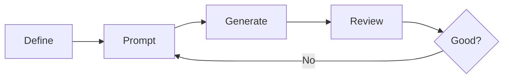
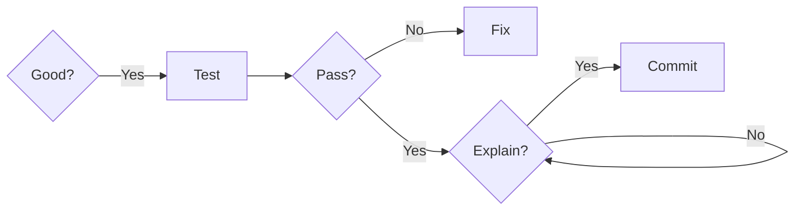

# Week 5: Data Persistence & AI
## Spring Data JPA & AI Code Evaluation

CPSC 310: Software Design

---
layout: two-cols
---

# This Week

## Session 9 (Sept 30)
- Spring Data JPA fundamentals
- Entity classes and relationships
- Repository pattern in Spring
- H2 in-memory database
- Testing with @DataJpaTest

::right::

## Session 10 (Oct 2)
- AI as pair programmer
- Effective prompt engineering
- Common AI mistakes
- Testing AI-generated code
- Code review best practices

---
layout: center
class: text-center
---

# Session 9
## Spring Data JPA

Adding persistence to your REST APIs

---

# Learning Objectives

By the end of Session 9, you will:

- Understand **JPA** and **ORM** concepts
- Create **entity classes** with proper annotations
- Define **entity relationships** (@OneToMany, @ManyToOne)
- Use **Spring Data repositories** for data access
- Configure **H2 in-memory database** for testing
- Write **@DataJpaTest** slice tests

---

# Why Do We Need Persistence?

## Current Problem
```java
@RestController
public class TaskController {
    private List<Task> tasks = new ArrayList<>();  // Lost when app restarts!

    @GetMapping("/tasks")
    public List<Task> getTasks() {
        return tasks;
    }
}
```

## Issues
- Data disappears on restart
- No data sharing between instances
- Cannot scale horizontally
- No data integrity guarantees

---

# The Solution: Databases

## Benefits of Persistence Layer
- **Durability**: Data survives restarts
- **Concurrency**: Multiple users safely
- **Transactions**: ACID guarantees
- **Querying**: Complex data retrieval
- **Relationships**: Model real-world connections

## Spring Data JPA
- Object-Relational Mapping (ORM)
- Database-agnostic code
- Automatic CRUD operations
- Type-safe queries

---

# JPA Entity Basics

## What is an Entity?

A Java class that maps to a database table

```java
@Entity
public class Task {
    @Id
    @GeneratedValue(strategy = GenerationType.IDENTITY)
    private Long id;

    private String title;
    private String description;
    private boolean completed;

    // constructors, getters, setters
}
```

---

# Entity Annotations Explained

```java
@Entity                                      // Marks as JPA entity
@Table(name = "tasks")                       // Optional: custom table name
public class Task {

    @Id                                      // Primary key
    @GeneratedValue(strategy = GenerationType.IDENTITY)  // Auto-increment
    private Long id;

    @Column(nullable = false, length = 100)  // Column constraints
    private String title;

    @Column(columnDefinition = "TEXT")       // Custom SQL type
    private String description;

    private boolean completed;                // Defaults: column name = field name
}
```

---

# Using Records as Entities

## Modern Java Approach

```java
@Entity
public record Task(
    @Id
    @GeneratedValue(strategy = GenerationType.IDENTITY)
    Long id,

    String title,
    String description,
    boolean completed
) {}
```

## Considerations
- ✅ Immutable by default
- ✅ Less boilerplate
- ⚠️ JPA prefers mutable entities
- ⚠️ Consider using records for DTOs instead

---

# Entity Relationships: @ManyToOne

## Example: Tasks belong to Users

```java
@Entity
public class Task {
    @Id
    @GeneratedValue(strategy = GenerationType.IDENTITY)
    private Long id;

    private String title;

    @ManyToOne(fetch = FetchType.LAZY)      // Many tasks → One user
    @JoinColumn(name = "user_id")            // Foreign key column
    private User user;
}
```

---

# Entity Relationships: @OneToMany

## Example: User has many Tasks

```java
@Entity
public class User {
    @Id
    @GeneratedValue(strategy = GenerationType.IDENTITY)
    private Long id;

    private String username;

    @OneToMany(mappedBy = "user",           // Field name in Task
               cascade = CascadeType.ALL,    // Cascade operations
               orphanRemoval = true)         // Delete orphaned tasks
    private List<Task> tasks = new ArrayList<>();
}
```

---

# Relationship Mapping: Bidirectional

```java
// User side
@OneToMany(mappedBy = "user")
private List<Task> tasks = new ArrayList<>();

// Task side
@ManyToOne
@JoinColumn(name = "user_id")
private User user;
```

## Key Points
- `mappedBy` indicates the **owning side**
- Owning side has `@JoinColumn`
- Only owning side persists the relationship
- Helper methods maintain consistency

---

# Helper Methods for Relationships

```java
@Entity
public class User {
    @OneToMany(mappedBy = "user", cascade = CascadeType.ALL)
    private List<Task> tasks = new ArrayList<>();

    // Helper method to maintain consistency
    public void addTask(Task task) {
        tasks.add(task);
        task.setUser(this);    // Set both sides!
    }

    public void removeTask(Task task) {
        tasks.remove(task);
        task.setUser(null);
    }
}
```

**Best Practice**: Always update both sides of relationship

---

# Spring Data Repository Pattern

## Interface-Based Approach

```java
public interface TaskRepository extends JpaRepository<Task, Long> {
    // No implementation needed!
}
```

Spring generates the implementation at runtime!

---

# What JpaRepository Provides

## 80+ methods out of the box

**Create & Update:**
- `save(Task)`, `saveAll(List<Task>)`

**Read:**
- `findById(Long)`, `findAll()`

**Delete:**
- `deleteById(Long)`, `delete(Task)`

**Utilities:**
- `count()`, `existsById(Long)`
- Pagination, sorting, and more!

---

# Custom Query Methods

## Method Naming Convention

```java
public interface TaskRepository extends JpaRepository<Task, Long> {

    // SELECT * FROM task WHERE completed = ?
    List<Task> findByCompleted(boolean completed);

    // SELECT * FROM task WHERE title LIKE ?
    List<Task> findByTitleContaining(String keyword);

    // SELECT * FROM task WHERE user_id = ?
    List<Task> findByUserId(Long userId);

    // SELECT COUNT(*) FROM task WHERE completed = ?
    long countByCompleted(boolean completed);
}
```

**Spring generates the SQL automatically!**

---

# Query Method Keywords (Part 1)

| Keyword | Example | SQL |
|---------|---------|-----|
| `findBy` | `findByTitle(String)` | `WHERE title = ?` |
| `And` | `findByTitleAndCompleted()` | `WHERE title = ? AND completed = ?` |
| `Or` | `findByTitleOrDescription()` | `WHERE title = ? OR description = ?` |
| `Between` | `findByCreatedBetween()` | `WHERE created BETWEEN ? AND ?` |
| `LessThan` | `findByIdLessThan()` | `WHERE id < ?` |

---

# Query Method Keywords (Part 2)

| Keyword | Example | SQL |
|---------|---------|-----|
| `GreaterThan` | `findByIdGreaterThan()` | `WHERE id > ?` |
| `Like` | `findByTitleLike()` | `WHERE title LIKE ?` |
| `Containing` | `findByTitleContaining()` | `WHERE title LIKE '%?%'` |
| `OrderBy` | `findByCompletedOrderByTitle()` | `ORDER BY title` |

---

# Custom JPQL Queries

## When Method Names Get Too Complex

```java
public interface TaskRepository extends JpaRepository<Task, Long> {

    @Query("SELECT t FROM Task t WHERE t.title LIKE %:keyword% OR t.description LIKE %:keyword%")
    List<Task> searchTasks(@Param("keyword") String keyword);

    @Query("SELECT t FROM Task t JOIN t.user u WHERE u.username = :username")
    List<Task> findTasksByUsername(@Param("username") String username);

    @Modifying
    @Query("UPDATE Task t SET t.completed = true WHERE t.user.id = :userId")
    int completeAllTasksForUser(@Param("userId") Long userId);
}
```

---

# H2 In-Memory Database

## Perfect for Development & Testing

```yaml
# application.yml
spring:
  datasource:
    url: jdbc:h2:mem:testdb
    driver-class-name: org.h2.Driver
    username: sa
    password:

  h2:
    console:
      enabled: true
      path: /h2-console

  jpa:
    hibernate:
      ddl-auto: create-drop    # Recreate schema on startup
    show-sql: true             # Log SQL statements
```

---

# H2 Configuration Options

## DDL Auto Options

| Value | Behavior |
|-------|----------|
| `none` | Do nothing |
| `validate` | Validate schema, no changes |
| `update` | Update schema if needed |
| `create` | Create schema, drop existing |
| `create-drop` | Create on start, drop on exit |

---

# DDL Auto: Best Practices

## Choose the Right Option

- **Development**: `create-drop` or `update`
  - Recreate schema on each restart
  - Quick iteration

- **Testing**: `create-drop`
  - Clean state for each test run

- **Production**: `validate` or `none`
  - Never auto-modify production schemas
  - Use migration tools (Flyway, Liquibase)

---

# Accessing H2 Console

## During Development

1. Start your Spring Boot application
2. Navigate to: `http://localhost:8080/h2-console`
3. Use connection settings from `application.yml`:
   - JDBC URL: `jdbc:h2:mem:testdb`
   - Username: `sa`
   - Password: (empty)

---

# H2 Console Benefits

## Why Use It?

- **Visual inspection** of tables and schemas
- **Run SQL queries** directly against your data
- **Verify data** during debugging
- **Explore relationships** between entities
- **Test queries** before adding to repository

Perfect for development and learning!

---

# Service Layer with Repository

```java
@Service
public class TaskService {

    private final TaskRepository taskRepository;

    public TaskService(TaskRepository taskRepository) {
        this.taskRepository = taskRepository;
    }

    public List<Task> getAllTasks() {
        return taskRepository.findAll();
    }

    public Optional<Task> getTaskById(Long id) {
        return taskRepository.findById(id);
    }

    public Task createTask(Task task) {
        return taskRepository.save(task);
    }
}
```

---

# Controller with Service

```java
@RestController
@RequestMapping("/api/tasks")
public class TaskController {

    private final TaskService taskService;

    public TaskController(TaskService taskService) {
        this.taskService = taskService;
    }

    @GetMapping
    public List<Task> getAllTasks() {
        return taskService.getAllTasks();
    }

    @GetMapping("/{id}")
    public ResponseEntity<Task> getTask(@PathVariable Long id) {
        return taskService.getTaskById(id)
            .map(ResponseEntity::ok)
            .orElse(ResponseEntity.notFound().build());
    }
}
```

---

# Testing: @DataJpaTest

## Slice Testing for Repository Layer

```java
@DataJpaTest
class TaskRepositoryTest {

    @Autowired
    private TaskRepository taskRepository;

    @Test
    void shouldSaveAndFindTask() {
        // Given
        Task task = new Task(null, "Test Task", "Description", false);

        // When
        Task saved = taskRepository.save(task);
```

---

# Testing: @DataJpaTest (cont'd)

```java
        // Then
        assertThat(saved.getId()).isNotNull();
        assertThat(taskRepository.findById(saved.getId()))
            .isPresent()
            .get()
            .extracting(Task::getTitle)
            .isEqualTo("Test Task");
    }
}
```

**Key**: Tests are transactional and roll back automatically

---

# @DataJpaTest Features

## What It Does

- Configures **in-memory database** (H2)
- Scans for `@Entity` classes
- Configures **Spring Data repositories**
- Provides `TestEntityManager`
- **Transactional** by default (rolls back after each test)
- **Faster** than @SpringBootTest

## What It Doesn't Include
- Web layer (@Controller)
- Service layer (@Service)
- Security configuration

---

# Testing Custom Query Methods

```java
@DataJpaTest
class TaskRepositoryTest {

    @Autowired
    private TaskRepository taskRepository;

    @BeforeEach
    void setUp() {
        taskRepository.saveAll(List.of(
            new Task(null, "Task 1", "Description", true),
            new Task(null, "Task 2", "Description", false),
            new Task(null, "Task 3", "Description", false)
        ));
    }

    @Test
    void shouldFindCompletedTasks() {
        List<Task> completed = taskRepository.findByCompleted(true);

        assertThat(completed).hasSize(1);
        assertThat(completed.get(0).getTitle()).isEqualTo("Task 1");
    }
}
```

---

# Testing Relationships

```java
@DataJpaTest
class UserRepositoryTest {

    @Autowired
    private UserRepository userRepository;

    @Test
    void shouldSaveUserWithTasks() {
        // Given
        User user = new User(null, "john", new ArrayList<>());
        Task task1 = new Task(null, "Task 1", "Desc", false);
        Task task2 = new Task(null, "Task 2", "Desc", false);

        user.addTask(task1);
        user.addTask(task2);
```

---

# Testing Relationships (cont'd)

```java
        // When
        User saved = userRepository.save(user);

        // Then
        assertThat(saved.getTasks()).hasSize(2);
        assertThat(saved.getTasks())
            .extracting(Task::getTitle)
            .containsExactly("Task 1", "Task 2");
    }
}
```

**Cascade**: Saving user also saves tasks

---

# Common Pitfalls: N+1 Problem

## The Problem

```java
// Fetches all users - 1 query
List<User> users = userRepository.findAll();

// For each user, fetches tasks - N queries
users.forEach(user -> {
    System.out.println(user.getTasks().size());  // Triggers separate query!
});
```

**Total: 1 + N queries** (if 100 users → 101 queries!)

---

# Solution: JOIN FETCH

```java
public interface UserRepository extends JpaRepository<User, Long> {

    @Query("SELECT u FROM User u LEFT JOIN FETCH u.tasks")
    List<User> findAllWithTasks();
}
```

**Result: 1 query with JOIN**

## Alternative: Entity Graphs
```java
@EntityGraph(attributePaths = {"tasks"})
List<User> findAll();
```

---

# Common Pitfall: Lazy Loading Outside Transaction

```java
@Service
public class UserService {

    public User getUser(Long id) {
        return userRepository.findById(id).orElseThrow();
        // Transaction ends here!
    }
}

// In controller
User user = userService.getUser(1L);
user.getTasks().size();  // LazyInitializationException!
```

## Solutions
1. Use `@Transactional` on service method
2. Use `JOIN FETCH` in query
3. Use DTOs with only needed data

---

# Best Practices: DTOs vs Entities

## Entities are for persistence

```java
@Entity
public class Task {
    private Long id;
    private String title;
    @ManyToOne
    private User user;  // Might cause circular references in JSON
}
```

## DTOs are for API

```java
public record TaskDTO(
    Long id,
    String title,
    String description,
    boolean completed,
    String username    // Flattened from User
) {}
```

---

# Mapping Entities to DTOs

```java
@Service
public class TaskService {

    public TaskDTO getTaskDTO(Long id) {
        Task task = taskRepository.findById(id).orElseThrow();
        return new TaskDTO(
            task.getId(),
            task.getTitle(),
            task.getDescription(),
            task.isCompleted(),
            task.getUser().getUsername()
        );
    }
}
```

---

# DTO Mapping Libraries

## Options to Consider

- **MapStruct**: Compile-time mapping
  - Type-safe, fast, generated code

- **ModelMapper**: Runtime mapping
  - Flexible, convention-based

- **Manual mapping**: Most control
  - Clear, explicit, easy to debug

---

# Dependencies for Spring Data JPA

```kotlin
// build.gradle.kts
dependencies {
    implementation("org.springframework.boot:spring-boot-starter-data-jpa")
    implementation("org.springframework.boot:spring-boot-starter-web")

    runtimeOnly("com.h2database:h2")  // In-memory database

    testImplementation("org.springframework.boot:spring-boot-starter-test")
}
```

---

# Production Database Dependencies

```kotlin
// build.gradle.kts - PostgreSQL
dependencies {
    runtimeOnly("org.postgresql:postgresql")
}
```

```kotlin
// build.gradle.kts - MySQL
dependencies {
    runtimeOnly("com.mysql:mysql-connector-j")
}
```

**Note**: H2 for dev/test, real database for production

---

# Live Coding Demo

## Let's Build Together

1. Create `Task` entity with relationships
2. Create `TaskRepository` with custom queries
3. Update `TaskService` to use repository
4. Write `@DataJpaTest` tests
5. Test in H2 console
6. Run full application

---
layout: center
class: text-center
---

# Session 10
## AI Code Evaluation

Working effectively with AI coding assistants

---

# Learning Objectives

By the end of Session 10, you will:

- Understand **AI as pair programmer** model
- Write **effective prompts** for code generation
- Recognize **common AI mistakes** in Java/Spring
- Apply **testing strategies** for AI-generated code
- Conduct **thorough code reviews**
- Make informed decisions about **when to trust AI**

---

# AI as Pair Programmer

## Traditional Pair Programming

- **Driver**: Types the code
- **Navigator**: Thinks strategically, reviews, suggests

## With AI

- **You**: Navigator + Quality Control
- **AI**: Driver + Code Generator

**Key Difference**: You're responsible for correctness

---

# The AI Development Workflow

## Top Row: Generate & Review


## Bottom Row: Test & Verify


---

# Effective Prompt Engineering

## Poor Prompt ❌
```
create a rest api for tasks
```

## Better Prompt ✅
```
Create a Spring Boot REST API for task management with:
- Entity: Task (id, title, description, completed, createdAt)
- Repository using Spring Data JPA
- Service layer with business logic
- Controller with CRUD endpoints
- Use ResponseEntity for proper HTTP responses
- Include validation annotations
- Follow RESTful conventions
```

---

# Prompt Structure: The 4 C's

## 1. **Context**
"We're building a task management API with Spring Boot 3"

## 2. **Constraints**
"Use Spring Data JPA, return ResponseEntity, follow REST conventions"

## 3. **Clarity**
"Create a POST endpoint that accepts JSON, validates input, saves to database"

## 4. **Code Examples** (when helpful)
"Similar to this structure: [paste existing code pattern]"

---

# Common AI Mistakes: Outdated Patterns

## AI Might Generate ❌

```java
@Autowired  // Field injection (discouraged)
private TaskRepository taskRepository;
```

## You Should Use ✅

```java
private final TaskRepository taskRepository;

public TaskService(TaskRepository taskRepository) {
    this.taskRepository = taskRepository;
}
```

**Lesson**: AI training data includes old code patterns

---

# Common AI Mistakes: Over-Engineering

## AI Might Generate ❌

```java
public class TaskService {
    public Task createTask(CreateTaskRequest request) {
        TaskValidator validator = new TaskValidator();
        ValidationResult result = validator.validate(request);
        if (!result.isValid()) {
            throw new ValidationException(result.getErrors());
        }
        Task task = TaskMapper.mapFromRequest(request);
        task = taskRepository.save(task);
        return TaskMapper.mapToResponse(task);
    }
}
```

## When This Is Simpler ✅

```java
public Task createTask(@Valid Task task) {
    return taskRepository.save(task);
}
```

---

# Common AI Mistakes: Missing Edge Cases

## AI Generated Code ❌

```java
public Task getTaskById(Long id) {
    return taskRepository.findById(id).get();  // NoSuchElementException!
}
```

## Proper Error Handling ✅

```java
public Task getTaskById(Long id) {
    return taskRepository.findById(id)
        .orElseThrow(() -> new TaskNotFoundException(id));
}
```

**Lesson**: AI focuses on happy path

---

# Common AI Mistakes: Security Issues

## AI Might Generate ❌

```java
@GetMapping("/tasks")
public List<Task> getUserTasks(@RequestParam String userId) {
    return taskRepository.findByUserId(userId);  // No authentication check!
}
```

## Secure Version ✅

```java
@GetMapping("/tasks")
public List<Task> getUserTasks(@AuthenticationPrincipal User user) {
    return taskRepository.findByUserId(user.getId());
}
```

**Lesson**: AI doesn't understand your security requirements

---

# Common AI Mistakes: Deprecated APIs

## AI Might Suggest ❌

```java
RestTemplate restTemplate = new RestTemplate();  // Soft-deprecated
String result = restTemplate.getForObject(url, String.class);
```

## Modern Approach ✅

```java
WebClient webClient = WebClient.create();
String result = webClient.get()
    .uri(url)
    .retrieve()
    .bodyToMono(String.class)
    .block();
```

**Check**: Spring Boot version compatibility

---

# Testing AI-Generated Code

## Why Testing Is Critical

1. **Verifies correctness** - Does it actually work?
2. **Reveals edge cases** - What about nulls, empty lists?
3. **Documents behavior** - Tests are executable specs
4. **Enables refactoring** - Safety net for improvements

## The Rule

**If you didn't write the code, you MUST test it thoroughly**

---

# Test-First Approach with AI

## Better Workflow

1. **Write the test first** (you know what you want)
2. **Ask AI to make it pass**
3. **Review AI's solution**
4. **Run the test** (did it work?)
5. **Add edge case tests**

## Benefits
- Clear requirements for AI
- Immediate verification
- Forces you to think first

---

# Example: Test-First with AI

## Step 1: Write Test

```java
@Test
void shouldFindTasksByUser() {
    User user = new User(1L, "john");
    Task task1 = new Task(null, "Task 1", "Desc", false, user);
    Task task2 = new Task(null, "Task 2", "Desc", false, user);

    taskRepository.saveAll(List.of(task1, task2));

    List<Task> tasks = taskRepository.findByUserId(1L);

    assertThat(tasks).hasSize(2);
}
```

---

# Example: Test-First with AI (cont'd)

## Step 2: Prompt AI

```
Here's my test: [paste test]

Implement the findByUserId method in TaskRepository
to make this test pass. Use Spring Data JPA conventions.
```

## Step 3: Review & Run

- Check method signature
- Verify naming convention
- Run the test
- Add more edge cases

---

# Code Review Checklist: SOLID

## When Reviewing AI Code

- [ ] **Single Responsibility**: Each class has one reason to change?
- [ ] **Open/Closed**: Can extend without modifying?
- [ ] **Liskov Substitution**: Subtypes replaceable?
- [ ] **Interface Segregation**: No unused methods?
- [ ] **Dependency Inversion**: Depends on abstractions?

---

# Code Review Checklist: Quality

## Additional Checks

- [ ] **Naming**: Clear, descriptive names?
- [ ] **Null safety**: Proper use of Optional?
- [ ] **Error handling**: Specific exceptions?
- [ ] **Testing**: Edge cases covered?
- [ ] **Performance**: N+1 queries avoided?
- [ ] **Security**: Input validation, authorization?
- [ ] **Modern APIs**: Up-to-date Spring features?

---

# When to Trust AI

## High Trust ✅
- Boilerplate code (entities, DTOs)
- Standard CRUD operations
- Test data setup
- Configuration files
- Common patterns you understand

## Low Trust ⚠️
- Complex business logic
- Security-critical code
- Performance-sensitive operations
- Error handling strategies
- Architecture decisions

---

# When to Trust AI: Litmus Test

## Ask Yourself

1. **Can I explain this code** to a teammate?
2. **Do I understand** why it works?
3. **Could I debug** it if it fails?
4. **Does it follow** our project conventions?
5. **Are there tests** proving it works?

**If any answer is "no"**: Don't commit yet!

---

# Real Example: Human vs AI Code

## AI Generated (First Pass) ❌

```java
@GetMapping("/tasks/{id}")
public Task getTask(@PathVariable Long id) {
    Optional<Task> task = taskRepository.findById(id);
    if (task.isPresent()) {
        return task.get();
    } else {
        return null;  // Wrong HTTP semantics!
    }
}
```

---

# Real Example: Human vs AI Code (cont'd)

## Human Improved ✅

```java
@GetMapping("/tasks/{id}")
public ResponseEntity<Task> getTask(@PathVariable Long id) {
    return taskRepository.findById(id)
        .map(ResponseEntity::ok)
        .orElse(ResponseEntity.notFound().build());
}
```

## What Changed?
- Return `ResponseEntity` for proper HTTP codes
- Use functional style with `map`
- Return 404 instead of null

---

# Iterative Refinement with AI

## Round 1: Basic Prompt
"Create a task controller"

## Round 2: After Review
"Use ResponseEntity for proper HTTP status codes"

---

# Iterative Refinement (cont'd)

## Round 3: After Testing
"Add validation and handle duplicate task titles"

## Round 4: After Code Review
"Extract business logic to service layer following SRP"

**Improvement happens through iteration**

---

# Red Flags in AI Code

Watch out for:

- ⚠️ **Deprecated annotations** (`@Autowired` on fields)
- ⚠️ **`.get()` on Optional** without checking
- ⚠️ **Null returns** instead of Optional or exceptions
- ⚠️ **Catching generic Exception**
- ⚠️ **No input validation**
- ⚠️ **Hardcoded values** (ports, URLs, credentials)
- ⚠️ **Missing @Transactional** when needed
- ⚠️ **Comments explaining what** instead of why

---

# Best Practice: Document AI Assistance

## In Your Code

```java
/**
 * Finds all tasks for a specific user.
 *
 * AI-generated initial implementation, refined to:
 * - Use proper Spring Data query method naming
 * - Add pagination support
 * - Include soft-deleted filtering
 */
public Page<Task> findActiveTasksByUserId(Long userId, Pageable pageable) {
    return taskRepository.findByUserIdAndDeletedFalse(userId, pageable);
}
```

## In Commit Messages
```
Add user task filtering with pagination

- Initial structure from AI prompt
- Added pagination support manually
- Added soft-delete filtering based on code review
```

---

# AI Prompt Examples: Entity

## Good Prompt

```
Create a JPA entity called Task with:
- Long id (auto-generated)
- String title (required, max 100 chars)
- String description (optional, TEXT type)
- boolean completed (default false)
- LocalDateTime createdAt (auto-set on creation)
- ManyToOne relationship to User

Use Java records if possible, otherwise standard class with:
- Constructor
- Getters
- Builder pattern
```

---

# AI Prompt Examples: Repository

## Good Prompt

```
Create a Spring Data JPA repository for Task entity with:
- Standard CRUD operations (extends JpaRepository)
- Custom method: find all tasks by user ID
- Custom method: find incomplete tasks ordered by creation date
- Custom method: count tasks by completion status
- Use Spring Data query method naming conventions
```

---

# AI Prompt Examples: Service

## Good Prompt

```
Create a TaskService class with:
- Constructor injection of TaskRepository
- Method: createTask - validates title is not empty, sets createdAt
- Method: completeTask - finds by ID, sets completed=true, throws TaskNotFoundException if not found
- Method: getUserTasks - returns all tasks for given user ID
- Use @Service annotation
- Return types should use Optional where appropriate
```

---

# AI Prompt Examples: Tests

## Good Prompt

```
Create @DataJpaTest for TaskRepository testing:
- Test saving and retrieving a task
- Test findByUserId returns correct tasks
- Test findByCompletedFalse returns only incomplete tasks
- Use @BeforeEach to set up test data
- Use AssertJ assertions
- Each test should be independent
```

---

# Comparative Analysis: Exercise

## Your Turn

Compare these two implementations:

**Version A**: AI generated (first pass)
**Version B**: Human refined

Discuss:
1. What's different?
2. What's better in Version B?
3. What's the actual impact?
4. How would you have improved it?

---

# Lab Exercise: AI Evaluation

## Task

1. **Ask AI** to generate a `UserService` class
2. **Review** the generated code
3. **Write tests** for it
4. **Identify issues** (use checklist)
5. **Refine** the code
6. **Document** what you changed and why

---

# Lab Deliverable

## What to Submit

- Original AI code (commented out)
- Your improved version
- Test suite
- Brief explanation of changes

**Focus**: Quality over quantity

---

# Key Takeaways: AI Collaboration

1. **AI is a tool**, not a replacement for thinking
2. **Tests are mandatory** for AI-generated code
3. **Understand before committing** - you're responsible
4. **Iterate and refine** - first pass is rarely best
5. **Know the red flags** - security, edge cases, deprecated APIs
6. **Document AI assistance** - helps team understand decisions
7. **Use test-first approach** when possible

---

# Best Practices Summary

## Do ✅
- Write detailed prompts with context
- Review all AI-generated code
- Test thoroughly including edge cases
- Refactor for clarity and simplicity
- Document significant AI contributions

## Don't ❌
- Blindly copy-paste AI code
- Skip understanding how it works
- Trust AI for security decisions
- Forget to test edge cases
- Ignore deprecated warnings

---

# Resources

## Documentation
- Spring Data JPA: [docs.spring.io/spring-data/jpa](https://docs.spring.io/spring-data/jpa)
- H2 Database: [h2database.com](https://h2database.com)
- JPA Annotations: [jakarta.ee](https://jakarta.ee)

## AI Tools
- GitHub Copilot, Claude, ChatGPT, Gemini

---

# Next Week

## SOLID Principles in Depth
- Single Responsibility Principle (SRP)
- Open/Closed Principle (OCP)
- Liskov Substitution Principle (LSP)

## Plus
- Refactoring strategies
- Applying SOLID to Spring Boot