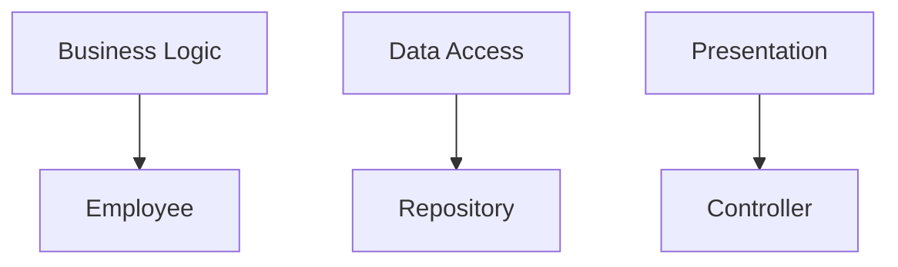
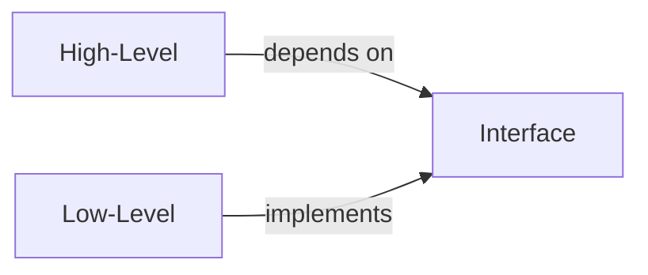

# Week 6: SOLID Principles

## Foundation of Good Object-Oriented Design

<div class="pt-12">
  <span @click="$slidev.nav.next" class="px-2 py-1 rounded cursor-pointer" hover="bg-white bg-opacity-10">
    Building maintainable, extensible software <carbon:arrow-right class="inline"/>
  </span>
</div>

<div class="abs-br m-6 flex gap-2">
  <span class="text-sm opacity-50">CPSC 310 | Fall 2025</span>
</div>

---
layout: two-cols
---

# This Week's Plan

<v-clicks>

## Session 11 (Oct 7)
- Single Responsibility Principle (SRP)
- Open-Closed Principle (OCP)
- Liskov Substitution Principle (LSP)

## Session 12 (Oct 9)
- Interface Segregation Principle (ISP)
- Dependency Inversion Principle (DIP)
- SOLID in Spring Boot

</v-clicks>

::right::

<div class="mt-12">
<v-clicks>

### Milestone 2 Due Oct 16
- CRUD API with SOLID principles
- 80% test coverage
- Refactored architecture

### Team Assignment 6
- Refactor existing code to follow SOLID
- Document design decisions
- Due Oct 23

</v-clicks>
</div>

---

# What is SOLID?

<div class="grid grid-cols-2 gap-8">
<div>

## The Five Principles

<v-clicks>

- **S** - Single Responsibility Principle
- **O** - Open-Closed Principle
- **L** - Liskov Substitution Principle
- **I** - Interface Segregation Principle
- **D** - Dependency Inversion Principle

</v-clicks>

</div>
<div>

## Why SOLID Matters

<v-clicks>

- Makes code more **maintainable**
- Reduces **coupling** between components
- Improves **testability**
- Enables easier **extension** and modification
- Creates more **flexible** architectures

</v-clicks>

</div>
</div>

---

# SOLID Origins

<v-clicks>

- Coined by **Robert C. Martin** ("Uncle Bob")
- Distilled from decades of OOP experience
- Not rules, but **guiding principles**
- Apply pragmatically, not dogmatically
- Foundation for design patterns

</v-clicks>

<div v-click class="mt-8 p-4 bg-blue-50 dark:bg-blue-900 rounded">

💡 **Key Insight**: SOLID principles work together. Applying one often leads to applying others.

</div>

---
layout: section
---

# Single Responsibility Principle (SRP)

> A class should have only one reason to change

---

# SRP: The Core Idea

<v-clicks>

- Each class should have **one responsibility**
- **Separation of concerns**
- High **cohesion** within classes
- Low **coupling** between classes
- A "reason to change" = a responsibility

</v-clicks>

<div v-click class="mt-8">

## Example Responsibilities

<div class="grid grid-cols-3 gap-4 mt-4">



</div>
</div>

---

# SRP Violation: God Class

```java
public class Employee {
    private String name;
    private double salary;

    // Responsibility 1: Business logic
    public double calculatePay() {
        return salary * 1.1;
    }

    // Responsibility 2: Data access
    public void saveToDatabase() {
        Connection conn = DriverManager.getConnection(DB_URL);
        // SQL logic...
    }
```

---

# SRP Violation: God Class (continued)

```java
    // Responsibility 3: Communication
    public void sendPayslipEmail() {
        EmailSender.send(email, "Payslip", generatePayslip());
    }

    // Responsibility 4: Reporting
    public String generateReport() {
        return "Employee Report: " + name;
    }
}
```

<div class="mt-4 text-red-500">❌ Too many reasons to change!</div>

---

# SRP: Refactored Design

```java
// Responsibility 1: Employee data
public class Employee {
    private String name;
    private double salary;
    // Just data, getters, setters
}

// Responsibility 2: Payroll calculations
public class PayrollCalculator {
    public double calculatePay(Employee employee) {
        return employee.getSalary() * 1.1;
    }
}
```

---

# SRP: Refactored Design (continued)

```java
// Responsibility 3: Data access
public class EmployeeRepository {
    public void save(Employee employee) {
        // Database logic
    }
}

// Responsibility 4: Notifications
public class PayrollNotificationService {
    public void sendPayslip(Employee employee, double pay) {
        // Email logic
    }
}
```

<div class="mt-4 text-green-500">✅ Each class has one reason to change</div>

---

# SRP in Our Examples

See `examples/design-patterns/src/main/java/edu/trincoll/solid/srp/`

```java {all|1-7|9-13|15-19}
// Employee.java - Just data
public record Employee(
    String id,
    String name,
    double salary
) {}

// PayrollCalculator.java - Business logic only
public class PayrollCalculator {
    public double calculatePay(Employee employee) {
        return employee.salary() * 1.1;
    }
}

// EmployeeRepository.java - Data access only
public class EmployeeRepository {
    public void save(Employee employee) {
        // Persistence logic
    }
}
```

---

# SRP Benefits

<v-clicks>

## Easier to Understand
- Each class has a clear, focused purpose
- Less cognitive load when reading code

## Easier to Test
- Smaller, focused test suites
- Mock dependencies are simpler

</v-clicks>

---

# SRP Benefits (continued)

<v-clicks>

## Easier to Change
- Changes are localized to one class
- Reduced risk of breaking unrelated functionality

## Better Reusability
- Focused classes are easier to reuse
- No unwanted baggage

</v-clicks>

---
layout: section
---

# Open-Closed Principle (OCP)

> Software entities should be open for extension but closed for modification

---

# OCP: The Core Idea

<v-clicks>

- **Open for extension**: Add new functionality
- **Closed for modification**: Don't change existing code
- Use **abstraction** and **polymorphism**
- New requirements → New classes, not modified classes
- Strategy pattern is the classic example

</v-clicks>

<div v-click class="mt-8 p-4 bg-yellow-50 dark:bg-yellow-900 rounded">

⚠️ **Why?** Modifying existing code risks breaking working functionality

</div>

---

# OCP Violation: Switch Statement

```java {all|2-11}
public class DiscountCalculator {
    public double calculateDiscount(Customer customer, double amount) {
        if (customer.getType() == CustomerType.REGULAR) {
            return amount * 0.05;
        } else if (customer.getType() == CustomerType.PREMIUM) {
            return amount * 0.10;
        } else if (customer.getType() == CustomerType.VIP) {
            return amount * 0.20;
        }
        return 0;
    }
}
```

<v-click>

## Problems:
- Adding a new customer type requires **modifying** this class
- Risk of breaking existing discount logic
- Violates OCP

</v-click>

---

# OCP: Strategy Pattern Solution

```java {all|1-3|5-9}
public interface DiscountStrategy {
    double calculateDiscount(double amount);
}

public class RegularCustomerDiscount implements DiscountStrategy {
    public double calculateDiscount(double amount) {
        return amount * 0.05;
    }
}
```

---

# OCP: More Strategy Implementations

```java
public class PremiumCustomerDiscount implements DiscountStrategy {
    public double calculateDiscount(double amount) {
        return amount * 0.10;
    }
}

public class VIPCustomerDiscount implements DiscountStrategy {
    public double calculateDiscount(double amount) {
        return amount * 0.20;
    }
}
```

<div class="mt-4 text-green-500">✅ Add new discounts without modifying existing code</div>

---

# OCP: Using the Strategy

```java
public class Customer {
    private final DiscountStrategy discountStrategy;

    public Customer(DiscountStrategy strategy) {
        this.discountStrategy = strategy;
    }

    public double applyDiscount(double amount) {
        return discountStrategy.calculateDiscount(amount);
    }
}
```

---

# OCP: Easy to Extend

```java
// Adding new discount types is easy!
public class StudentDiscount implements DiscountStrategy {
    public double calculateDiscount(double amount) {
        return amount * 0.15;
    }
}
```

See `examples/design-patterns/src/main/java/edu/trincoll/solid/ocp/`

---

# OCP in Modern Java

```java
// Sealed classes help enforce OCP
public sealed interface PaymentMethod
    permits CreditCard, DebitCard, PayPal {}

public record CreditCard(String number, double transactionFee)
    implements PaymentMethod {}

public record DebitCard(String number)
    implements PaymentMethod {}

public record PayPal(String email)
    implements PaymentMethod {}

// Pattern matching supports extension
public double calculateFee(PaymentMethod method) {
    return switch (method) {
        case CreditCard(var number, var fee) -> fee;
        case DebitCard(var number) -> 0.0;
        case PayPal(var email) -> 2.5;
    };
}
```

---
layout: section
---

# Liskov Substitution Principle (LSP)

> Objects of a superclass should be replaceable with objects of its subclasses without breaking the application

---

# LSP: The Core Idea

<v-clicks>

- Subtypes must be **substitutable** for their base types
- Derived classes must not **violate** base class behavior
- About **behavioral compatibility**, not just syntax
- "Is-a" relationship must be **preserved**
- Preconditions cannot be strengthened
- Postconditions cannot be weakened

</v-clicks>

<div v-click class="mt-8 p-4 bg-purple-50 dark:bg-purple-900 rounded">

💡 **Key Test**: If you replace a base class with a subclass, the program should still work correctly

</div>

---

# LSP: Classic Violation - Rectangle

```java
public class Rectangle {
    protected int width, height;

    public void setWidth(int width) {
        this.width = width;
    }

    public void setHeight(int height) {
        this.height = height;
    }

    public int getArea() {
        return width * height;
    }
}
```

---

# LSP: Classic Violation - Square

```java
public class Square extends Rectangle {
    @Override
    public void setWidth(int width) {
        this.width = width;
        this.height = width;  // Maintains square invariant
    }

    @Override
    public void setHeight(int height) {
        this.width = height;
        this.height = height;
    }
}
```

---

# LSP: Why Square/Rectangle Fails

```java {all|1-6|8-11}
public void testRectangle(Rectangle rect) {
    rect.setWidth(5);
    rect.setHeight(4);

    // This assertion works for Rectangle but fails for Square!
    assert rect.getArea() == 20;
}

Rectangle rect = new Rectangle();
testRectangle(rect);  // ✅ Works: area is 20

Rectangle square = new Square();
testRectangle(square);  // ❌ Fails: area is 16, not 20
```

<v-click>

## The Problem
- Square **changes** the expected behavior of Rectangle
- Violates the **behavioral contract** of the base class
- Substitution is **not safe**

</v-click>

---

# LSP: Better Design

```java {all|1-3|5-15}
public interface Shape {
    double getArea();
}

public class Rectangle implements Shape {
    private final double width, height;

    public Rectangle(double width, double height) {
        this.width = width;
        this.height = height;
    }

    public double getArea() {
        return width * height;
    }
}
```

---

# LSP: Better Design (continued)

```java
public class Square implements Shape {
    private final double side;

    public Square(double side) {
        this.side = side;
    }

    public double getArea() {
        return side * side;
    }
}
```

<div class="mt-4 text-green-500">✅ No inheritance, no violation</div>

---

# LSP: Bird Hierarchy Example

See `examples/design-patterns/src/main/java/edu/trincoll/solid/lsp/`

```java
// ❌ Bad: Not all birds can fly!
public class Bird {
    public void fly() { /* ... */ }
}

public class Penguin extends Bird {
    @Override
    public void fly() {
        throw new UnsupportedOperationException("Penguins can't fly!");
    }
}
```

---

# LSP: Bird Hierarchy Fixed

```java
// ✅ Better: Separate flying capability
public interface FlyingBird {
    void fly();
}

public class Eagle implements FlyingBird {
    public void fly() { /* ... */ }
}

public class Penguin {
    // No fly method - doesn't implement FlyingBird
}
```

---

# LSP: Collections Violation

```java
// ❌ Violates LSP
public class ReadOnlyList<T> extends ArrayList<T> {
    @Override
    public boolean add(T element) {
        throw new UnsupportedOperationException("Read-only!");
    }
}

// Code expecting ArrayList will break
public void processItems(ArrayList<String> items) {
    items.add("New Item");  // 💥 Throws exception with ReadOnlyList!
}
```

---

# LSP: Collections Fixed

```java
// ✅ Correct: Use composition, not inheritance
public class ReadOnlyList<T> {
    private final List<T> items;

    public ReadOnlyList(List<T> items) {
        this.items = Collections.unmodifiableList(new ArrayList<>(items));
    }

    public T get(int index) { return items.get(index); }
    public int size() { return items.size(); }
    // No add/remove methods
}
```

---
layout: section
---

# Interface Segregation Principle (ISP)

> Clients should not be forced to depend on interfaces they don't use

---

# ISP: The Core Idea

<v-clicks>

- Prefer **small, focused** interfaces
- Avoid "fat" interfaces with too many methods
- Interface pollution leads to unnecessary dependencies
- Split large interfaces into smaller, cohesive ones
- Clients only depend on what they actually use

</v-clicks>

<div v-click class="mt-8 p-4 bg-green-50 dark:bg-green-900 rounded">

💡 **Analogy**: A Swiss Army knife is great, but sometimes you just need a simple screwdriver

</div>

---

# ISP Violation: Fat Interface

```java
public interface Worker {
    void work();
    void eat();
    void sleep();
    void attendMeeting();
    void writeCode();
    void testCode();
    void deployCode();
    void fixBugs();
}
```

---

# ISP Violation: Forced Implementation

```java
public class Developer implements Worker {
    // Must implement all methods, even if some don't make sense
}

public class Robot implements Worker {
    public void eat() {
        throw new UnsupportedOperationException("Robots don't eat");
    }

    public void sleep() {
        throw new UnsupportedOperationException("Robots don't sleep");
    }
    // Forced to implement irrelevant methods
}
```

<div class="mt-4 text-red-500">❌ Forced to implement unused methods</div>

---

# ISP: Segregated Interfaces

```java
public interface Workable {
    void work();
}

public interface Eatable {
    void eat();
}

public interface Sleepable {
    void sleep();
}

public interface Codeable {
    void writeCode();
    void testCode();
    void fixBugs();
}
```

---

# ISP: Using Segregated Interfaces

```java
// Classes implement only relevant interfaces
public class Developer implements Workable, Eatable, Sleepable, Codeable {
    // All methods make sense
}

public class Robot implements Workable, Codeable {
    // Only implements what robots actually do
}
```

<div class="mt-4 text-green-500">✅ Clients depend only on what they use</div>

---

# ISP: Printer Example

See `examples/design-patterns/src/main/java/edu/trincoll/solid/isp/`

```java
// ❌ Fat interface
public interface MultiFunctionDevice {
    void print();
    void scan();
    void fax();
    void copy();
    void email();
    void staple();
}
```

---

# ISP: Printer Example Fixed

```java
// ✅ Segregated interfaces
public interface Printable {
    void print();
}

public interface Scannable {
    void scan();
}

public interface Faxable {
    void fax();
}
```

---

# ISP: Using Printer Interfaces

```java
// Simple printer only implements what it can do
public class BasicPrinter implements Printable {
    public void print() { /* ... */ }
}

// All-in-one device implements multiple interfaces
public class OfficeDevice implements Printable, Scannable, Faxable {
    public void print() { /* ... */ }
    public void scan() { /* ... */ }
    public void fax() { /* ... */ }
}
```

---

# ISP Benefits

<v-clicks>

## Reduced Coupling
- Classes depend on minimal interfaces
- Changes to unused methods don't affect clients

## Better Testability
- Mock only the methods you need
- Smaller, focused test doubles

</v-clicks>

---

# ISP Benefits (continued)

<v-clicks>

## More Flexibility
- Mix and match interfaces as needed
- Compose behavior from multiple interfaces

## Clearer Intent
- Interface names express specific capabilities
- Self-documenting code

</v-clicks>

---
layout: section
---

# Dependency Inversion Principle (DIP)

> High-level modules should not depend on low-level modules. Both should depend on abstractions.

---

# DIP: The Core Idea

<v-clicks>

- **Depend on abstractions**, not concretions
- **High-level** policy should not depend on **low-level** details
- Interfaces define **contracts**
- Implementation details are **hidden**
- Enables **dependency injection**
- Inverts the traditional dependency direction

</v-clicks>

<div v-click class="mt-8">



</div>

---

# DIP Violation: Direct Dependencies

```java {all|2-7|9-14}
public class EmailService {
    private SmtpServer smtpServer;

    public EmailService() {
        // Direct dependency on concrete class
        this.smtpServer = new SmtpServer("mail.example.com", 587);
    }

    public void sendEmail(String to, String subject, String body) {
        smtpServer.connect();
        smtpServer.authenticate("user", "password");
        smtpServer.send(to, subject, body);
        smtpServer.disconnect();
    }
}
```

<v-click>

## Problems:
- **Tightly coupled** to SMTP implementation
- Hard to **test** (requires real SMTP server)
- Can't **switch** to different email provider
- **Violates** DIP

</v-click>

---

# DIP: Depend on Abstraction

```java
public interface MessageService {
    void send(String to, String subject, String body);
}

public class EmailService implements MessageService {
    private final String host;
    private final int port;

    public EmailService(String host, int port) {
        this.host = host;
        this.port = port;
    }

    public void send(String to, String subject, String body) {
        // SMTP implementation
    }
}
```

---

# DIP: High-Level Module

```java
public class NotificationService {
    private final MessageService messageService;

    // Depend on abstraction, not concrete class
    public NotificationService(MessageService messageService) {
        this.messageService = messageService;
    }

    public void notifyUser(String email, String message) {
        messageService.send(email, "Notification", message);
    }
}
```

---

# DIP: Benefits

```java {all|1-3|5-8|10-14}
// Easy to test with mocks
MessageService mockService = mock(MessageService.class);
NotificationService service = new NotificationService(mockService);

// Easy to switch implementations
MessageService emailService = new EmailService("smtp.gmail.com", 587);
MessageService smsService = new SMSService("api.twilio.com");
MessageService slackService = new SlackService("hooks.slack.com");

// Different services for different environments
MessageService service = isDevelopment()
    ? new ConsoleMessageService()  // Logs to console
    : new EmailService(host, port); // Sends real emails
NotificationService notifier = new NotificationService(service);
```

See `examples/design-patterns/src/main/java/edu/trincoll/solid/dip/`

---

# DIP: Repository Pattern

```java
// Domain layer (high-level) defines the contract
public interface UserRepository {
    User findById(Long id);
    void save(User user);
    List<User> findByEmail(String email);
}
```

---

# DIP: Repository Implementation

```java
// Infrastructure layer (low-level) implements it
public class JpaUserRepository implements UserRepository {
    private final EntityManager entityManager;

    public User findById(Long id) {
        return entityManager.find(User.class, id);
    }

    public void save(User user) {
        entityManager.persist(user);
    }

    public List<User> findByEmail(String email) {
        return entityManager.createQuery(
            "SELECT u FROM User u WHERE u.email = :email", User.class)
            .setParameter("email", email)
            .getResultList();
    }
}
```

---

# DIP in Spring Boot

```java
// Interface in domain/service layer
public interface PaymentGateway {
    PaymentResult process(Payment payment);
}

// Implementation in infrastructure layer
@Service
public class StripePaymentGateway implements PaymentGateway {
    public PaymentResult process(Payment payment) {
        // Stripe API calls
    }
}

// Service depends on abstraction
@Service
public class OrderService {
    private final PaymentGateway paymentGateway;

    // Spring injects concrete implementation
    public OrderService(PaymentGateway paymentGateway) {
        this.paymentGateway = paymentGateway;
    }

    public void checkout(Order order) {
        Payment payment = order.getPayment();
        PaymentResult result = paymentGateway.process(payment);
        // ...
    }
}
```

---

# SOLID Principles Working Together

```java
// ISP: Focused interface
public interface NotificationSender {
    void send(String message, String recipient);
}

// SRP: Each implementation has one responsibility
// OCP: Easy to add new notification types
// LSP: All senders are substitutable
public class EmailNotificationSender implements NotificationSender {
    private final EmailService emailService;

    public EmailNotificationSender(EmailService emailService) {
        this.emailService = emailService;
    }

    public void send(String message, String recipient) {
        emailService.send(recipient, "Notification", message);
    }
}
```

---

# SOLID Working Together (continued)

```java
// DIP: Depends on abstraction
public class NotificationService {
    private final List<NotificationSender> senders;

    public NotificationService(List<NotificationSender> senders) {
        this.senders = senders;
    }

    public void notifyAll(String message, List<String> recipients) {
        recipients.forEach(recipient ->
            senders.forEach(sender -> sender.send(message, recipient)));
    }
}
```

---

# Testing with SOLID

```java
@Test
void shouldSendNotificationViaEmail() {
    // DIP makes testing easy - inject mocks
    EmailService mockEmailService = mock(EmailService.class);
    NotificationSender emailSender =
        new EmailNotificationSender(mockEmailService);
    NotificationService service =
        new NotificationService(List.of(emailSender));

    // Act
    service.notifyAll("Hello", List.of("user@example.com"));

    // Assert
    verify(mockEmailService).send(
        eq("user@example.com"),
        eq("Notification"),
        eq("Hello")
    );
}
```

---

# SOLID Benefits for Testing

- **SRP**: Smaller, focused tests
- **DIP**: Easy to inject mocks
- **ISP**: Mock only what you need
- **LSP**: Tests work with any subtype
- **OCP**: Add new tests without changing existing

---

# SOLID and AI-Generated Code

When reviewing AI code, check for:

## Common AI Violations
- **God classes** doing too many things (SRP)
- **Hard-coded dependencies** (DIP)
- **Switch statements** that need modification for new cases (OCP)
- **Fat interfaces** with too many methods (ISP)
- **Broken inheritance** hierarchies (LSP)

---

# Questions to Ask About AI Code

- Can I extend this without modification? (OCP)
- Does this class have one responsibility? (SRP)
- Am I depending on abstractions? (DIP)
- Are my interfaces focused? (ISP)
- Is substitution safe? (LSP)

---

# SOLID Violations in the Wild

<div class="grid grid-cols-2 gap-8">
<div>

## God Classes
```java
class UserManager {
    void createUser() {}
    void sendEmail() {}
    void logActivity() {}
    void generateReport() {}
    void processPayment() {}
}
```
Violates **SRP**

<v-click>

## Rigid Hierarchies
```java
class Shape {
    void draw() {
        if (type == CIRCLE) {
            // draw circle
        } else if (type == SQUARE) {
            // draw square
        }
    }
}
```
Violates **OCP**

</v-click>

</div>
<div>

<v-click>

## Concrete Dependencies
```java
class OrderService {
    private MySQLDatabase db;

    OrderService() {
        db = new MySQLDatabase();
    }
}
```
Violates **DIP**

</v-click>

<v-click>

## Fat Interfaces
```java
interface Vehicle {
    void drive();
    void fly();
    void sail();
    void hover();
}
```
Violates **ISP**

</v-click>

</div>
</div>

---

# Refactoring to SOLID

## Step-by-Step Process

1. **Identify violations** in existing code
   - Look for God classes, switch statements, concrete dependencies

2. **Extract interfaces** from concrete classes
   - Define contracts based on behavior

3. **Split responsibilities** into separate classes
   - Each class should have one reason to change

---

# Refactoring to SOLID (continued)

4. **Introduce abstractions** between layers
   - High-level modules depend on interfaces

5. **Use dependency injection** for flexibility
   - Pass dependencies via constructor

6. **Write tests** to ensure behavior is preserved
   - Tests verify refactoring didn't break functionality

---

# Exercise: Identify SOLID Violations

```java
public class OrderService {
    public void processOrder(Order order) {
        // Validate
        if (order.getItems().isEmpty()) {
            throw new IllegalArgumentException("Empty order");
        }

        // Calculate total
        double total = 0;
        for (OrderItem item : order.getItems()) {
            total += item.getPrice() * item.getQuantity();
        }

        // Apply discount
        if (order.getCustomer().getType() == "PREMIUM") {
            total *= 0.9;
        }
```

---

# Exercise: Violations (continued)

```java
        // Save to database
        Connection conn = DriverManager.getConnection("jdbc:...");
        PreparedStatement stmt = conn.prepareStatement("INSERT...");

        // Send email
        EmailSender.send(order.getCustomer().getEmail(),
            "Order confirmed", "Total: " + total);
    }
}
```

<div class="text-red-500 mt-4">

Violations: **SRP** (multiple responsibilities), **OCP** (discount logic), **DIP** (concrete dependencies)

</div>

---

# Common Misconceptions

## ❌ "SOLID means more interfaces"
**No**, it means the **right** interfaces

## ❌ "SOLID makes code complex"
It makes code **organized** and **maintainable**

## ❌ "SOLID is only for large projects"
Benefits apply at **any scale**

---

# More Misconceptions

## ❌ "SOLID is outdated"
Principles are **timeless**, implementation evolves

## ❌ "You must follow SOLID perfectly"
Use **pragmatically**, not dogmatically

## ✅ Best Practice
Apply SOLID where it adds value, not everywhere

---

# SOLID and Design Patterns

## SOLID Enables Patterns

- **Strategy Pattern**: Perfect example of OCP
- **Factory Pattern**: Supports DIP and OCP
- **Decorator Pattern**: Follows OCP and SRP
- **Observer Pattern**: Uses DIP and ISP
- **Repository Pattern**: Classic DIP implementation
- **Adapter Pattern**: Enables LSP compliance

---

# Patterns Implement SOLID

Design patterns are concrete implementations of SOLID principles

Each pattern demonstrates one or more SOLID principles in action

---

# Key Takeaways

1. **SRP**: One class, one responsibility, one reason to change

2. **OCP**: Extend behavior without modifying existing code

3. **LSP**: Subtypes must be substitutable for base types

4. **ISP**: Small, focused interfaces beat fat ones

---

# Key Takeaways (continued)

5. **DIP**: Depend on abstractions, not concrete implementations

6. **Together**: SOLID principles create maintainable, testable, extensible systems

7. **Pragmatic**: Apply principles where they add value, not dogmatically

---

# This Week's Work

<div class="grid grid-cols-2 gap-8">
<div>

## In Class
- Review SOLID examples in `examples/design-patterns`
- Refactoring exercises
- Identify violations in code
- Apply SOLID to Spring Boot

## Team Assignment 6
- Refactor your project code
- Apply SOLID principles
- Document design decisions
- Due October 23

</div>
<div>

## Milestone 2 (Due Oct 16)
- Complete CRUD API
- Follow SOLID principles
- 80% test coverage
- SonarCloud analysis

## Next Week
- Spring Boot architecture
- Service layer patterns
- Repository pattern
- Dependency injection in practice

</div>
</div>

---

# Resources

## Code Examples
- `examples/design-patterns/src/main/java/edu/trincoll/solid/`
- Comprehensive tests in `src/test/java/`

## Further Reading
- Robert C. Martin: "Clean Architecture"
- Martin Fowler: "Refactoring"
- Joshua Bloch: "Effective Java"

---

# Practice Exercises

- Review your Assignment 1-3 code
- Identify SOLID violations
- Refactor one class to follow SOLID
- Share findings with your team

---
layout: center
class: text-center
---

# Questions?

<div class="mt-8">

Ready to build more maintainable software with SOLID principles!

</div>

---

# Next Session: SOLID in Spring Boot

- Dependency injection with Spring
- Service layer architecture
- Repository pattern implementation
- Testing SOLID Spring applications
