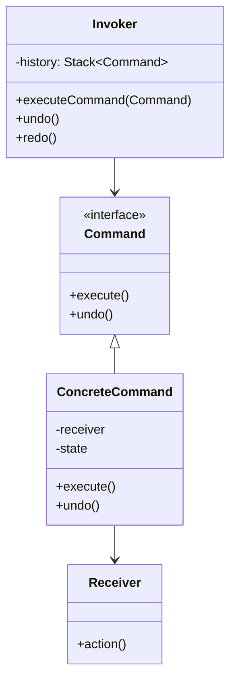
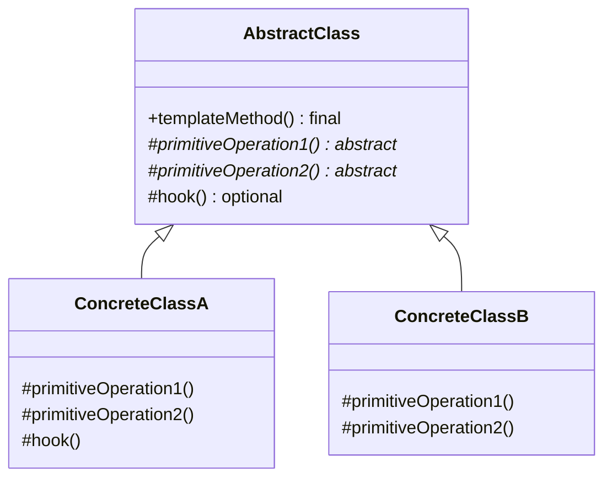

# Session 14: Command & Template Method

## More Behavioral Design Patterns

<div class="pt-12">
  <span @click="$slidev.nav.next" class="px-2 py-1 rounded cursor-pointer" hover="bg-white bg-opacity-10">
    Encapsulating requests & algorithm skeletons <carbon:arrow-right class="inline"/>
  </span>
</div>

<div class="abs-br m-6 flex gap-2">
  <span class="text-sm opacity-50">CPSC 310 | Fall 2025</span>
</div>

---

# Today's Agenda

<v-clicks>

## Command Pattern (First Half)
- Encapsulating requests as objects
- Undo/redo functionality
- Macro commands (Composite pattern integration)
- Real-world applications

## Template Method Pattern (Second Half)
- Defining algorithm skeletons
- Abstract vs. concrete methods
- Hook methods for customization
- Framework design patterns

## Both patterns are complementary
- Command: Encapsulates **what** to do
- Template Method: Defines **how** to do it

</v-clicks>

---
layout: center
---

# Command Pattern

## Encapsulate a request as an object

---

# Command Pattern: The Problem

```java
// Without Command Pattern - actions tightly coupled
class TextEditor {
    void handleKeyPress(String key) {
        if (key.equals("Ctrl+Z")) {
            // How do we undo? What was the last action?
            // No way to track history!
        } else if (key.equals("Ctrl+C")) {
            copy();
        } else if (key.equals("Ctrl+V")) {
            paste();
        }
        // How to implement undo/redo?
        // How to create macros?
    }
}
```

---

# The Problem with Tight Coupling

<v-clicks>

- Cannot undo operations
- Cannot create macros
- Cannot queue/log operations
- Hard to test individual actions

</v-clicks>

---

# Command Pattern: The Solution

## Command Interface

```java
interface Command {
    void execute();
    void undo();
    String getDescription();
}
```

Encapsulate each request as an object

---

# Concrete Command Example

<div class="text-sm">

```java
class InsertCommand implements Command {
    private final TextEditor editor;
    private final String text;
    private final int position;

    public void execute() {
        editor.insert(text, position);
    }

    public void undo() {
        editor.delete(position, text.length());
    }
}
```

</div>

Each command knows how to execute and undo itself

---

# Command History (Invoker)

<div class="text-sm">

```java
class CommandHistory {
    private Stack<Command> undoStack;
    private Stack<Command> redoStack;

    void executeCommand(Command cmd) {
        cmd.execute();
        undoStack.push(cmd);
        redoStack.clear();
    }

    void undo() {
        Command cmd = undoStack.pop();
        cmd.undo();
        redoStack.push(cmd);
    }

    void redo() {
        Command cmd = redoStack.pop();
        cmd.execute();
        undoStack.push(cmd);
    }
}
```

</div>

---

# Command Pattern: Structure



---

# Command Pattern: Usage Example

<div class="text-sm">

```java
// Create editor and history
var editor = new TextEditor();
var history = new CommandHistory();

// Execute commands
history.executeCommand(new InsertCommand(editor, "Hello", 0));
history.executeCommand(new InsertCommand(editor, " World", 5));
history.executeCommand(new InsertCommand(editor, "!", 11));

System.out.println(editor.getContent());  // "Hello World!"

// Undo operations
history.undo();  // Remove "!"
history.undo();  // Remove " World"

// Redo operations
history.redo();  // Add " World" back
```

</div>

---

# Command Pattern: Key Benefits

<v-clicks>

- ✓ Each operation is a separate class (testable)
- ✓ Full undo/redo support
- ✓ Command history tracking
- ✓ Can save/replay command sequences

</v-clicks>

---

# Macro Commands (Composite Pattern)

<div class="text-sm">

```java
class MacroCommand implements Command {
    private List<Command> commands;

    public void execute() {
        for (Command cmd : commands) {
            cmd.execute();
        }
    }

    public void undo() {
        // Undo in reverse order
        var reversed = new ArrayList<>(commands);
        Collections.reverse(reversed);
        for (Command cmd : reversed) {
            cmd.undo();
        }
    }
}
```

</div>

Execute multiple commands as one unit

---

# Using Macro Commands

<div class="text-sm">

```java
// Create a "Format Title" macro
var titleCommands = List.of(
    new InsertCommand(editor, "Title", 0),
    new InsertCommand(editor, "\n", 5),
    new InsertCommand(editor, "=====", 6)
);

var formatTitle = new MacroCommand(titleCommands, "Format Title");

// Execute all 3 operations at once
history.executeCommand(formatTitle);

// Result: Title
//         =====

// Undo all 3 operations at once
history.undo();
```

</div>

---

# Command Pattern: When to Use

<v-clicks>

## Perfect Fit ✓

- **Undo/Redo**: Text editors, drawing programs, games
- **Transactions**: Database operations, batch processing
- **Macros**: Recording and replaying action sequences
- **Queuing**: Job queues, request scheduling
- **Logging**: Audit trails, crash recovery

## Real-World Examples

- **Git commits**: Each commit is a command with history
- **Database transactions**: BEGIN, COMMIT, ROLLBACK
- **GUI frameworks**: Button clicks, menu actions
- **Game input**: Move history for replay/undo
- **Smart home**: Schedule commands for devices

## Not Needed When

- Simple, stateless operations
- No need for undo or history
- Operations cannot be encapsulated

</v-clicks>

---
layout: center
---

# Template Method Pattern

## Define the skeleton of an algorithm, deferring some steps to subclasses

---

# Template Method: The Problem

```java
// Without Template Method - duplicated algorithm structure
class CsvProcessor {
    void process() {
        List<String> data = loadCsvData();
        if (!validateCsv(data)) return;
        List<String> transformed = transformCsv(data);
        saveCsvData(transformed);
    }
}

class JsonProcessor {
    void process() {
        List<String> data = loadJsonData();      // Same structure!
        if (!validateJson(data)) return;          // Same structure!
        List<String> transformed = transformJson(data);  // Same structure!
        saveJsonData(transformed);                // Same structure!
    }
}
```

---

# The Problem with Duplication

<v-clicks>

- Duplicate algorithm structure
- Hard to maintain consistency
- Cannot enforce processing steps
- No code reuse of common logic

</v-clicks>

---

# Template Method: The Solution

<div class="text-sm">

```java
abstract class DataProcessor<T> {
    // Template method - final to prevent overriding
    public final ProcessingResult process() {
        List<T> data = loadData();
        if (!validateData(data)) {
            return new ProcessingResult(false, "Validation failed");
        }
        List<T> transformed = transformData(data);
        int saved = saveData(transformed);
        onProcessingComplete(saved);  // Hook method
        return new ProcessingResult(true, "Success", saved);
    }

    // Abstract methods - subclasses MUST implement
    protected abstract List<T> loadData();
    protected abstract boolean validateData(List<T> data);
    protected abstract List<T> transformData(List<T> data);
    protected abstract int saveData(List<T> data);
```

</div>

---

# Template Method: Hook Methods

<div class="text-sm">

```java
abstract class DataProcessor<T> {
    // ... template method ...

    // Hook method - subclasses CAN override (optional)
    protected void onProcessingComplete(int count) {
        // Default: do nothing
    }
}
```

</div>

Hook methods provide optional extension points

---

# CSV Processor Implementation

<div class="text-sm">

```java
class CsvDataProcessor extends DataProcessor<String> {
    @Override
    protected List<String> loadData() {
        return csvLines;  // Load from CSV file
    }

    @Override
    protected boolean validateData(List<String> data) {
        return !data.isEmpty();  // Check CSV format
    }

    @Override
    protected List<String> transformData(List<String> data) {
        return data.stream()
            .map(String::toUpperCase)
            .toList();
    }

    @Override
    protected int saveData(List<String> data) {
        return data.size();  // Save to file
    }
}
```

</div>

---

# JSON Processor Implementation

<div class="text-sm">

```java
class JsonDataProcessor extends DataProcessor<String> {
    @Override
    protected List<String> loadData() {
        return jsonObjects;  // Load from JSON file
    }

    @Override
    protected boolean validateData(List<String> data) {
        return data.stream()
            .allMatch(s -> s.startsWith("{") && s.endsWith("}"));
    }

    @Override
    protected List<String> transformData(List<String> data) {
        return data.stream()
            .map(json -> json + ", \"processed\": true}")
            .toList();
    }

    @Override
    protected int saveData(List<String> data) {
        return data.size();
    }
}
```

</div>

---

# Template Method: Structure



---

# Overriding Hook Methods

<div class="text-sm">

```java
class LoggingCsvProcessor extends CsvDataProcessor {
    @Override
    protected void onProcessingComplete(int count) {
        logger.info("Processed {} CSV rows", count);
    }
}
```

</div>

Subclasses can selectively override hook methods

---

# Template Method vs Strategy

## Key Differences

<v-clicks>

**Template Method**
- Uses **inheritance** (subclasses)
- **Compile-time** binding
- Fixed algorithm structure
- Cannot swap at runtime
- Good for: Frameworks, libraries

**Strategy**
- Uses **composition** (interfaces)
- **Runtime** binding
- Interchangeable algorithms
- Can swap at runtime
- Good for: Business rules, algorithms

</v-clicks>

---

# Using Both Together

Template Method for the overall structure, Strategy for variable steps

<div class="text-sm">

```java
abstract class DataProcessor {
    final void process() {
        load();
        validate();
        transform();  // Strategy pattern here!
        save();
    }

    abstract void load();
    abstract void validate();
    abstract void save();
}
```

</div>

---

# Template Method: When to Use

<v-clicks>

## Perfect Fit ✓

- **Framework design**: JUnit's `@BeforeEach`, `@AfterEach`
- **Data processing**: ETL pipelines (Extract, Transform, Load)
- **Workflow engines**: Fixed sequence with custom steps
- **Testing**: Setup, execute, teardown pattern
- **Code generation**: Template-based generation

## Real-World Examples

- **JUnit**: Test lifecycle methods
- **Spring**: Transaction templates, JDBC templates
- **Servlet filters**: `doFilter()` template method
- **Build tools**: Maven lifecycle phases
- **Compilers**: Parse, analyze, optimize, generate

## When to Avoid

- Algorithm needs to change at runtime (use Strategy)
- Steps don't follow a fixed sequence
- Too much variation between subclasses

</v-clicks>

---

# Combining Command & Template Method

Real-world patterns often combine multiple patterns

<div class="text-sm">

```java
abstract class TransactionalCommand implements Command {
    public final void execute() {
        beginTransaction();
        try {
            doExecute();  // Subclass provides specific action
            commitTransaction();
        } catch (Exception e) {
            rollbackTransaction();
            throw e;
        }
    }

    protected abstract void doExecute();

    private void beginTransaction() { /* ... */ }
    private void commitTransaction() { /* ... */ }
    private void rollbackTransaction() { /* ... */ }
}
```

</div>

Template Method controls transaction lifecycle, Command provides action

---

# Live Coding Demo

<v-clicks>

## We'll Build
1. **Command Pattern**: Text editor with undo/redo
2. **Template Method**: Data processor for different formats
3. **Combined**: Show how patterns work together

## Follow Along
- Code in `examples/design-patterns/src/main/java/edu/trincoll/patterns/`
- Tests demonstrate proper usage
- Run demos to see patterns in action

</v-clicks>

---

# Week 7 Summary

<div class="grid grid-cols-3 gap-4">

<div>

### Strategy Pattern
**Encapsulate algorithms**

- Modern: Use `Function<T,R>`
- Runtime algorithm selection
- Embodies Open-Closed Principle
- Great for business rules

**Example**: Payment methods

</div>

<div>

### Command Pattern
**Encapsulate requests**

- Undo/redo operations
- Command history
- Macro recording
- Transaction support

**Example**: Text editor actions

</div>

<div>

### Template Method
**Algorithm skeleton**

- Fixed structure
- Subclass customization
- Hook methods
- Framework design

**Example**: Data processing pipeline

</div>

</div>

<v-click>

## All Three Are Behavioral Patterns
They define **how objects interact** and **distribute responsibility**

</v-click>

---

# Assignment

<v-clicks>

## Implement Two Patterns (Due Next Week)

### Option 1: Command Pattern
Create a drawing application with:
- Draw shapes commands (Circle, Rectangle, Line)
- Undo/redo for drawing operations
- Macro for drawing composite shapes
- 80% test coverage

### Option 2: Template Method Pattern
Create a file converter with:
- Abstract conversion template
- Concrete implementations (CSV→JSON, JSON→XML, XML→CSV)
- Validation and transformation steps
- 80% test coverage

### Bonus: Combine Both Patterns
Use Template Method for conversion lifecycle, Command for undo/redo

</v-clicks>

---
layout: center
class: text-center
---

# Questions?

## Command & Template Method Patterns

<div class="pt-8">
  <p class="text-xl">Next week: Creational Patterns (Singleton, Factory, Builder)</p>
  <p class="text-sm opacity-75">See you next class!</p>
</div>

<div class="abs-br m-6 text-sm opacity-50">
  Week 7, Session 14
</div>
