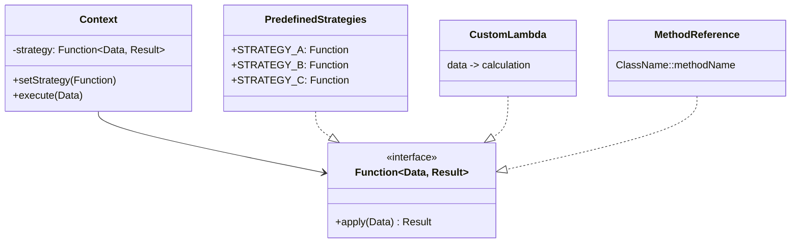

# Week 7: Behavioral Design Patterns

## Strategy, Command & Template Method

<div class="pt-12">
  <span @click="$slidev.nav.next" class="px-2 py-1 rounded cursor-pointer" hover="bg-white bg-opacity-10">
    Patterns for flexible behavior and algorithms <carbon:arrow-right class="inline"/>
  </span>
</div>

<div class="abs-br m-6 flex gap-2">
  <span class="text-sm opacity-50">CPSC 310 | Fall 2025</span>
</div>

---
layout: two-cols
---

# This Week's Plan

<v-clicks>

## Session 13 (Today)
- What are Design Patterns?
- Strategy Pattern
- Modern Java Implementation
- Strategy vs Lambdas

## Session 14 (Next Class)
- Command Pattern
- Template Method Pattern
- Combining Patterns

</v-clicks>

::right::

<div class="mt-12">
<v-clicks>

### Key Concepts
- Gang of Four (GoF) patterns
- Behavioral pattern category
- Open-Closed Principle in action
- Function interfaces replace classes

### Examples Today
- Payroll calculation strategies
- Shipping cost strategies
- Custom lambda strategies

</v-clicks>
</div>

---

# What Are Design Patterns?

<div class="grid grid-cols-2 gap-8">
<div>

## Definition

<v-clicks>

Reusable solutions to commonly occurring problems in software design

- **Not** code you can copy-paste
- **Not** frameworks or libraries
- **Are** templates for solving problems
- **Are** shared vocabulary for developers

</v-clicks>

</div>
<div>

## The Gang of Four (GoF)

<v-clicks>

Published in 1994 by:
- Erich Gamma
- Richard Helm
- Ralph Johnson
- John Vlissides

23 classic patterns in 3 categories:
- **Creational** - Object creation
- **Structural** - Object composition
- **Behavioral** - Object interaction

</v-clicks>

</div>
</div>

---

# Why Learn Design Patterns?

<v-clicks>

## Communication

"Use a Strategy pattern here" conveys more than explaining the entire approach

## Problem Recognition

You'll recognize situations where patterns apply

## Modern Simplification

Many patterns are simpler with modern Java features:
- **Strategy Pattern** → Lambda expressions
- **Factory Pattern** → Static factory methods (`List.of()`, `Optional.of()`)
- **Observer Pattern** → Functional reactive programming
- **Command Pattern** → Method references

## Career Value

Patterns are a common language in technical interviews and code reviews

</v-clicks>

---

# Design Patterns in This Course

<div class="grid grid-cols-3 gap-4">

<div>

### Week 7: Behavioral
- **Strategy**
- **Command**
- **Template Method**

Focus: Algorithm variation

</div>

<div>

### Week 8: Creational
- **Singleton**
- **Factory**
- **Builder**

Focus: Object creation

</div>

<div>

### Week 9: Structural
- **Decorator**
- **Adapter**
- **Proxy**

Focus: Object composition

</div>

</div>

<v-click>

### Week 10: Integration
- Observer & Reactive patterns
- Pattern combinations
- Refactoring to patterns
- Anti-patterns to avoid

</v-click>

---
layout: center
---

# Strategy Pattern

## Defining a family of algorithms, encapsulating each one, and making them interchangeable

---

# Strategy Pattern: The Problem

<v-clicks>

## Without Strategy Pattern

```java
public class OrderProcessor {
    public double calculateShipping(Order order, String type) {
        if (type.equals("standard")) {
            return 5.0 + order.weight() * 0.50;
        } else if (type.equals("express")) {
            return 12.0 + order.weight() * 0.75;
        } else if (type.equals("overnight")) {
            return 25.0 + order.weight() * 1.00;
        } else if (type.equals("international")) {
            return 30.0 + order.weight() * 2.00 + 15.0; // customs
        }
        throw new IllegalArgumentException("Unknown shipping type");
    }
}
```

## Problems
- Violates **Open-Closed Principle** (must modify to add strategies)
- Violates **Single Responsibility** (shipping logic mixed with selection)
- Hard to test individual strategies
- Cannot reuse strategies elsewhere

</v-clicks>

---

# Strategy Pattern: The Solution

<div class="grid grid-cols-2 gap-6">

<div>

## Traditional Approach

```java
// Strategy interface
interface ShippingStrategy {
    double calculate(Order order);
}

// Concrete strategies
class StandardShipping
    implements ShippingStrategy {

    public double calculate(Order order) {
        return 5.0 +
            order.weight() * 0.50;
    }
}

class ExpressShipping
    implements ShippingStrategy {

    public double calculate(Order order) {
        return 12.0 +
            order.weight() * 0.75;
    }
}
```

</div>

<div>

## Context Class

```java
class OrderProcessor {
    private ShippingStrategy strategy;

    public void setStrategy(
        ShippingStrategy strategy) {
        this.strategy = strategy;
    }

    public double processOrder(
        Order order) {
        return strategy.calculate(order);
    }
}

// Usage
var processor = new OrderProcessor();
processor.setStrategy(
    new StandardShipping());
processor.processOrder(order);
```

## Benefits
✓ Open-Closed Principle
✓ Easy to test
✓ Reusable strategies

</div>

</div>

---

# Modern Java Strategy Pattern

## Using Function Interface & Lambdas

<v-clicks>

```java {all|1-2|4-12|14-20|22-27|all}
// No need for interface! Use Function<T, R> from java.util.function
import java.util.function.Function;

// Define strategies as Function constants
class ShippingStrategies {
    public static final Function<Order, Double> STANDARD =
        order -> 5.0 + order.weight() * 0.50;

    public static final Function<Order, Double> EXPRESS =
        order -> 12.0 + order.weight() * 0.75;

    public static final Function<Order, Double> OVERNIGHT =
        order -> 25.0 + order.weight() * 1.00;
}

// Context uses Function interface
class OrderProcessor {
    private Function<Order, Double> strategy = ShippingStrategies.STANDARD;

    public void setStrategy(Function<Order, Double> strategy) {
        this.strategy = strategy;
    }

    public double processOrder(Order order) {
        return strategy.apply(order);
    }
}

// Usage - predefined strategies
processor.setStrategy(ShippingStrategies.EXPRESS);

// Usage - custom lambda
processor.setStrategy(order -> {
    double base = 10.0;
    return order.weight() > 10 ? base * 0.8 : base; // bulk discount
});

// Usage - method reference
processor.setStrategy(ShippingCalculator::calculateBulk);
```

</v-clicks>

---

# Strategy Pattern: Structure



---

# Real Example: Payroll Calculation

<div class="text-sm">

```java {all|1-10|12-22|24-32|34-42|all}
// Data record - modern Java immutable data carrier
record PayrollData(
    Employee employee,
    Integer hoursWorked,
    Double hourlyRate,
    Double annualSalary,
    Double salesAmount,
    Double baseSalary,
    Double commissionRate
) {}

// Strategy definitions using Function interface
class PayrollStrategies {
    // Hourly with overtime
    public static final Function<PayrollData, Double> HOURLY = data -> {
        int hours = data.hoursWorked();
        double rate = data.hourlyRate();
        if (hours <= 40) return hours * rate;
        return (40 * rate) + ((hours - 40) * rate * 1.5); // 1.5x overtime
    };

    // Salaried (bi-weekly)
    public static final Function<PayrollData, Double> SALARIED =
        data -> data.annualSalary() / 26;

    // Commission only
    public static final Function<PayrollData, Double> COMMISSION =
        data -> data.salesAmount() * data.commissionRate();

    // Base + commission
    public static final Function<PayrollData, Double> BASE_PLUS_COMMISSION =
        data -> data.baseSalary() + (data.salesAmount() * data.commissionRate());
}

// Context processor
class PayrollProcessor {
    private Function<PayrollData, Double> calculator = PayrollStrategies.SALARIED;

    public void setCalculator(Function<PayrollData, Double> calculator) {
        this.calculator = calculator;
    }

    public double processPayroll(PayrollData data) {
        return calculator.apply(data);
    }
}
```

</div>

---

# Using the Payroll Strategy

```java {all|1-3|5-9|11-16|18-24|all}
var processor = new PayrollProcessor();

// 1. Predefined strategy
processor.setCalculator(PayrollStrategies.HOURLY);
var hourlyData = new PayrollData(employee, 45, 25.0, null, null, null, null);
double pay = processor.processPayroll(hourlyData);
// Result: (40 * $25) + (5 * $25 * 1.5) = $1,187.50

// 2. Custom lambda - tiered commission
processor.setCalculator(data -> {
    double sales = data.salesAmount();
    double commission = sales <= 20000 ?
        sales * 0.05 :                      // 5% up to $20k
        (20000 * 0.05) + ((sales - 20000) * 0.08); // 8% above
    return data.baseSalary() + commission;
});

// 3. Batch processing with streams
Map<String, Function<PayrollData, Double>> employeeStrategies = Map.of(
    "Alice", PayrollStrategies.HOURLY,
    "Bob", PayrollStrategies.SALARIED,
    "Carol", customCommissionStrategy
);

List<Double> payments = employees.parallelStream()
    .map(emp -> employeeStrategies.get(emp.name()).apply(emp.data()))
    .toList();
```

---

# Strategy Pattern Benefits

<div class="grid grid-cols-2 gap-8">

<div>

## Advantages

<v-clicks>

### Open-Closed Principle
Add new strategies without modifying existing code

### Testability
Each strategy can be tested independently

### Runtime Flexibility
Switch strategies at runtime based on context

### Code Reuse
Strategies can be used across different contexts

### Composition
Combine strategies or create decorators

</v-clicks>

</div>

<div>

## Modern Java Benefits

<v-clicks>

### No Boilerplate
Lambdas eliminate strategy classes

### Type Safety
Function interface provides compile-time checking

### Parallel Processing
Easy to use with streams for batch operations

### Method References
Reuse existing methods as strategies

### Functional Composition
Chain and combine strategies functionally

</v-clicks>

</div>

</div>

---

# When to Use Strategy Pattern

<v-clicks>

## Perfect Fit ✓

- Multiple algorithms for the same task
- Need to switch algorithms at runtime
- Want to isolate algorithm implementation from usage
- Algorithms have conditional logic that's hard to maintain

## Examples in Real Systems

- **Payment processing**: Credit card, PayPal, Bitcoin
- **Compression**: ZIP, GZIP, RAR, 7z
- **Sorting**: Quick sort, merge sort, bubble sort
- **Validation**: Email, phone, credit card, password rules
- **Pricing**: Standard, discount, promotional, tiered
- **Routing**: Fastest, shortest, scenic, avoid tolls

## Maybe Overkill ✗

- Only one algorithm that rarely changes
- Algorithm is extremely simple
- Context doesn't need runtime flexibility

</v-clicks>

---

# Strategy vs SOLID Principles

<div class="grid grid-cols-2 gap-6">

<div>

## Open-Closed Principle (OCP)

Remember from Week 6?

```java
// OCP Example - DiscountStrategy
interface DiscountStrategy {
    double calculate(double amount);
}

class RegularCustomerDiscount
    implements DiscountStrategy {

    public double calculate(double amount) {
        return amount * 0.90; // 10% off
    }
}

class VIPCustomerDiscount
    implements DiscountStrategy {

    public double calculate(double amount) {
        return amount * 0.75; // 25% off
    }
}
```

This **is** the Strategy pattern!

</div>

<div>

## Strategy Pattern IS OCP

<v-clicks>

Strategy pattern is the primary way to achieve the Open-Closed Principle

### OCP States
"Software entities should be open for extension but closed for modification"

### Strategy Achieves This By
- Define strategy interface (**closed**)
- Create new strategy implementations (**open**)
- Context uses any strategy via interface
- Add strategies without changing context

### You've Already Seen It!
Week 6 OCP examples were Strategy patterns:
- `DiscountStrategy` for orders
- `MessageService` implementations (DIP)

</v-clicks>

</div>

</div>

---

# Live Coding: Shipping Strategy

Let's implement a complete shipping calculator with multiple strategies

<v-clicks>

## Requirements
1. Calculate shipping costs for different service levels
2. Support standard, express, overnight
3. Allow custom strategies for bulk discounts
4. Process batch shipments efficiently

## We'll Build
- `ShippingData` record
- `ShippingStrategies` with Function constants
- `ShippingCalculator` context class
- Custom lambda strategies
- Batch processing with streams

</v-clicks>

<div v-click class="mt-8 p-4 bg-blue-50 rounded">

💡 **Follow along**: Code is in `examples/design-patterns/src/main/java/edu/trincoll/patterns/strategy/`

</div>

---

# Strategy Pattern: Key Takeaways

<v-clicks>

## Core Concept
Define a family of algorithms, encapsulate each one, make them interchangeable

## Modern Implementation
- Use `Function<T, R>` instead of custom interfaces
- Lambdas replace concrete strategy classes
- Method references for existing methods
- Easy to compose and combine

## Relationship to SOLID
- **Embodies** Open-Closed Principle
- **Supports** Single Responsibility (separate algorithms)
- **Enables** Dependency Inversion (depend on Function interface)

## Real-World Usage
Essential pattern in production systems for:
- Payment processing
- Business rules that vary
- Algorithm selection
- Testable, maintainable code

</v-clicks>

---

# Exercise: Temperature Converter Strategy

<div class="text-sm">

Implement a temperature converter with multiple conversion strategies.

```java
record Temperature(double value, String unit) {}

// TODO: Implement these strategies as Function<Temperature, Temperature>
class ConversionStrategies {
    // Celsius to Fahrenheit: F = C * 9/5 + 32
    public static final Function<Temperature, Temperature> CELSIUS_TO_FAHRENHEIT = null;

    // Fahrenheit to Celsius: C = (F - 32) * 5/9
    public static final Function<Temperature, Temperature> FAHRENHEIT_TO_CELSIUS = null;

    // Celsius to Kelvin: K = C + 273.15
    public static final Function<Temperature, Temperature> CELSIUS_TO_KELVIN = null;

    // Kelvin to Celsius: C = K - 273.15
    public static final Function<Temperature, Temperature> KELVIN_TO_CELSIUS = null;
}

class TemperatureConverter {
    private Function<Temperature, Temperature> strategy;

    public void setStrategy(Function<Temperature, Temperature> strategy) {
        this.strategy = strategy;
    }

    public Temperature convert(Temperature temp) {
        return strategy.apply(temp);
    }
}
```

**Bonus**: Create a composite strategy that converts Fahrenheit → Celsius → Kelvin

</div>

---

# Next Session Preview

<div class="grid grid-cols-2 gap-8">

<div>

## Command Pattern

Encapsulate a request as an object

```java
interface Command {
    void execute();
    void undo();
}

class SaveFileCommand
    implements Command {

    void execute() { /* save */ }
    void undo() { /* restore */ }
}
```

Use cases:
- Undo/redo operations
- Transaction systems
- Macro recording
- GUI actions

</div>

<div>

## Template Method Pattern

Define algorithm skeleton, subclasses fill in steps

```java
abstract class DataProcessor {
    // Template method
    public final void process() {
        loadData();
        validateData();
        transformData();
        saveData();
    }

    protected abstract void loadData();
    protected abstract void transformData();
    // ... concrete methods for common steps
}
```

Use cases:
- Framework hooks
- Test fixtures
- Workflow pipelines

</div>

</div>

---
layout: center
class: text-center
---

# Questions?

## Strategy Pattern

<div class="pt-8">
  <p class="text-xl">Next class: Command & Template Method patterns</p>
  <p class="text-sm opacity-75">Assignment: Implement pattern examples with tests</p>
</div>

<div class="abs-br m-6 text-sm opacity-50">
  Week 7, Session 13
</div>
