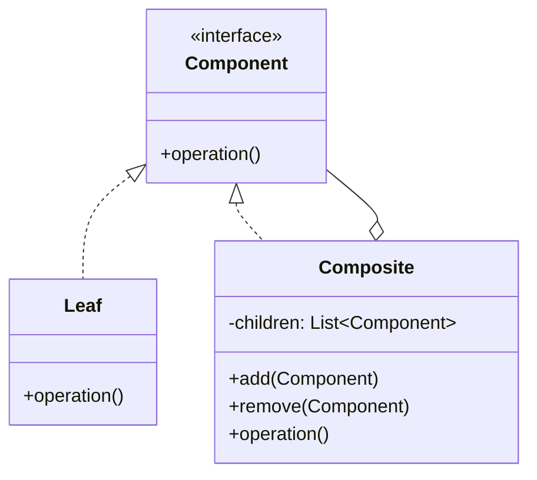

# Week 9: Structural Design Patterns

## Adapter, Decorator, Composite, Proxy & Facade

<div class="pt-12">
  <span @click="$slidev.nav.next" class="px-2 py-1 rounded cursor-pointer" hover="bg-white bg-opacity-10">
    Patterns for flexible object composition <carbon:arrow-right class="inline"/>
  </span>
</div>

<div class="abs-br m-6 flex gap-2">
  <span class="text-sm opacity-50">CPSC 310 | Fall 2025</span>
</div>

---
layout: two-cols
---

# This Week's Plan

<v-clicks>

## Session 16 (Today)
- What are Structural Patterns?
- Adapter Pattern
- Decorator Pattern
- Real-world examples

## Session 17 (Thursday)
- Composite Pattern
- Proxy Pattern
- Facade Pattern
- Pattern combinations

</v-clicks>

::right::

<div class="mt-12">
<v-clicks>

### Key Concepts
- Object composition
- Interface adaptation
- Dynamic behavior extension
- Simplified interfaces

### Examples Today
- Legacy system integration
- Adding features dynamically
- Java I/O streams
- API simplification

</v-clicks>
</div>

---

# What Are Structural Patterns?

<v-clicks>

Patterns focused on **how objects are composed** to form larger structures

## Key Principle
> Favor composition over inheritance

## Why Structural Patterns?

- Inheritance is inflexible (compile-time)
- Composition is flexible (runtime)
- Combine simple objects into complex structures
- Adapt incompatible interfaces

</v-clicks>

---

# The Five Structural Patterns

<div class="grid grid-cols-2 gap-4">

<div>

### Adapter
**Convert interface**
Make incompatible interfaces work together

### Decorator
**Add responsibility**
Attach new behaviors dynamically

### Composite
**Part-whole hierarchy**
Treat objects and compositions uniformly

</div>

<div>

### Proxy
**Control access**
Provide surrogate for another object

### Facade
**Simplify interface**
Unified interface to subsystem

</div>

</div>

---
layout: center
---

# Adapter Pattern

## Converting one interface to another

---

# Adapter: The Problem

## Incompatible Interfaces

```java
// Your code expects this interface
interface MediaPlayer {
    void play(String filename);
}

// But you have this legacy class
class LegacyAudioPlayer {
    void playAudio(File audioFile) {
        // Plays audio
    }
}
```

<v-clicks>

## The Challenge
- Cannot modify `LegacyAudioPlayer` (third-party library)
- Your code expects `MediaPlayer` interface
- Need to make them work together

</v-clicks>

---

# Adapter: Solution

## Create an Adapter Class

```java
class AudioAdapter implements MediaPlayer {
    private final LegacyAudioPlayer legacyPlayer;

    public AudioAdapter() {
        this.legacyPlayer = new LegacyAudioPlayer();
    }

    @Override
    public void play(String filename) {
        // Adapt new interface to legacy interface
        File file = new File(filename);
        legacyPlayer.playAudio(file);
    }
}
```

Adapter implements expected interface, delegates to legacy code

---

# Adapter Pattern Structure

## Components

**Target**: Interface client expects
**Adaptee**: Existing incompatible class
**Adapter**: Converts Adaptee to Target interface
**Client**: Works with Target interface

Adapter implements Target, delegates to Adaptee

---

# Adapter: Real Example - Payment Processing

## The Target Interface

```java
interface PaymentProcessor {
    boolean processPayment(double amount, String currency);
}
```

## Legacy System

```java
class LegacyPaymentSystem {
    public int charge(int amountInCents) {
        // Returns status code: 200 = success
        return 200;
    }
}
```

Different parameter types, different return types!

---

# Payment Adapter Implementation

```java
class PaymentAdapter implements PaymentProcessor {
    private final LegacyPaymentSystem legacySystem;

    public PaymentAdapter() {
        this.legacySystem = new LegacyPaymentSystem();
    }

    @Override
    public boolean processPayment(double amount, String currency) {
        // Convert dollars to cents
        int amountInCents = (int) (amount * 100);

        // Call legacy system
        int statusCode = legacySystem.charge(amountInCents);

        // Convert status code to boolean
        return statusCode == 200;
    }
}
```

---

# Adapter Usage

## Client Code

```java
PaymentProcessor processor = new PaymentAdapter();

boolean success = processor.processPayment(99.99, "USD");

if (success) {
    System.out.println("Payment processed successfully");
}
```

<v-clicks>

✓ Client uses clean interface
✓ Legacy system unchanged
✓ Easy to test
✓ Can swap implementations

</v-clicks>

---

# Adapter Pattern Benefits

<v-clicks>

## Advantages

- **Reuse existing code**: Don't rewrite legacy systems
- **Single Responsibility**: Adapter handles conversion only
- **Open-Closed**: Add new adapters without changing code
- **Testable**: Mock adapters for testing

## When to Use

- Integrate legacy code
- Use third-party libraries with different interfaces
- Make incompatible classes work together

</v-clicks>

---

# Adapter: Java Examples

<v-clicks>

## Arrays.asList()

```java
String[] array = {"a", "b", "c"};
List<String> list = Arrays.asList(array);
// Adapts array to List interface
```

## InputStreamReader

```java
InputStream in = new FileInputStream("file.txt");
Reader reader = new InputStreamReader(in);
// Adapts byte stream to character stream
```

</v-clicks>

---
layout: center
---

# Decorator Pattern

## Adding responsibilities to objects dynamically

---

# Decorator: The Problem

## Need to Add Features Dynamically

```java
class Coffee {
    public double cost() {
        return 2.00;
    }
}
```

<v-clicks>

What if we want to add:
- Milk (+$0.50)
- Sugar (+$0.25)
- Whipped cream (+$0.75)

With inheritance, we'd need:
`CoffeeWithMilk`, `CoffeeWithSugar`, `CoffeeWithMilkAndSugar`, etc.

**Explosion of classes!**

</v-clicks>

---

# Decorator: Solution

## Wrap objects to add behavior

```java
interface Beverage {
    double cost();
    String description();
}

class Coffee implements Beverage {
    public double cost() { return 2.00; }
    public String description() { return "Coffee"; }
}
```

Base component implements interface

---

# Decorator Base Class

```java
abstract class BeverageDecorator implements Beverage {
    protected final Beverage beverage;

    public BeverageDecorator(Beverage beverage) {
        this.beverage = beverage;
    }

    @Override
    public double cost() {
        return beverage.cost();  // Delegate to wrapped object
    }

    @Override
    public String description() {
        return beverage.description();
    }
}
```

Decorator wraps a `Beverage` and delegates to it

---

# Concrete Decorators

```java
class MilkDecorator extends BeverageDecorator {
    public MilkDecorator(Beverage beverage) {
        super(beverage);
    }

    @Override
    public double cost() {
        return beverage.cost() + 0.50;
    }

    @Override
    public String description() {
        return beverage.description() + ", Milk";
    }
}
```

Each decorator adds its own behavior

---

# More Decorators

```java
class SugarDecorator extends BeverageDecorator {
    public SugarDecorator(Beverage beverage) {
        super(beverage);
    }

    @Override
    public double cost() {
        return beverage.cost() + 0.25;
    }

    @Override
    public String description() {
        return beverage.description() + ", Sugar";
    }
}
```

---

# Decorator Usage

## Stack decorators dynamically

```java
// Start with basic coffee
Beverage beverage = new Coffee();
System.out.println(beverage.description() + " = $" + beverage.cost());
// Coffee = $2.00

// Add milk
beverage = new MilkDecorator(beverage);
System.out.println(beverage.description() + " = $" + beverage.cost());
// Coffee, Milk = $2.50

// Add sugar
beverage = new SugarDecorator(beverage);
System.out.println(beverage.description() + " = $" + beverage.cost());
// Coffee, Milk, Sugar = $2.75
```

---

# Decorator Pattern Structure

## Components

**Component**: Common interface for all
**ConcreteComponent**: Basic implementation
**Decorator**: Wraps a Component
**ConcreteDecorators**: Add specific behaviors

Key: Decorators implement Component AND contain Component

---

# Decorator Benefits

<v-clicks>

## Advantages

- **Runtime flexibility**: Add/remove features dynamically
- **Open-Closed**: Add decorators without modifying existing code
- **Single Responsibility**: Each decorator has one job
- **Composition**: Combine decorators in any order

## When to Use

- Need to add responsibilities dynamically
- Extension by inheritance is impractical
- Want to add features without affecting other objects

</v-clicks>

---

# Decorator: Java I/O Streams

## Classic Example

```java
// Basic input
InputStream in = new FileInputStream("data.txt");

// Add buffering
in = new BufferedInputStream(in);

// Add compression
in = new GZIPInputStream(in);

// Add object deserialization
ObjectInputStream objIn = new ObjectInputStream(in);
```

<v-click>

Each decorator adds one responsibility!

</v-click>

---

# Java I/O Decorator Hierarchy

<v-clicks>

## InputStream (Component)
- `FileInputStream` (Concrete Component)
- `ByteArrayInputStream` (Concrete Component)

## FilterInputStream (Decorator)
- `BufferedInputStream` (Concrete Decorator)
- `DataInputStream` (Concrete Decorator)
- `PushbackInputStream` (Concrete Decorator)

## And many more...

This is why Java I/O looks complex - it's extremely flexible!

</v-clicks>

---

# Decorator vs Inheritance

<div class="grid grid-cols-2 gap-4">

<div>

## Inheritance

```java
class MilkCoffee extends Coffee
class SugarCoffee extends Coffee
class MilkSugarCoffee extends Coffee
// 2^n combinations!
```

<v-clicks>

✗ Compile-time only
✗ Class explosion
✗ Inflexible

</v-clicks>

</div>

<div>

## Decorator

```java
new SugarDecorator(
    new MilkDecorator(
        new Coffee()
    )
)
```

<v-clicks>

✓ Runtime flexibility
✓ Few classes
✓ Any combination

</v-clicks>

</div>

</div>

---

# Exercise: Text Formatter Decorator

Implement decorators for text formatting.

```java
interface Text {
    String getContent();
}

class PlainText implements Text {
    private final String content;
    public PlainText(String content) { this.content = content; }
    public String getContent() { return content; }
}

// TODO: Implement decorators:
// - BoldDecorator: wraps in **text**
// - ItalicDecorator: wraps in *text*
// - UpperCaseDecorator: converts to uppercase
```

Usage: `new BoldDecorator(new ItalicDecorator(new PlainText("hello")))`

---
layout: center
---

# Composite Pattern

## Part-whole hierarchies

---

# Composite: The Problem

## Tree Structures

```java
// Individual file
class File {
    public int getSize() { return 100; }
}

// Directory containing files
class Directory {
    private List<File> files;
    public int getSize() {
        return files.stream().mapToInt(File::getSize).sum();
    }
}
```

<v-clicks>

## Problem
- Different types (File vs Directory)
- Cannot nest directories
- Client code must distinguish types

</v-clicks>

---

# Composite: Solution

## Treat individual and composite objects uniformly

```java
interface FileSystemElement {
    String getName();
    int getSize();
}

class File implements FileSystemElement {
    private final String name;
    private final int size;

    public String getName() { return name; }
    public int getSize() { return size; }
}
```

Both implement same interface

---

# Composite: The Composite Class

```java
class Directory implements FileSystemElement {
    private final String name;
    private final List<FileSystemElement> children = new ArrayList<>();

    public void add(FileSystemElement element) {
        children.add(element);
    }

    public String getName() { return name; }

    public int getSize() {
        return children.stream()
            .mapToInt(FileSystemElement::getSize)
            .sum();
    }
}
```

Composite contains other elements (leaf or composite)

---

# Composite Usage

```java
// Create files
File file1 = new File("file1.txt", 100);
File file2 = new File("file2.txt", 200);
File file3 = new File("file3.txt", 150);

// Create directories
Directory root = new Directory("root");
Directory subDir = new Directory("subdir");

// Build tree
root.add(file1);
root.add(subDir);
subDir.add(file2);
subDir.add(file3);

// Treat uniformly
System.out.println("Total size: " + root.getSize());
// 450 (calculates recursively)
```

---

# Composite Pattern Structure



---

# Composite: Real Example - GUI

## UI Components

```java
interface UIComponent {
    void render();
}

class Button implements UIComponent {
    public void render() {
        System.out.println("Rendering button");
    }
}

class Panel implements UIComponent {
    private List<UIComponent> children = new ArrayList<>();

    public void add(UIComponent component) {
        children.add(component);
    }

    public void render() {
        children.forEach(UIComponent::render);
    }
}
```

---

# GUI Composite Usage

```java
// Create components
Button button1 = new Button();
Button button2 = new Button();

// Create composite
Panel mainPanel = new Panel();
Panel subPanel = new Panel();

// Build hierarchy
mainPanel.add(button1);
mainPanel.add(subPanel);
subPanel.add(button2);

// Render entire tree with one call
mainPanel.render();
```

Client treats leaf and composite uniformly!

---

# Composite Pattern Benefits

<v-clicks>

## Advantages

- **Uniform treatment**: Same interface for leaf and composite
- **Recursive operations**: Automatic traversal
- **Easy to add new types**: Just implement interface
- **Flexible structure**: Can nest arbitrarily

## When to Use

- Part-whole hierarchies
- Want to treat objects uniformly
- Tree structures (file systems, GUI, organizations)

</v-clicks>

---

# Exercise: Organization Hierarchy

Implement an organization structure with employees and departments.

```java
interface OrganizationElement {
    String getName();
    double getSalary();  // Total for department
}

class Employee implements OrganizationElement {
    // TODO: Implement employee with name and salary
}

class Department implements OrganizationElement {
    // TODO: Implement department that can contain
    //       employees and sub-departments
    // getSalary() should sum all children
}
```

---
layout: center
---

# Proxy Pattern

## Controlling access to an object

---

# Proxy: The Problem

## Expensive Object Creation

```java
class ExpensiveObject {
    public ExpensiveObject() {
        loadLargeData(); // Takes time
    }

    public void doWork() {
        // Actual work
    }
}
```

---

# Problems with Direct Access

<v-clicks>

- Always pays initialization cost (even if unused)
- No access control
- Cannot add logging/caching

**Solution**: Add a proxy to control access

</v-clicks>

---

# Proxy Types

<v-clicks>

## Virtual Proxy
Delays creation until needed (lazy loading)

## Protection Proxy
Controls access (permissions)

## Remote Proxy
Represents object in different address space

## Logging Proxy
Adds logging to method calls

## Caching Proxy
Caches expensive operations

</v-clicks>

---

# Virtual Proxy Example

```java
interface Service {
    void doWork();
}

class ExpensiveService implements Service {
    public ExpensiveService() {
        // Expensive initialization
        System.out.println("Creating expensive service...");
    }

    public void doWork() {
        System.out.println("Doing work");
    }
}
```

---

# Virtual Proxy Implementation

```java
class ServiceProxy implements Service {
    private ExpensiveService realService;

    @Override
    public void doWork() {
        // Lazy initialization
        if (realService == null) {
            realService = new ExpensiveService();
        }
        realService.doWork();
    }
}
```

<v-click>

Service only created when `doWork()` is called!

</v-click>

---

# Proxy Usage

```java
// Create proxy (fast - no expensive initialization)
Service service = new ServiceProxy();

// Do other work...
System.out.println("Doing other tasks...");

// Now we need the service
service.doWork();
// Output:
// Creating expensive service...
// Doing work
```

<v-click>

Initialization delayed until actually needed

</v-click>

---

# Protection Proxy Example

```java
interface Document {
    void view();
    void edit();
}

class SecureDocument implements Document {
    public void view() {
        System.out.println("Viewing document");
    }

    public void edit() {
        System.out.println("Editing document");
    }
}
```

---

# Protection Proxy Implementation

```java
class DocumentProxy implements Document {
    private final SecureDocument document;
    private final String userRole;

    public DocumentProxy(String userRole) {
        this.document = new SecureDocument();
        this.userRole = userRole;
    }

    public void view() {
        document.view();  // Everyone can view
    }

    public void edit() {
        if (userRole.equals("ADMIN")) {
            document.edit();
        } else {
            throw new SecurityException("No edit permission");
        }
    }
}
```

---

# Proxy Pattern Structure

## Components

**Subject**: Common interface
**RealSubject**: The actual object
**Proxy**: Surrogate for RealSubject
**Client**: Works with Subject interface

Proxy controls access to RealSubject

---

# Proxy Pattern Benefits

<v-clicks>

## Advantages

- **Lazy initialization**: Create expensive objects only when needed
- **Access control**: Add security checks
- **Logging**: Track method calls
- **Caching**: Store expensive results
- **Remote access**: Local representative of remote object

## When to Use

- Expensive object creation
- Access control needed
- Want to add functionality without modifying object

</v-clicks>

---

# Proxy: Java Examples

<v-clicks>

## Dynamic Proxies

```java
Service proxy = (Service) Proxy.newProxyInstance(
    Service.class.getClassLoader(),
    new Class[] { Service.class },
    (proxyObj, method, args) -> {
        System.out.println("Calling: " + method.getName());
        return method.invoke(realService, args);
    }
);
```

## Spring AOP
Spring uses proxies for transactions, security, logging

</v-clicks>

---
layout: center
---

# Facade Pattern

## Simplified interface to complex subsystem

---

# Facade: The Problem

## Complex Subsystem

```java
// Client code has to deal with complexity
AudioPlayer audio = new AudioPlayer();
VideoPlayer video = new VideoPlayer();
SubtitleRenderer subtitles = new SubtitleRenderer();

audio.loadAudio("movie.mp3");
video.loadVideo("movie.mp4");
subtitles.loadSubtitles("movie.srt");
audio.play();
video.play();
subtitles.show();
```

Too many classes, too many calls!

---

# Facade: Solution

## Simple Unified Interface

```java
class MediaPlayerFacade {
    private final AudioPlayer audio;
    private final VideoPlayer video;
    private final SubtitleRenderer subtitles;

    public MediaPlayerFacade() {
        this.audio = new AudioPlayer();
        this.video = new VideoPlayer();
        this.subtitles = new SubtitleRenderer();
    }

    public void playMovie(String filename) {
        audio.loadAudio(filename + ".mp3");
        video.loadVideo(filename + ".mp4");
        subtitles.loadSubtitles(filename + ".srt");
        audio.play();
        video.play();
        subtitles.show();
    }
}
```

---

# Facade Usage

```java
// Before: Complex
AudioPlayer audio = new AudioPlayer();
VideoPlayer video = new VideoPlayer();
SubtitleRenderer subtitles = new SubtitleRenderer();
audio.loadAudio("movie.mp3");
video.loadVideo("movie.mp4");
// ... many more calls

// After: Simple
MediaPlayerFacade player = new MediaPlayerFacade();
player.playMovie("movie");
```

<v-click>

One simple method instead of many complex calls!

</v-click>

---

# Facade: Home Theater Example (Part 1)

```java
class HomeTheaterFacade {
    private final Amplifier amp;
    private final DvdPlayer dvd;
    private final Projector projector;
    private final Screen screen;
    private final Lights lights;

    public void watchMovie(String movie) {
        lights.dim(10);
        screen.down();
        projector.on();
        amp.on();
        dvd.play(movie);
    }
}
```

---

# Facade: Home Theater Example (Part 2)

```java
class HomeTheaterFacade {
    // ... fields from Part 1

    public void endMovie() {
        dvd.stop();
        amp.off();
        projector.off();
        screen.up();
        lights.on();
    }
}
```

One simple method coordinates many subsystem calls!

---

# Facade Pattern Structure

## Components

**Facade**: Simple unified interface
**Subsystems**: Complex components (A, B, C...)
**Client**: Uses only Facade

Facade coordinates subsystem calls, provides simple methods

---

# Facade Pattern Benefits

<v-clicks>

## Advantages

- **Simplicity**: Easy-to-use interface
- **Decoupling**: Clients don't depend on subsystem classes
- **Layering**: Good for organizing subsystems
- **Flexibility**: Can still access subsystem directly if needed

## When to Use

- Complex subsystem with many classes
- Want to provide simple interface for common tasks
- Reduce dependencies between subsystems

</v-clicks>

---

# Facade: Java Examples

<v-clicks>

- **javax.faces.context.FacesContext** - Facade for JSF
- **java.net.URL** - Facade for networking
- **Spring** - `JdbcTemplate`, `RestTemplate`

</v-clicks>

---

# Facade vs Adapter

<div class="grid grid-cols-2 gap-4">

<div>

## Adapter

- Converts one interface to another
- Makes incompatible classes work
- Usually wraps one class
- Changes interface

</div>

<div>

## Facade

- Simplifies complex subsystem
- Provides easier interface
- Wraps multiple classes
- Adds new interface

</div>

</div>

---

# Structural Patterns: Comparison

| Pattern | Purpose | Key Benefit |
|---------|---------|-------------|
| **Adapter** | Interface conversion | Reuse incompatible code |
| **Decorator** | Add responsibilities | Dynamic feature addition |
| **Composite** | Part-whole hierarchy | Uniform treatment |
| **Proxy** | Control access | Lazy loading, security |
| **Facade** | Simplify subsystem | Easy-to-use interface |

---

# Patterns Working Together

## Example: Spring Framework

<v-clicks>

- **Proxy**: AOP for transactions, security
- **Decorator**: Bean post-processors
- **Adapter**: HandlerAdapter for different controller types
- **Facade**: Template classes (JdbcTemplate, RestTemplate)
- **Composite**: ApplicationContext hierarchy

All five structural patterns in one framework!

</v-clicks>

---

# Live Coding: Coffee Shop System

Let's combine Decorator and Facade patterns.

<v-clicks>

## Requirements
1. Beverages with multiple add-ons (Decorator)
2. Simple ordering interface (Facade)
3. Track total cost
4. Generate receipt

</v-clicks>

<div v-click class="mt-8 p-4 bg-blue-50 rounded">

💡 **Follow along**: Combining structural patterns

</div>

---

# Exercise: Logger System

Implement a logging system using Proxy and Decorator patterns.

```java
interface Logger {
    void log(String message);
}

// TODO 1: Create FileLogger (writes to file)
// TODO 2: Create TimestampDecorator (adds timestamp)
// TODO 3: Create LogLevelDecorator (adds INFO, ERROR)
// TODO 4: Create CachingProxy (caches messages)
```

Combine decorators: Timestamp → LogLevel → Proxy → FileLogger

---

# Structural Patterns & SOLID

<v-clicks>

## How They Support SOLID

### Single Responsibility
Each pattern focuses on one structural concern

### Open-Closed
Add new decorators, adapters without modifying existing code

### Liskov Substitution
Decorators and proxies substitute for their wrapped objects

### Interface Segregation
Facade provides focused interface to complex subsystem

### Dependency Inversion
All patterns depend on abstractions, not concrete classes

</v-clicks>

---

# Common Mistakes (Part 1)

<v-clicks>

## Adapter
❌ Adapting when you control both sides
✓ Only for incompatible existing interfaces

## Decorator
❌ Too many decorators (complexity)
✓ Keep decorator chains reasonable

## Composite
❌ Making leaf nodes support composite operations
✓ Different interfaces acceptable

</v-clicks>

---

# Common Mistakes (Part 2)

<v-clicks>

## Proxy
❌ Proxy doing more than controlling access
✓ Keep proxy focused on access control

## Facade
❌ Facade doing business logic
✓ Facade only coordinates, doesn't implement

</v-clicks>

---

# When to Use Each Pattern (Part 1)

<v-clicks>

## Choose Adapter When
- Need to use existing class with incompatible interface
- Integrating legacy code or third-party libraries

## Choose Decorator When
- Need to add responsibilities dynamically
- Extension by inheritance is impractical

## Choose Composite When
- Have part-whole hierarchies
- Want to treat individual and composite uniformly

</v-clicks>

---

# When to Use Each Pattern (Part 2)

<v-clicks>

## Choose Proxy When
- Need lazy initialization, access control, or caching
- Want to add functionality without modifying object

## Choose Facade When
- Complex subsystem needs simple interface
- Want to reduce coupling between subsystems

</v-clicks>

---

# Pattern Selection Guide

## What's your goal?

- **Convert interface** → Adapter
- **Add features dynamically** → Decorator
- **Tree structure** → Composite
- **Control access** → Proxy
- **Simplify complexity** → Facade

---

# Assignment 5 Connection

## Structural Patterns in the Game System

<v-clicks>

While Assignment 5 focuses on behavioral and creational patterns, you could extend it with structural patterns:

### Potential Extensions
- **Decorator**: Add equipment to characters (armor, weapons)
- **Composite**: Team hierarchies (squads, armies)
- **Proxy**: Lazy loading of character data
- **Facade**: Simplified game interface

These would be great optional challenges!

</v-clicks>

---

# Next Steps

<v-clicks>

## This Week
- Complete Assignment 5 (due Nov 6)
- Practice identifying pattern opportunities
- Study pattern combinations

## Prepare For
- Repository Analysis due Nov 6
- Next week: Security & Production

</v-clicks>

---
layout: center
class: text-center
---

# Questions?

## Structural Design Patterns

<div class="pt-8">
  <p class="text-xl">Remember: Favor composition over inheritance</p>
  <p class="text-sm opacity-75">Structural patterns make composition elegant</p>
</div>

<div class="abs-br m-6 text-sm opacity-50">
  Week 9, Sessions 16-17
</div>
