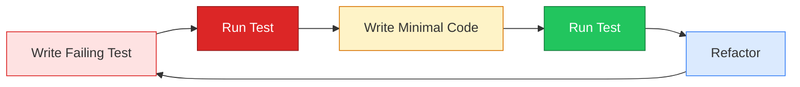

# TDD Deep Dive

## JUnit 6 & AssertJ

<div class="pt-12">
  <span @click="$slidev.nav.next" class="px-2 py-1 rounded cursor-pointer" hover="bg-white bg-opacity-10">
    Mastering Modern Java Testing <carbon:arrow-right class="inline"/>
  </span>
</div>

<div class="abs-br m-6 flex gap-2">
  <span class="text-sm opacity-50">CPSC 310 | Fall 2025</span>
</div>

---

# Learning Objectives

<v-clicks>

- Understand **Test-Driven Development** methodology in depth
- Learn **JUnit 6** new features and migration path
- Master **parameterized** and **nested** test patterns
- Write expressive tests with **AssertJ** fluent assertions

</v-clicks>

---
layout: section
---

# Part 1: TDD Philosophy

---

# The TDD Cycle

## <span style="color: red;">Red</span>-<span style="color: green;">Green</span>-<span style="color: #3b82f6;">Refactor</span>



---

# Why Test First?

<v-clicks>

- **Design tool** - Tests shape your API before implementation
- **Documentation** - Tests show exactly how code should behave
- **Confidence** - Every line of code has a reason to exist
- **Faster debugging** - Failures are localized immediately

</v-clicks>

---

# TDD in Practice: Calculator

## Step 1: Write the Test

```java
@Test
@DisplayName("Adding two positive numbers")
void addTwoPositiveNumbers() {
    Calculator calc = new Calculator();

    int result = calc.add(2, 3);

    assertEquals(5, result);
}
```

**The class doesn't exist yet!**

---

# TDD in Practice: Calculator

## Step 2: Make It Compile

```java
public class Calculator {
    public int add(int a, int b) {
        return 0; // Minimal code to compile
    }
}
```

Run test: **RED** - Expected 5, got 0

---

# TDD in Practice: Calculator

## Step 3: Make It Pass

```java
public class Calculator {
    public int add(int a, int b) {
        return a + b; // Just enough to pass
    }
}
```

Run test: **GREEN**

---

# TDD in Practice: Calculator

## Step 4: Refactor (if needed)

For simple cases, no refactoring needed. But as tests grow:

```java
public class Calculator {
    public int add(int... numbers) {
        return Arrays.stream(numbers).sum();
    }
}
```

Add tests for the new signature before changing!

---
layout: section
---

# Part 2: JUnit 6

---
layout: image-right
image: https://images.unsplash.com/photo-1518932945647-7a1c969f8be2?w=800
---

# JUnit 6 Overview

Released September 30, 2025

<v-clicks>

- **Java 17 minimum** (up from Java 8)
- **Unified versioning** across all modules
- **Kotlin suspend** function support
- **JSpecify nullability** annotations
- **CancellationToken** API

</v-clicks>

---

# JUnit Architecture

<div class="grid grid-cols-2 gap-8">
<div>

## Platform

<v-clicks>

- Test engine discovery
- Launcher API
- IDE/build tool integration

</v-clicks>

</div>
<div>

## Jupiter

<v-clicks>

- New programming model
- Extension mechanism
- Annotations we use daily

</v-clicks>

</div>
</div>

---

# Basic Assertions: assertEquals

```java
@Test
void testAddition() {
    int result = calculator.add(2, 3);

    assertEquals(5, result);
    assertEquals(5, result, "2 + 3 should equal 5");
}
```

- First argument is **expected**, second is **actual**
- Optional message for failure context

---

# Basic Assertions: assertTrue / assertFalse

```java
@Test
void testBooleanConditions() {
    assertTrue(list.isEmpty());
    assertTrue(list.isEmpty(), "List should be empty");

    assertFalse(user.isAdmin());
    assertFalse(user.isAdmin(), "New user should not be admin");
}
```

---

# Basic Assertions: assertNull / assertNotNull

```java
@Test
void testNullChecks() {
    assertNull(service.findById(999L));

    User user = service.findById(1L);
    assertNotNull(user);
    assertNotNull(user, "User with ID 1 should exist");
}
```

---

# assertAll: Grouped Assertions

```java
@Test
void testPersonProperties() {
    Person person = new Person("John", "Doe", 30);

    assertAll("person",
        () -> assertEquals("John", person.getFirstName()),
        () -> assertEquals("Doe", person.getLastName()),
        () -> assertEquals(30, person.getAge())
    );
}
```

All assertions run even if earlier ones fail!

---

# assertThrows: Exception Testing

```java
@Test
void testExceptionThrown() {
    Exception exception = assertThrows(
        IllegalArgumentException.class,
        () -> calculator.divide(10, 0)
    );

    assertEquals("Cannot divide by zero", exception.getMessage());
}
```

---
layout: section
---

# Part 3: Test Lifecycle

---

# Test Lifecycle Annotations

```java
public class LifecycleDemo {
    @BeforeAll
    static void setupClass() { /* Once before all tests */ }

    @BeforeEach
    void setupTest() { /* Before each test method */ }

    @Test
    void testMethod() { /* The actual test */ }

    @AfterEach
    void teardownTest() { /* After each test method */ }

    @AfterAll
    static void teardownClass() { /* Once after all tests */ }
}
```

---

# Lifecycle Execution Order

```
@BeforeAll: setupClass()
  @BeforeEach: setupTest()
    @Test: testMethod1()
  @AfterEach: teardownTest()
  @BeforeEach: setupTest()
    @Test: testMethod2()
  @AfterEach: teardownTest()
@AfterAll: teardownClass()
```

---

# Practical Lifecycle Example

```java
class DatabaseTest {
    static Connection connection;

    @BeforeAll
    static void connectToDatabase() {
        connection = DriverManager.getConnection(URL);
    }

    @BeforeEach
    void beginTransaction() {
        connection.setAutoCommit(false);
    }

    @AfterEach
    void rollbackTransaction() {
        connection.rollback();
    }
}
```

---
layout: section
---

# Part 4: Nested Tests

---

# Why Nested Tests?

<v-clicks>

- **Organize** related tests hierarchically
- **Share setup** between related test groups
- **Readable output** - tests read like specifications
- **Context building** - state accumulates through nesting

</v-clicks>

---

# Nested Test Structure

```java
@DisplayName("A Stack")
class StackTest {
    Stack<String> stack;

    @Nested
    @DisplayName("when new")
    class WhenNew {
        @BeforeEach
        void createStack() {
            stack = new Stack<>();
        }

        @Test
        @DisplayName("is empty")
        void isEmpty() {
            assertTrue(stack.isEmpty());
        }
    }
}
```

---

# Nested Test Structure (continued)

```java
        @Nested
        @DisplayName("after pushing an element")
        class AfterPushing {
            @BeforeEach
            void pushElement() {
                stack.push("element");
            }

            @Test
            @DisplayName("is no longer empty")
            void isNotEmpty() {
                assertFalse(stack.isEmpty());
            }

            @Test
            @DisplayName("returns element when popped")
            void returnsElement() {
                assertEquals("element", stack.pop());
            }
        }
```

---

# Nested Tests Output

Test runner output reads like a specification:

```
A Stack
  when new
    ✓ is empty
    ✓ throws when popped
    after pushing an element
      ✓ is no longer empty
      ✓ returns element when popped
      ✓ returns element when peeked
```

---
layout: section
---

# Part 5: Parameterized Tests

---

# Why Parameterized Tests?

Without parameters:

```java
@Test void isPrime2() { assertTrue(isPrime(2)); }
@Test void isPrime3() { assertTrue(isPrime(3)); }
@Test void isPrime5() { assertTrue(isPrime(5)); }
@Test void isPrime7() { assertTrue(isPrime(7)); }
// ... tedious!
```

---

# @ValueSource - Simple Values

```java
@ParameterizedTest(name = "{0} is prime")
@ValueSource(ints = {2, 3, 5, 7, 11, 13, 17, 19})
void valueIsPrime(int number) {
    assertTrue(isPrime(number));
}
```

Supported types: `ints`, `longs`, `doubles`, `strings`, `classes`

---

# @CsvSource - Multiple Arguments

```java
@ParameterizedTest(name = "{0} + {1} = {2}")
@CsvSource({
    "1, 2, 3",
    "0, 0, 0",
    "-1, 1, 0",
    "100, 200, 300"
})
void testAddition(int a, int b, int expected) {
    assertEquals(expected, calculator.add(a, b));
}
```

---

# @MethodSource - Complex Data

```java
@ParameterizedTest
@MethodSource("provideBooks")
void testBookValidation(Book book) {
    assertTrue(book.isbn().length() == 10 ||
               book.isbn().length() == 13);
}

static Stream<Book> provideBooks() {
    return Stream.of(
        new Book("1234567890", "Title A"),
        new Book("1234567890123", "Title B")
    );
}
```

---

# @EnumSource - Enum Values

```java
@ParameterizedTest
@EnumSource(Month.class)
void allMonthsAreValid(Month month) {
    assertThat(month.getValue())
        .isBetween(1, 12);
}

@ParameterizedTest
@EnumSource(mode = MATCH_ALL, names = "^.*DAY$")
void onlyDayUnits(ChronoUnit unit) {
    assertTrue(unit.name().endsWith("DAY"));
}
```

---

# JUnit 6: FastCSV for @CsvSource

JUnit 6 migrated to FastCSV (from univocity-parsers):

<v-clicks>

- **Faster parsing** of CSV data
- **RFC 4180 compliant**
- **Zero dependencies**
- **Better error messages** for malformed CSV

</v-clicks>

---
layout: section
---

# Part 6: AssertJ Basics

---
layout: image-left
image: https://images.unsplash.com/photo-1454165804606-c3d57bc86b40?w=800
---

# Why AssertJ?

<v-clicks>

- **Fluent API** - readable assertions
- **IDE autocomplete** - discover assertions easily
- **Rich matchers** - for collections, exceptions, etc.
- **Better errors** - descriptive failure messages

</v-clicks>

---

# JUnit vs AssertJ

<div class="grid grid-cols-2 gap-4">
<div>

## JUnit Assertions

```java
assertEquals(expected, actual);
assertTrue(list.contains(item));
assertNotNull(result);
```

</div>
<div>

## AssertJ Assertions

```java
assertThat(actual).isEqualTo(expected);
assertThat(list).contains(item);
assertThat(result).isNotNull();
```

</div>
</div>

---

# String Assertions

```java
String title = "The Lord of the Rings";

assertThat(title)
    .isNotNull()
    .isNotEmpty()
    .startsWith("The")
    .contains("Lord")
    .endsWith("Rings")
    .hasSize(21);
```

Chain multiple assertions fluently!

---

# Number Assertions

```java
int answer = 42;

assertThat(answer)
    .isPositive()
    .isGreaterThan(40)
    .isLessThanOrEqualTo(50)
    .isBetween(40, 50)
    .isEven();
```

---

# Collection Assertions

```java
List<String> hobbits = List.of("Frodo", "Sam", "Merry", "Pippin");

assertThat(hobbits)
    .hasSize(4)
    .contains("Frodo", "Sam")
    .containsExactly("Frodo", "Sam", "Merry", "Pippin")
    .doesNotContain("Gandalf")
    .startsWith("Frodo")
    .endsWith("Pippin");
```

---

# Exception Assertions

```java
assertThatThrownBy(() -> {
    throw new IllegalArgumentException("Invalid input");
})
    .isInstanceOf(IllegalArgumentException.class)
    .hasMessage("Invalid input")
    .hasMessageContaining("Invalid");

// Or for specific exception types
assertThatIllegalArgumentException()
    .isThrownBy(() -> validate(null))
    .withMessage("Input cannot be null");
```

---

# Extracting from Objects

```java
Person person = new Person("Jean-Luc", "Picard", LocalDate.of(2305, 7, 13));

assertThat(person)
    .extracting(Person::first, Person::last)
    .containsExactly("Jean-Luc", "Picard");

assertThat(person)
    .extracting("first", "last")
    .containsExactly("Jean-Luc", "Picard");
```

---

# Extracting from Collections

```java
List<Person> crew = List.of(
    new Person("Jean-Luc", "Picard"),
    new Person("William", "Riker"),
    new Person("Data", "")
);

assertThat(crew)
    .extracting(Person::first)
    .containsExactly("Jean-Luc", "William", "Data");

assertThat(crew)
    .extracting(Person::first, Person::last)
    .contains(tuple("Jean-Luc", "Picard"),
              tuple("William", "Riker"));
```

---
layout: section
---

# Part 7: Best Practices

---

# Test Naming Conventions

<v-clicks>

- **Descriptive names** - `shouldReturnEmptyWhenNotFound()`
- **Use @DisplayName** for readable output
- **Follow pattern**: `should_expectedBehavior_when_condition`
- **Avoid**: `test1()`, `testAdd()`, `myTest()`

</v-clicks>

---

# Good Test Names

```java
@Test
@DisplayName("Returns empty Optional when user not found")
void shouldReturnEmptyOptionalWhenUserNotFound() {
    Optional<User> result = service.findById(999L);

    assertThat(result).isEmpty();
}

@Test
@DisplayName("Throws exception for negative deposit amount")
void shouldThrowExceptionForNegativeDeposit() {
    assertThatIllegalArgumentException()
        .isThrownBy(() -> account.deposit(-100));
}
```

---

# The AAA Pattern

```java
@Test
void shouldCalculateOrderTotal() {
    // Arrange - Set up test data
    Order order = new Order();
    order.addItem(new Item("Widget", 10.00));
    order.addItem(new Item("Gadget", 25.00));

    // Act - Execute the behavior under test
    double total = order.calculateTotal();

    // Assert - Verify the results
    assertThat(total).isEqualTo(35.00);
}
```

---

# One Assertion Per Test?

<v-clicks>

- **Guideline**, not a rule
- Multiple assertions OK if testing **one logical concept**
- Use `assertAll()` for related assertions
- Split if assertions test **different behaviors**

</v-clicks>

---

# assertAll for Related Assertions

```java
@Test
void shouldCreateValidPerson() {
    Person person = new Person("John", "Doe", LocalDate.of(1990, 1, 15));

    assertAll("person properties",
        () -> assertThat(person.first()).isEqualTo("John"),
        () -> assertThat(person.last()).isEqualTo("Doe"),
        () -> assertThat(person.dob()).isEqualTo(LocalDate.of(1990, 1, 15)),
        () -> assertThat(person.age()).isGreaterThan(30)
    );
}
```

All assertions run even if one fails!

---

# Test Independence

<v-clicks>

- Tests should **not depend on each other**
- Each test creates its own test data
- No shared mutable state between tests
- Tests can run in **any order**

</v-clicks>

---

# Avoid Test Interdependence

```java
// BAD - Tests depend on shared state
static List<String> items = new ArrayList<>();

@Test void addItem() {
    items.add("item");
    assertEquals(1, items.size());
}

@Test void addSecondItem() {
    items.add("item2");
    assertEquals(2, items.size()); // Fails if run alone!
}
```

---

# Independent Tests

```java
// GOOD - Each test has its own data
@Test void addItem() {
    List<String> items = new ArrayList<>();
    items.add("item");
    assertEquals(1, items.size());
}

@Test void addTwoItems() {
    List<String> items = new ArrayList<>();
    items.add("item1");
    items.add("item2");
    assertEquals(2, items.size());
}
```

---
layout: section
---

# Part 8: Migrating to JUnit 6

---

# JUnit 6: Unified Versioning

## Before (JUnit 5.x)

```kotlin
testImplementation("org.junit.jupiter:junit-jupiter:5.11.0")
testImplementation("org.junit.platform:junit-platform-launcher:1.11.0")
```

## After (JUnit 6.x)

```kotlin
testImplementation("org.junit.jupiter:junit-jupiter:6.0.1")
testImplementation("org.junit.platform:junit-platform-launcher:6.0.1")
```

All modules share the same version number now!

---

# Migration Checklist

<v-clicks>

- **Good news**: Most tests work unchanged
- **Check**: Java version (minimum 17)
- **Update**: Build configuration versions
- **Review**: Any deprecated API usage
- **JUnit Vintage**: Now deprecated (INFO warning)

</v-clicks>

---

# JUnit 6: CancellationToken API

New API for aborting long-running tests:

```java
@Test
void longRunningTest(CancellationToken token) {
    while (!token.isCancelled()) {
        // Do work in chunks
        processNextBatch();
    }
}
```

Console launcher now supports `--fail-fast` flag

---

# JUnit 6: Nullability Annotations

JSpecify annotations throughout the API:

```java
// Method signatures now clearly indicate nullability
@Nullable
String getDisplayName();

void execute(@NonNull TestDescriptor descriptor);
```

- Better IDE support
- Kotlin interoperability
- Static analysis benefits

---

# JUnit 6: Kotlin Support

Test methods can now be `suspend` functions:

```kotlin
@Test
suspend fun testAsyncOperation() {
    val result = myService.fetchDataAsync()

    assertThat(result).isNotEmpty()
}
```

First-class coroutine support without workarounds!

---

# Summary

<v-clicks>

- **TDD** drives design through tests
- **JUnit 6** modernizes with Java 17+, unified versioning
- **Nested tests** organize specs hierarchically
- **Parameterized tests** reduce test duplication
- **AssertJ** provides fluent, readable assertions

</v-clicks>

---
layout: center
class: text-center
---

# Questions?

## Test First, Test Often!

**Remember**: Tests are documentation that never lies

<div class="pt-8">
  <span class="text-sm opacity-50">CPSC 310 | Fall 2025</span>
</div>
